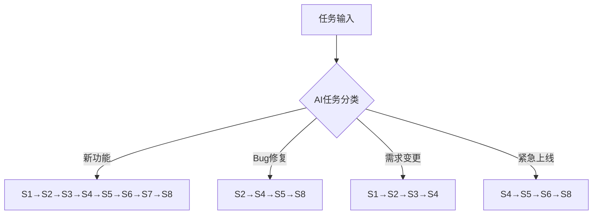

# AceFlow-PATEOAS 流程规范

## 1. 概述

### 1.1 目的
本规范定义了一套AI优先的软件研发工作流，通过状态驱动和记忆机制，使AI能够自主完成大部分开发任务，最小化人工干预。

### 1.2 适用范围
- **AI自主执行**：新功能开发、Bug修复、需求变更、紧急上线
- **人机协作**：复杂架构设计、关键决策确认、异常处理

### 1.3 术语定义
- **PATEOAS**：Prompt as the Engine of AI State - 将提示词作为驱动AI状态转换的核心引擎
- **状态**：`{阶段, 任务, 进度, 记忆, 下一步}` 五元组
- **记忆池**：跨阶段信息存储，格式：`类型-ID-内容`
- **流程分支**：基于任务特征的自适应执行路径

## 2. 核心原则

### 2.1 状态驱动
```yaml
state_transition:
  trigger: "阶段完成条件满足"
  action: "自动进入下一阶段"
  fallback: "条件不满足时请求人工确认"
```

### 2.2 流程弹性
- **自动路由**：AI根据任务类型自动选择执行路径
- **动态阈值**：可配置的质量标准和完成条件
- **智能回退**：检测到问题时自动返回相关阶段

### 2.3 记忆持续
- **格式标准**：`[类型]-[ID]-[内容]`
- **自动关联**：AI自动识别记忆与阶段的相关性
- **主动召回**：在需要时自动提取相关记忆

### 2.4 AI自主性
```yaml
autonomy_levels:
  L1_监督: "AI建议，人类决策"
  L2_协作: "AI执行，人类审核" 
  L3_自主: "AI决策并执行，仅异常时人工介入"
```

## 3. 流程框架

### 3.1 流程总览


### 3.2 AI流程选择逻辑
```python
def select_flow(task_description):
    if "新功能" in task_description or "开发" in task_description:
        return "FULL_FLOW"
    elif "bug" in task_description or "修复" in task_description:
        return "QUICK_FLOW"
    elif "变更" in task_description or "调整" in task_description:
        return "CHANGE_FLOW"
    elif "紧急" in task_description or "P0" in task_description:
        return "URGENT_FLOW"
    else:
        return "REQUEST_CLARIFICATION"
```

## 4. 阶段定义与AI执行规范

### 4.1 S1：用户故事细化

**AI执行指令**：
```markdown
任务：将输入需求转换为INVEST原则的用户故事
输入检查：是否包含{用户角色, 功能描述, 业务价值}
执行步骤：
1. 识别所有用户角色
2. 为每个角色生成故事：作为[角色]，我希望[功能]，以便[价值]
3. 验证每个故事的独立性和可测试性
输出格式：/aceflow_result/S1_user_story/s1_user_story.md
完成条件：故事数量≥需求点数量 AND 每个故事符合INVEST
```

**状态模板**：
```yaml
current_state:
  stage: "S1"
  task: "用户故事细化"
  progress: "[自动计算]%"
  memory:
    - "REQ-001: [核心需求]"
    - "CON-001: [技术约束]"
  next: "所有故事验证通过→S2"
```

### 4.2 S2：任务拆分

**AI执行指令**：
```markdown
任务：将用户故事分解为可执行任务
输入依赖：S1_user_story.md
执行算法：
1. foreach 用户故事:
   - 识别技术组件
   - 评估复杂度
   - 拆分任务(目标工时≤8小时)
2. 设置任务依赖关系
3. 分配优先级(P0-P3)
输出格式：任务ID|描述|预估工时|优先级|依赖
完成条件：所有故事已拆分 AND 单任务工时≤8h
```

### 4.3 S3：测试用例设计

**AI执行指令**：
```markdown
任务：基于用户故事生成测试用例
输入依赖：S1_user_story.md, S2_tasks.md
生成策略：
1. 正常路径：每个用户故事至少1个
2. 边界条件：识别数值/长度限制
3. 异常场景：空值/错误输入/并发
覆盖率计算：(用例覆盖的故事点/总故事点)*100%
输出格式：TC-[ID]|场景|步骤|预期|优先级
完成条件：覆盖率≥80% AND 核心功能覆盖率=100%
```

### 4.4 S4：功能实现

**AI执行指令**：
```markdown
任务：TDD方式实现功能
输入依赖：S2_tasks.md, S3_testcases.md
执行模式：
1. 读取任务和对应测试用例
2. 生成测试代码框架
3. 实现功能代码
4. 运行测试验证
代码标准：遵循团队编码规范
输出内容：源代码 + 单元测试 + 实现说明
完成条件：单元测试通过率≥90%
```

### 4.5 S5：测试报告

**AI执行指令**：
```markdown
任务：执行测试并生成报告
输入依赖：S3_testcases.md, S4_implementation/
执行流程：
1. 执行所有测试用例
2. 记录执行结果
3. 分析失败原因
4. 评估质量风险
报告内容：
- 执行摘要：总数/通过/失败
- 缺陷列表：ID|严重度|描述|状态
- 风险评估：高/中/低
完成条件：执行率=100% AND 高严重度缺陷=0
```

### 4.6 S6：代码评审

**AI执行指令**：
```markdown
任务：自动化代码质量检查
检查项：
1. 代码规范：命名/格式/注释
2. 逻辑正确：算法/边界/异常处理  
3. 性能安全：复杂度/内存/SQL注入
4. 架构合理：耦合度/扩展性
评审方式：静态分析 + 规则检查 + 最佳实践对比
输出格式：问题ID|类型|位置|建议|严重度
完成条件：关键问题=0 AND 一般问题≤3
```

### 4.7 S7：演示与反馈

**AI执行指令**：
```markdown
任务：准备演示材料并收集反馈
准备内容：
1. 功能演示脚本
2. 核心场景展示
3. 性能指标数据
反馈模板：
- 功能符合度：1-5分
- 用户体验：优/良/需改进
- 改进建议：[具体描述]
输出格式：演示记录 + 反馈汇总 + 改进方案
完成条件：获得关键干系人反馈≥80%
```

### 4.8 S8：进度汇总

**AI执行指令**：
```markdown
任务：生成进度报告和后续规划
汇总内容：
1. 各阶段完成情况
2. 关键产出物清单
3. 问题与解决方案
4. 经验教训总结
规划建议：
- 待完成事项
- 优化建议
- 下轮迭代重点
输出格式：结构化报告 + 可视化图表
完成条件：报告完整 AND 获得确认
```

## 5. AI状态管理规范

### 5.1 状态数据结构
```json
{
  "current_stage": "S1",
  "status": "in_progress|blocked|completed",
  "progress": 75,
  "memory_refs": ["REQ-001", "DEC-001"],
  "next_action": {
    "condition": "progress >= 100",
    "target": "S2"
  }
}
```

### 5.2 状态转换规则
```python
def state_transition(current_state):
    if meets_completion_criteria(current_state):
        return auto_proceed_next()
    elif has_blocking_issues(current_state):
        return request_human_intervention()
    else:
        return continue_current_stage()
```

## 6. 异常处理规范

### 6.1 AI异常识别
```yaml
exception_patterns:
  - pattern: "测试覆盖率 < 80%"
    severity: "medium"
    action: "return_to_S3"
  - pattern: "核心功能测试失败"
    severity: "high"
    action: "alert_and_block"
  - pattern: "需求理解歧义"
    severity: "medium"
    action: "request_clarification"
```

### 6.2 自动处理策略
| 异常类型 | AI处理方式 | 人工介入条件 |
|---------|-----------|-------------|
| 任务超时 | 自动分解为子任务 | 分解后仍>8h |
| 测试失败 | 分析原因并尝试修复 | 修复2次失败 |
| 需求不清 | 基于上下文推断 | 置信度<70% |
| 代码冲突 | 自动合并或隔离 | 核心模块冲突 |

## 7. 人机协作规范

### 7.1 AI决策边界
```yaml
ai_can_decide:
  - 常规任务拆分
  - 标准测试用例生成
  - 代码格式优化
  - 简单bug修复

require_human:
  - 架构变更
  - 核心算法选择
  - 外部系统集成
  - 数据模型修改
```

### 7.2 协作接口
```markdown
AI请求格式：
[HUMAN_INPUT_REQUIRED]
上下文：[当前状态和问题描述]
需要决策：[具体问题]
建议选项：[AI分析的可选方案]
影响分析：[各方案的影响]
```

## 8. 附录

### 8.1 AI执行检查清单
- [ ] 任务类型正确识别
- [ ] 流程路径自动选择
- [ ] 状态信息完整记录
- [ ] 记忆跨阶段传递正常
- [ ] 异常自动处理适当
- [ ] 人工介入时机合理

### 8.2 AI工具链
```yaml
tools:
  task_classifier: "基于NLP的任务分类器"
  state_engine: "PATEOAS状态管理引擎"
  memory_system: "向量数据库记忆系统"
  code_generator: "模板驱动代码生成器"
  test_runner: "自动化测试执行器"
  quality_checker: "静态代码分析器"
```

这个优化版本保持了你的原有架构，但做了以下增强：
1. **AI执行指令**：每个阶段都有明确的执行指令
2. **自动化逻辑**：增加了判断和决策的具体规则
3. **结构化数据**：使用JSON/YAML格式便于AI解析
4. **明确边界**：清晰定义了AI可自主决策和需要人工介入的场景
5. **实用性增强**：添加了代码示例和具体的执行模板