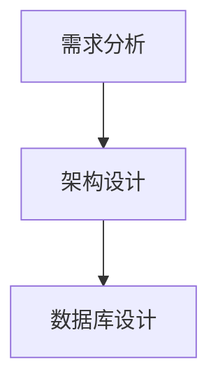

# 分组任务清单: {groupName}

## 本组统计
- **任务数**: [数量]
- **预估工时**: [小时]h
---

## 任务列表

| 任务ID | 任务名称 | 所属用户故事 | 负责人 | 预估工时 | 优先级 | 状态 | 依赖任务 | 记忆关联ID |
|--------|----------|--------------|--------|----------|--------|------|----------|------------|
| T-{{序号}} | {{任务名称}} | {{US-xxx}} | {{姓名}} | {{小时}} | {{高/中/低}} | {{未开始/进行中/已完成}} | {{T-xxx}} | MEM-TASK-xxx |

## 任务依赖关系图
