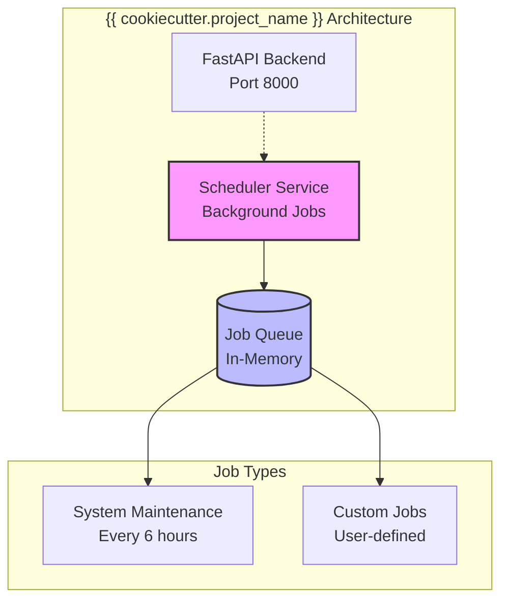

# Scheduler Component

The Scheduler Component provides background task processing and cron job capabilities using [APScheduler](https://apscheduler.readthedocs.io/).

## Overview

{{ cookiecutter.project_name }} includes a scheduler component that runs as an independent service, enabling:

- **Background job processing**
- **Cron-style scheduled tasks**  
- **Async job execution**
- **Job persistence and recovery**
- **Real-time job monitoring**

## Architecture



## Running the Scheduler

The scheduler runs as a Docker service. Use these commands:

### Docker Deployment
```bash
# Run only scheduler service
docker compose --profile dev up scheduler

# Run all services including scheduler
make run

# Or use docker compose directly
docker compose --profile dev up
```

## Job Configuration

The scheduler is configured in `app/components/scheduler/main.py`:

```python
from apscheduler.schedulers.asyncio import AsyncIOScheduler
from apscheduler.triggers.cron import CronTrigger

def create_scheduler() -> AsyncIOScheduler:
    scheduler = AsyncIOScheduler()
    
    # Add your jobs here
    scheduler.add_job(
        func=system_maintenance_job,
        trigger=CronTrigger(hour=2),  # Run daily at 2 AM
        id="system_maintenance",
        name="System Maintenance",
        replace_existing=True
    )
    
    return scheduler
```

## Adding Custom Jobs

### 1. Create Job Function
Create job functions in `app/services/`:

```python
# app/services/my_jobs.py
import asyncio
from app.core.log import logger

async def process_daily_reports():
    """Generate daily reports."""
    logger.info("Starting daily report generation")
    
    # Your job logic here
    await asyncio.sleep(1)  # Simulate work
    
    logger.info("Daily reports completed")

async def cleanup_old_files():
    """Clean up old temporary files."""
    logger.info("Starting file cleanup")
    
    # Your cleanup logic here
    
    logger.info("File cleanup completed")
```

### 2. Register Jobs in Scheduler
Add jobs to the scheduler configuration:

```python
# app/components/scheduler/main.py
from app.services.my_jobs import process_daily_reports, cleanup_old_files

def create_scheduler() -> AsyncIOScheduler:
    scheduler = AsyncIOScheduler()
    
    # Daily report at 6 AM
    scheduler.add_job(
        func=process_daily_reports,
        trigger=CronTrigger(hour=6, minute=0),
        id="daily_reports",
        name="Daily Report Generation"
    )
    
    # Weekly cleanup on Sundays at midnight
    scheduler.add_job(
        func=cleanup_old_files,
        trigger=CronTrigger(day_of_week="sun", hour=0, minute=0),
        id="weekly_cleanup", 
        name="Weekly File Cleanup"
    )
    
    return scheduler
```

## Job Scheduling Options

### Cron-Style Triggers
```python
from apscheduler.triggers.cron import CronTrigger

# Every day at 2:30 AM
CronTrigger(hour=2, minute=30)

# Every Monday at 9:00 AM  
CronTrigger(day_of_week="mon", hour=9, minute=0)

# Every 15 minutes
CronTrigger(minute="*/15")

# First day of every month at midnight
CronTrigger(day=1, hour=0, minute=0)
```

### Interval Triggers
```python
from apscheduler.triggers.interval import IntervalTrigger

# Every 5 minutes
IntervalTrigger(minutes=5)

# Every 2 hours
IntervalTrigger(hours=2)

# Every 30 seconds
IntervalTrigger(seconds=30)
```

### One-Time Jobs
```python
from datetime import datetime, timedelta

# Run once in 1 hour
scheduler.add_job(
    func=one_time_task,
    trigger="date", 
    run_date=datetime.now() + timedelta(hours=1),
    id="one_time_task"
)
```

## Job Management

### Listing Jobs
```python
# Get all scheduled jobs
jobs = scheduler.get_jobs()
for job in jobs:
    print(f"Job: {job.name}, Next run: {job.next_run_time}")
```

### Modifying Jobs
```python
# Pause a job
scheduler.pause_job("daily_reports")

# Resume a job  
scheduler.resume_job("daily_reports")

# Remove a job
scheduler.remove_job("old_job_id")

# Modify job schedule
scheduler.modify_job("daily_reports", hour=7)  # Change to 7 AM
```

## Error Handling

### Job Error Handling
```python
async def robust_job():
    """A job with proper error handling."""
    try:
        logger.info("Starting robust job")
        
        # Job logic here
        result = await some_async_operation()
        
        logger.info(f"Job completed successfully: {result}")
        
    except Exception as e:
        logger.error(f"Job failed: {str(e)}", exc_info=True)
        # Optionally send alerts or retry logic
```

### Scheduler Error Listeners
```python
def job_listener(event):
    """Listen for job events."""
    if event.exception:
        logger.error(f"Job {event.job_id} crashed: {event.exception}")
    else:
        logger.info(f"Job {event.job_id} executed successfully")

# Add listener to scheduler
scheduler.add_listener(job_listener, EVENT_JOB_EXECUTED | EVENT_JOB_ERROR)
```

## Monitoring Jobs

### Health Checks
The scheduler health is included in system health checks:

```bash
{{ cookiecutter.project_slug }} health check --detailed
```

Shows scheduler status, active jobs, and next execution times.

### Job Logging
All job executions are logged with structured logging:

```json
{
  "timestamp": "2024-01-01T02:00:00Z",
  "level": "INFO", 
  "logger": "scheduler",
  "message": "Job executed successfully",
  "job_id": "system_maintenance",
  "execution_time_ms": 1250
}
```

### Custom Job Metrics
Add metrics to your jobs:

```python
import time
from app.core.log import logger

async def monitored_job():
    start_time = time.time()
    
    try:
        # Job work here
        await do_work()
        
        execution_time = time.time() - start_time
        logger.info(f"Job completed in {execution_time:.2f}s")
        
    except Exception as e:
        execution_time = time.time() - start_time
        logger.error(f"Job failed after {execution_time:.2f}s: {e}")
        raise
```

## Configuration

### Scheduler Settings
Configure scheduler behavior in `app/core/config.py`:

```python
class Settings(BaseSettings):
    # Scheduler configuration
    scheduler_timezone: str = "UTC"
    scheduler_max_workers: int = 10
    scheduler_job_defaults: dict = {
        "coalesce": False,
        "max_instances": 3
    }
```

### Job Persistence
For production deployments, consider using persistent job storage:

```python
from apscheduler.jobstores.sqlalchemy import SQLAlchemyJobStore

jobstores = {
    'default': SQLAlchemyJobStore(url='sqlite:///jobs.sqlite')
}

scheduler = AsyncIOScheduler(jobstores=jobstores)
```

## Best Practices

### 1. Keep Jobs Small and Focused
```python
# Good: Small, focused job
async def send_daily_summary():
    await generate_summary()
    await send_email()

# Better: Break into smaller jobs
async def generate_daily_summary():
    return await generate_summary()

async def send_summary_email():
    summary = await get_cached_summary()
    await send_email(summary)
```

### 2. Use Proper Async Patterns
```python
# Good: Use async/await consistently
async def async_job():
    async with httpx.AsyncClient() as client:
        response = await client.get("https://api.example.com")
        return response.json()

# Avoid: Blocking operations
def bad_job():
    response = requests.get("https://api.example.com")  # Blocks event loop
    return response.json()
```

### 3. Handle Job Dependencies
```python
async def dependent_job():
    # Check if prerequisite job completed
    if not await check_prerequisite_completed():
        logger.warning("Prerequisite not completed, skipping job")
        return
    
    await perform_dependent_work()
```

### 4. Use Idempotent Jobs
```python
async def idempotent_job():
    # Check if work already done today
    if await is_work_already_done_today():
        logger.info("Work already completed today")
        return
    
    await perform_work()
    await mark_work_completed()
```

## Troubleshooting

### Common Issues

**Jobs not executing:**
- Check if scheduler service is running
- Verify job is properly registered  
- Check timezone settings
- Review job logs for errors

**High memory usage:**
- Monitor job execution times
- Check for memory leaks in job functions
- Consider job queue limits

**Jobs running too frequently:**
- Review cron trigger configuration
- Check for overlapping job instances
- Consider using `max_instances=1` for singleton jobs

### Debug Commands
```bash
# Check scheduler status
{{ cookiecutter.project_slug }} health check

# View scheduler logs
docker compose logs scheduler

# List all jobs (in Python shell)
python -c "
from app.components.scheduler.main import create_scheduler
scheduler = create_scheduler()
for job in scheduler.get_jobs():
    print(f'{job.id}: {job.next_run_time}')
"
```

## Production Considerations

1. **Job Persistence**: Use database job store for job persistence across restarts
2. **Monitoring**: Set up alerts for job failures and long execution times  
3. **Resource Limits**: Configure appropriate memory and CPU limits
4. **Timezone Handling**: Always use UTC for job scheduling
5. **Error Notifications**: Implement alerting for critical job failures
6. **Job Cleanup**: Regularly remove old completed jobs to prevent database bloat