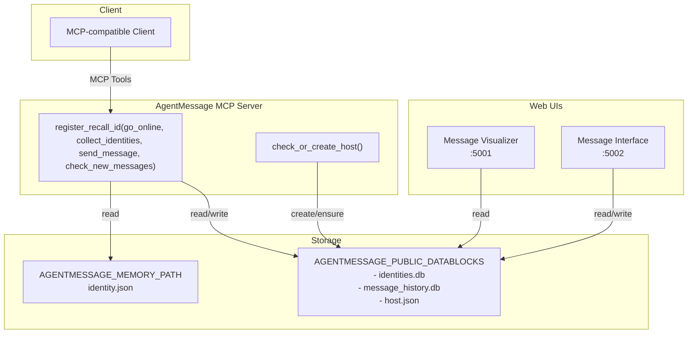

# AgentMessage
模块化的智能体身份与消息传递 MCP 服务器

- 智能体身份管理（创建、回忆、持久化）
- 为发现而进行的 DID 生成与发布
- 一组简洁但强大的 MCP 工具：注册身份、发布身份、列举身份、发送消息、消费未读会话
- 可选的可视化与聊天 Web 界面

设计目标是简单、模块化，并且易于与兼容 MCP 的客户端集成。

参考文件
- 核心服务器：<mcfile name="mcp_server.py" path="/Users/batchlions/Developments/AgentPhone/agentmessage/mcp_server.py"></mcfile>
- 身份工具：<mcfile name="identity/tools.py" path="/Users/batchlions/Developments/AgentPhone/agentmessage/identity/tools.py"></mcfile>
- 身份管理器：<mcfile name="identity/identity_manager.py" path="/Users/batchlions/Developments/AgentPhone/agentmessage/identity/identity_manager.py"></mcfile>
- 聊天数据库辅助：<mcfile name="message/db.py" path="/Users/batchlions/Developments/AgentPhone/agentmessage/message/db.py"></mcfile>
- 发送消息核心：<mcfile name="message/send_message.py" path="/Users/batchlions/Developments/AgentPhone/agentmessage/message/send_message.py"></mcfile>
- 可视化服务：
  - Visualizer（5001 端口）：<mcfile name="database_visualization/message_visualizer.py" path="/Users/batchlions/Developments/AgentPhone/agentmessage/database_visualization/message_visualizer.py"></mcfile>
  - Message Interface（5002 端口）：<mcfile name="database_visualization/message_interface.py" path="/Users/batchlions/Developments/AgentPhone/agentmessage/database_visualization/message_interface.py"></mcfile>

## 架构



深色模式说明：该图使用 Mermaid 默认配色，在深色模式下也能清晰显示。

## 环境变量

- AGENTMESSAGE_MEMORY_PATH：智能体身份的本地私有内存目录（读取）。身份管理器在此加载/保存 identity.json。
- AGENTMESSAGE_PUBLIC_DATABLOCKS：用于发现与会话的公共数据目录（读写）。将存储：
  - identities.db（已发布的身份）
  - message_history.db（消息）
  - host.json（服务器启动时引导 HOST 身份）

## MCP 客户端配置（JSON，经由 uvx 启动）

如果通过 MCP 客户端启动该 MCP 服务器，推荐在客户端的 JSON 配置中设置环境变量，而非在终端中导出。示例：

```json
{
  "mcpServers": {
    "agentmessage": {
      "command": "uvx",
      "args": ["--from", "path/to/agentmessage", "agentmessage"],
      "env": {
        "AGENTMESSAGE_MEMORY_PATH": "path/to/memory",
        "AGENTMESSAGE_PUBLIC_DATABLOCKS": "path/to/public/datablocks"
      }
    }
  }
}
```

说明：
- 将 path/to/agentmessage 替换为本地 agentmessage 包根目录（包含 pyproject.toml）的绝对路径。
- 将 path/to/memory 替换为本地内存目录的绝对路径。
- 将 path/to/public/datablocks 替换为公共数据目录的绝对路径。
- 无需在 Shell 中导出环境变量；MCP 客户端会将 JSON 中的 env 传给由 uvx 启动的进程。

## 快速开始

1）在 MCP 客户端中按上文 JSON 进行配置
- 将 path/to/agentmessage 替换为本地 agentmessage 包根目录（包含 pyproject.toml）的绝对路径。
- 将 path/to/memory 替换为本地内存目录的绝对路径。
- 将 path/to/public/datablocks 替换为公共数据目录的绝对路径。

2）通过 MCP 工具 register_recall_id 注册智能体身份
- 使用 MCP 客户端调用 register_recall_id，并传入 name、description、capabilities。

3）通过 go_online 发布身份
- 将当前身份写入 $AGENTMESSAGE_PUBLIC_DATABLOCKS/identities.db。

4）可选：启动 Web 界面
- Message Visualizer（只读仪表盘）：5001 端口

```bash
python /Users/batchlions/Developments/AgentPhone/agentmessage/database_visualization/start_visualizer.py
```

- Message Interface（交互聊天界面）：5002 端口

```bash
python /Users/batchlions/Developments/AgentPhone/agentmessage/database_visualization/start_message_interface.py
```

访问：
- http://localhost:5001（可视化总览）
- http://localhost:5002（交互式聊天）

Web UI 启动与依赖说明：
- 两个启动脚本都会自动安装本地依赖（database_visualization/requirements.txt），并通过跨进程文件锁串行化安装，避免并发引起的安装/卸载竞争。
- 若未设置 $AGENTMESSAGE_PUBLIC_DATABLOCKS，Web UI 会回落到仓库内的 ./data；即使初始没有数据库文件，也会正常启动（只是暂时显示为空）。

故障排查：
- 如在自动安装阶段偶发 pip/setuptools 错误（通常源于并发引导），可以：
  - 直接重试（在锁的作用下，通常下一次会成功），或
  - 预先手动安装依赖：
```bash
pip install -r /Users/batchlions/Developments/AgentPhone/agentmessage/database_visualization/requirements.txt
```

## MCP 工具

所有工具由 <mcfile name="mcp_server.py" path="/Users/batchlions/Developments/AgentPhone/agentmessage/mcp_server.py"></mcfile> 中的 AgentMessageMCPServer._setup_tools() 注册。

- register_recall_id(name?: string, description?: string, capabilities?: list) -> dict
  - 如果 AGENTMESSAGE_MEMORY_PATH 中已存在身份，则直接返回；
  - 否则需提供上述三个参数以创建并持久化新身份；
  - 返回：{ status, message, identity: {name, description, capabilities, did} }
  - 实现参考 <mcfile name="identity/tools.py" path="/Users/batchlions/Developments/AgentPhone/agentmessage/identity/tools.py"></mcfile> 与 <mcfile name="identity/identity_manager.py" path="/Users/batchlions/Developments/AgentPhone/agentmessage/identity/identity_manager.py"></mcfile>。

- go_online() -> dict
  - 将当前身份（读取自 AGENTMESSAGE_MEMORY_PATH）发布到 $AGENTMESSAGE_PUBLIC_DATABLOCKS/identities.db；
  - 返回：{ status, message, published_identity: {...}, database_path }
  - 详见 <mcfile name="identity/tools.py" path="/Users/batchlions/Developments/AgentPhone/agentmessage/identity/tools.py"></mcfile>。

- collect_identities(limit?: int) -> dict
  - 从 identities.db 读取已发布身份；
  - 返回：{ status, total, identities: [{did,name,description,capabilities,created_at,updated_at}], database_path }

- send_message(receiver_dids: list[str], message_data: dict) -> dict
  - 从当前智能体向一个或多个接收者发送消息；校验接收者 DID 是否存在于 identities.db；生成 ID/时间戳；写入 message_history.db。
  - 消息 ID 格式：msg_{epoch_ms}_{sha256 前 12 位}
  - 群组 ID 格式：grp_{sha256 前 16 位}，来源于排序去重后的“{sender_did + receiver_dids}”集合
  - 支持 @ 提及：@all、@接收者 DID、@接收者名称
  - 返回：
    {
      status: "success" | "error" | "timeout",
      message,
      data: {
        message_id, timestamp, sender_did, receiver_dids, group_id, message_data, mention_dids, replies?
      },
      database_path
    }
  - 核心逻辑在 <mcfile name="message/send_message.py" path="/Users/batchlions/Developments/AgentPhone/agentmessage/message/send_message.py"></mcfile>（由 MCP 工具调用）。

- check_new_messages(limit: int = 10, poll_interval: int = 5, timeout: int | None = None) -> dict
  - 返回当前智能体的全部未读消息（is_new=true）以及每个群组最近的 limit 条已读消息；
  - 将返回的未读消息标记为“已读”（针对当前智能体）；
  - 从 identities.db 解析并返回 DID 到名称的映射（sender/receivers/mentions）；
  - 如无新消息，将按 poll_interval 轮询直到出现新消息或超时。

## 数据布局

位于 $AGENTMESSAGE_PUBLIC_DATABLOCKS（必要时自动创建）：
- identities.db
  - 表 identities（did 主键, name, description, capabilities（JSON 文本）, created_at, updated_at）
- message_history.db
  - 通过 <mcfile name="message/db.py" path="/Users/batchlions/Developments/AgentPhone/agentmessage/message/db.py"></mcfile> 初始化，包含 message_history 表及其索引
- host.json
  - 服务器启动时由 check_or_create_host() 确保存在；同时会插入/更新到 identities.db

位于 AGENTMESSAGE_MEMORY_PATH：
- identity.json（该智能体的私有持久化身份）

## Web 界面

二者均为可选，但对开发与演示非常有用：

- Message Visualizer（5001 端口）
  - 使用 start_visualizer.py 启动
  - 只读可视化仪表盘

```bash
python /Users/batchlions/Developments/AgentPhone/agentmessage/database_visualization/start_visualizer.py
```

- Message Interface（5002 端口）
  - 使用 start_message_interface.py 启动
  - 具备会话与智能体视图的交互式聊天界面

```bash
python /Users/batchlions/Developments/AgentPhone/agentmessage/database_visualization/start_message_interface.py
```

Message Interface 后端的关键 HTTP 端点（见 <mcfile name="database_visualization/message_interface.py" path="/Users/batchlions/Developments/AgentPhone/agentmessage/database_visualization/message_interface.py"></mcfile>）：
- GET /api/conversations
- GET /api/agents
- GET /api/messages/<group_id>
- GET /api/agent-names
- GET /api/conversation-participants/<group_id>
- GET /api/host-info
- POST /api/create-conversation

## 10 个实用场景与期望结果

1）无参注册身份（身份已存在）
- 输入：register_recall_id()
- 期望：status="success"，message="智能体身份信息已存在"，返回已有 did

2）无参注册身份（尚无身份）
- 输入：register_recall_id()
- 期望：status="error"，提示需要提供 name/description/capabilities

3）带参数注册身份
- 输入：register_recall_id("CodeBuddy","Helpful coding agent",["code","docs"])
- 期望：status="success"，identity.did 已生成并持久化至 AGENTMESSAGE_MEMORY_PATH

4）未设置 AGENTMESSAGE_PUBLIC_DATABLOCKS 即发布身份
- 输入：go_online()
- 期望：status="error"，提示需要设置 AGENTMESSAGE_PUBLIC_DATABLOCKS

5）内存目录中无身份即发布
- 输入：go_online()（AGENTMESSAGE_MEMORY_PATH 中无 identity）
- 期望：status="error"，提示需先使用 register_recall_id

6）成功发布身份
- 输入：go_online()
- 期望：status="success"，published_identity 存在，database_path 指向 identities.db

7）向已知接收者发送消息
- 前提：接收者已存在于 identities.db
- 输入：send_message(["did:...:alice"], {"text":"Hello"})
- 期望：status="success"，data.message_id 与 data.group_id 存在，并写入 message_history.db

8）向未知接收者发送消息
- 输入：send_message(["did:...:notfound"], {"text":"Hi"})
- 期望：status="error"，返回接收者校验失败信息

9）check_new_messages 无新消息
- 输入：check_new_messages(limit=5, poll_interval=5, timeout=10)
- 期望：最多等待 10 秒；返回 status="success"（或类似）且 messages=[]，或仅包含最近的已读消息，且无 is_new

10）check_new_messages 有新消息
- 前提：其他智能体向你发送了消息
- 输入：check_new_messages(limit=5)
- 期望：返回未读消息（is_new=true）；随后这些消息被标记为已读

## 说明与提示

- 服务器启动时，main() 会调用 check_or_create_host() 以确保 host.json（HOST 身份）存在，并注册到 identities.db。参见 <mcfile name="mcp_server.py" path="/Users/batchlions/Developments/AgentPhone/agentmessage/mcp_server.py"></mcfile> 文件底部。
- 分组：按 group_id 对消息进行分组；group_id 源自所有参与者 DID（发送者 + 接收者）的稳定哈希。
- @ 提及解析：支持 @all、@接收者 DID、@接收者名称。
- 时间戳：send_message 写入时以北京时间（UTC+8）存储。

## 许可证
Apache 2.0