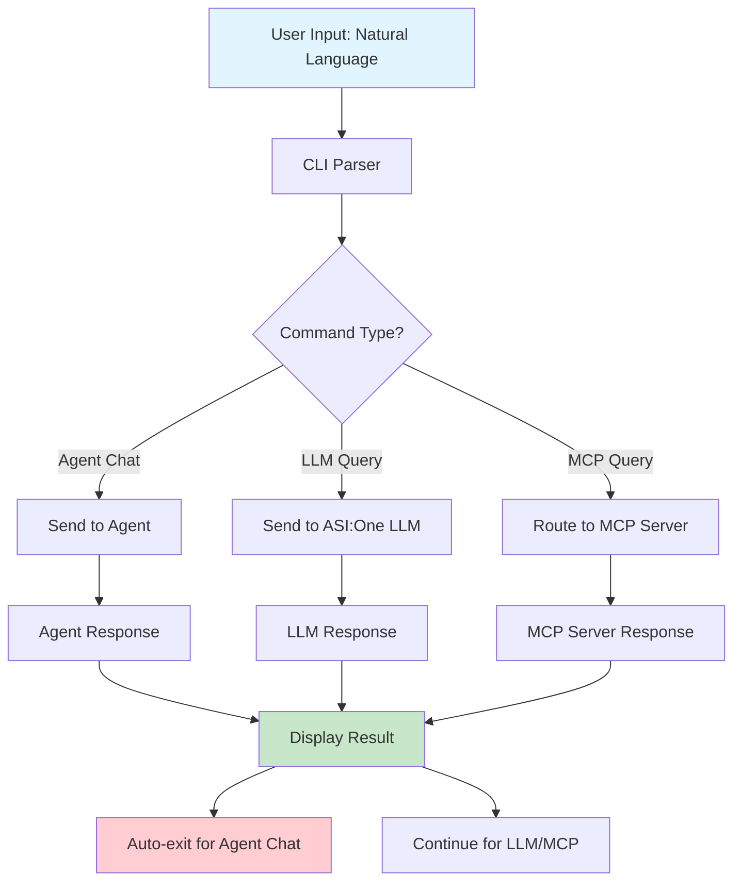

# FETCH.AI MCP CLI

A powerful CLI for interacting with the ASI:One LLM and Model Context Protocol (MCP) servers using **natural language queries** - no JSON required!

## Quick Start

### Installation

```bash
pip install asi1-mcp-cli
```

### Setup

1. **Create configuration directory:**
   ```bash
   mkdir -p ~/.asi1
   ```

2. **Create configuration file:**
   ```bash
   # Copy the example config
   cp $(python -c "import asi1_mcp_cli; import os; print(os.path.join(os.path.dirname(asi1_mcp_cli.__file__), '..', 'asi1-mcp-server-config-example.json'))") ~/.asi1/config.json
   ```

3. **Edit the configuration:**
   ```bash
   nano ~/.asi1/config.json
   ```

   Update the following fields:
   - `api_key`: Your ASI:One API key
   - `BRAVE_API_KEY`: Your Brave Search API key (optional)

### Usage

#### Basic Conversation
```bash
asi1 "What is the capital of France?"
```

#### Web Search (Natural Language - No JSON!)
```bash
asi1 "latest developments in quantum computing"
asi1 "What are the latest developments in quantum computing?"
```

#### List Available Prompts
```bash
asi1 --list-prompts
```

#### Use Specific Prompt Templates
```bash
# Code review
asi1 run p review

# Git commit
asi1 run p commit

# YouTube video summary
asi1 run p yt https://www.youtube.com/watch?v=example
```

## Configuration

The configuration file (`~/.asi1/config.json`) supports:
- `api_key`: Your ASI:One API key
- `BRAVE_API_KEY`: Your Brave Search API key (optional)
- Other LLM/MCP server settings as needed

### Configuration Example

```json
{
  "systemPrompt": "You are a helpful AI assistant",
  "llm": {
    "provider": "asi-one",
    "model": "asi1-mini",
    "api_key": "asi1-api",
    "temperature": 0,
    "base_url": "https://api.asi1.ai/v1"
  },
  "mcpServers": {
    "exa": {
      "command": "npx",
      "args": ["-y", "exa-mcp-server", "--tools=web_search"],
      "env": {
        "EXA_API_KEY": ""
      }
    },
    "brave-search": {
      "command": "npx",
      "args": ["-y", "@modelcontextprotocol/server-brave-search"],
      "env": {
        "BRAVE_API_KEY": ""
      }
    },
    "mcp-server-commands": {
      "command": "npx",
      "args": ["mcp-server-commands"],
      "requires_confirmation": ["run_command", "run_script"]
    }
  }
}
```

---

## 🔄 Workflow



---

## 🚀 Features

- **Natural Language Interface**: Simply type your query in plain English - no JSON or complex syntax required!
- **Beautiful CLI Header**: Eye-catching ASCII art and welcome message every time you start the CLI.
- **Agent Chat**: Send messages to other agents using `asi1 agent chat --address <agent_address> --message "..."`.
- **LLM/MCP Queries**: Use `asi1 <query>` or `asi1 run <query>` for natural language queries to the LLM or MCP server.
- **Prompt Templates**: Use pre-defined prompt templates for code review, commit messages, and YouTube summaries.
- **Backwards Compatible**: Old usage patterns still work—no need to change your workflow!
- **Call Agent, MCP Server, and LLM**: The CLI can route your query to an agent, the MCP server, or the LLM as needed.

---

## 🖥️ Example Usage

### 1. Show the CLI header and help
```sh
asi1 --help
```

### 2. Ask the LLM or MCP server a question (Natural Language!)
```sh
asi1 "What is the capital of France?"
asi1 "latest developments in quantum computing"
asi1 "Build a chat bot in JavaScript and HTML"
asi1 run "What are the latest AI developments?"
```

### 3. Use a prompt template
```sh
asi1 run p review
asi1 run p commit
asi1 run p yt https://www.youtube.com/watch?v=dQw4w9WgXcQ
```

### 4. Chat with another agent
```sh
asi1 agent chat --address <agent_address> --message "Get the latest tweet from Elon Musk"
```

---

## 🧠 Prompt Templates

You can use prompt templates for common tasks:
- `review`: Code review for your current git diff
- `commit`: Generate a Conventional Commit message for your changes
- `yt`: Summarize a YouTube video by URL

Example:
```sh
asi1 run p yt https://www.youtube.com/watch?v=dQw4w9WgXcQ
```

---

## 🔗 External Resources

- **[ASI:One Documentation](https://docs.asi1.ai/documentation/getting-started/overview)**: Official ASI:One platform documentation
- **[Agentverse](https://agentverse.ai/)**: Discover and interact with AI agents
- **ASI:One Models**: Choose from asi1-mini, asi1-fast, asi1-extended, asi1-agentic, and asi1-graph

---

## 🆕 Recent Improvements
- **Natural Language Interface**: No more JSON! Just type your query in plain English
- Premium, colorful CLI header with FETCH.AI MCP CLI branding
- Agent chat with auto-exit after first response
- Backward compatibility for LLM/MCP queries
- Improved help and usage examples
- Prompt templates for review, commit, and YouTube summary

---

## 🤝 Get Help
- Run `asi1 --help` for usage and examples
- For issues, open an issue on GitHub or contact the maintainers

---

**No more complex JSON!** Just type your query naturally and let the CLI handle the rest.

Enjoy using the FETCH.AI MCP CLI! Powered by [fetch.ai](https://fetch.ai/) and [ASI:One](https://docs.asi1.ai/).
