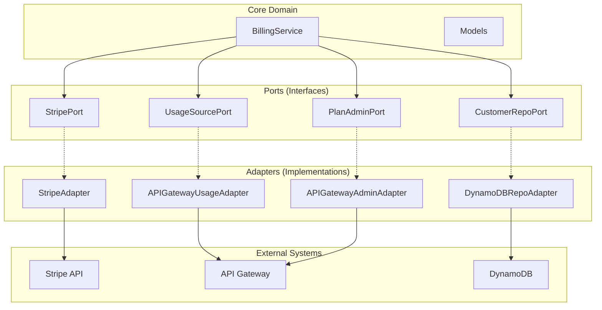

# Augint Billing Library

**Production-ready Python library for Stripe-powered usage-based billing with AWS integration.**

[](https://github.com/svange/augint-billing-lib/actions/workflows/pipeline.yaml)
[](https://pypi.org/project/augint-billing-lib/)
[](https://www.python.org/downloads/)
[](https://python-poetry.org/)
[](https://github.com/astral-sh/ruff)
[](LICENSE)

## 📊 Live Dashboards

| 📖 **[Documentation](https://svange.github.io/augint-billing-lib)** | 🧪 **[Unit Tests](https://svange.github.io/augint-billing-lib/unit-test-report.html)** | 🔬 **[Integration Tests](https://svange.github.io/augint-billing-lib/integration-test-report.html)** | 📊 **[Coverage](https://svange.github.io/augint-billing-lib/htmlcov/index.html)** | ⚡ **[Benchmarks](https://svange.github.io/augint-billing-lib/benchmark-report.html)** | 🔒 **[Security](https://svange.github.io/augint-billing-lib/security-reports.html)** | ⚖️ **[Compliance](https://svange.github.io/augint-billing-lib/license-compatibility.html)** |
|:-:|:-:|:-:|:-:|:-:|:-:|:-:|

## Overview

A serverless billing library that seamlessly integrates Stripe payment processing with AWS API Gateway usage tracking. Designed for SaaS applications with tiered pricing models, providing automatic plan transitions based on payment status and real-time usage reporting.

### Key Features

- **🎯 Usage-Based Billing** - Track API usage and automatically bill based on consumption
- **💳 Stripe Integration** - Complete payment processing with subscriptions and metered billing
- **🔄 Automatic Plan Transitions** - Move users between free and paid tiers based on payment status
- **📊 Real-Time Usage Reporting** - Hourly synchronization with Stripe for accurate billing
- **🏗️ Clean Architecture** - Ports & adapters pattern for maintainable, testable code
- **🚀 Serverless Ready** - Optimized for AWS Lambda with minimal cold start overhead
- **🛡️ Production Hardened** - Retry logic, circuit breakers, and comprehensive error handling

## Quick Start

### Installation

```bash
pip install augint-billing-lib
```

### Basic Usage

```python
from augint_billing_lib import bootstrap

# Process a Stripe webhook event
result = bootstrap.process_event_and_apply_plan_moves({
    "type": "payment_method.attached",
    "data": {"object": {"customer": "cus_123"}}
})

# Report usage to Stripe
reports = bootstrap.report_current_hour_usage()
```

### CLI Commands

```bash
# Show environment configuration
poetry run ai-billing env-dump

# Handle Stripe events locally
poetry run ai-billing handle-event --file tests/fixtures/setup_intent.succeeded.json

# Report usage to Stripe
poetry run ai-billing sync-usage

# Monitor Zero-Touch operations
poetry run ai-billing monitor dashboard

# Check infrastructure status
poetry run ai-billing infra status
```

## Architecture

The library follows a **Ports & Adapters** (Hexagonal) architecture pattern:



### Core Components

- **`BillingService`** - Orchestrates billing operations and business logic
- **`Ports`** - Abstract interfaces defining external dependencies
- **`Adapters`** - Concrete implementations for AWS and Stripe
- **`Bootstrap`** - Dependency injection and Lambda handler setup

## Billing Flows

### 1. Card Attachment → Plan Promotion

When a user adds a payment method:
1. Stripe sends `payment_method.attached` event
2. Service ensures metered subscription exists
3. API key moves from `FREE_10K` to `METERED` usage plan
4. DynamoDB updated with new plan status

### 2. Payment Failure → Plan Demotion

When payment fails:
1. Stripe sends `invoice.payment_failed` event
2. Service cancels metered subscription
3. API key moves back to `FREE_10K` usage plan
4. User continues with free tier limits

### 3. Hourly Usage Reporting

Every hour:
1. Lambda triggered by CloudWatch schedule
2. Fetches usage from API Gateway for all metered users
3. Calculates delta from last reported checkpoint
4. Reports usage to Stripe with idempotency
5. Updates DynamoDB with new checkpoint

## Configuration

### Required Environment Variables

```bash
# CloudFormation stack identifier
STACK_NAME=augint-billing-prod

# AWS region for resources
AWS_REGION=us-east-1

# Stripe authentication (use one)
STRIPE_SECRET_KEY=sk_live_...
# OR
STRIPE_SECRET_ARN=arn:aws:secretsmanager:...
```

### Optional Environment Variables

```bash
# DynamoDB table name (default: {STACK_NAME}-customer-links)
TABLE_NAME=billing-customer-links

# API Gateway usage plan IDs
FREE_USAGE_PLAN_ID=FREE_10K        # Default free tier plan
METERED_USAGE_PLAN_ID=METERED      # Default paid tier plan

# API Gateway product ID (auto-discovered if not set)
API_USAGE_PRODUCT_ID=prod_123
```

## Development

### Setup

```bash
# Clone repository
git clone https://github.com/svange/augint-billing-lib.git
cd augint-billing-lib

# Install dependencies
poetry install

# Run tests
make test              # Unit tests only
make test-integration  # Integration tests
make test-e2e         # End-to-end tests
make test-all         # All tests

# Code quality
poetry run pre-commit run --all-files
```

### Testing Strategy

The library uses a **"Mock at the Boundaries"** approach:
- Unit tests mock external services (Stripe, AWS)
- Integration tests use real adapters with mocked APIs
- E2E tests validate complete workflows

### Project Structure

```
src/augint_billing_lib/
├── adapters/          # Concrete implementations
│   ├── stripe.py      # Stripe API integration
│   ├── ddb_repo.py    # DynamoDB repository
│   ├── apigw_usage.py # Usage data collection
│   └── apigw_admin.py # Plan administration
├── ports.py           # Abstract interfaces
├── service.py         # Core business logic
├── models.py          # Data models
├── bootstrap.py       # Dependency injection
└── cli.py            # CLI commands
```

## Documentation

- **[Product Requirements](documentation/PRD.md)** - Business requirements and goals
- **[Technical Contract](documentation/CONTRACT.md)** - Cross-repository integration spec
- **[Implementation Plan](documentation/PLAN.md)** - Development roadmap and testing strategy
- **[Architecture Flows](documentation/FLOWS.md)** - Sequence diagrams for key workflows
- **[Class Diagram](documentation/CLASS_DIAGRAM.md)** - System architecture overview

## Contributing

We welcome contributions! Please follow these guidelines:

### Branch Naming

- `feat/issue-N-description` - New features
- `fix/issue-N-description` - Bug fixes
- `docs/issue-N-description` - Documentation
- `test/issue-N-description` - Test improvements
- `chore/issue-N-description` - Maintenance

### Commit Convention

Use conventional commits:
```bash
feat: add usage caching layer
fix: handle month boundary in usage reporting
docs: update stripe integration guide
test: add e2e payment flow tests
chore: update dependencies
```

### Pull Request Process

1. Create feature branch from `main`
2. Write tests for new functionality
3. Ensure all tests pass (`make test-all`)
4. Run pre-commit checks (`poetry run pre-commit run --all-files`)
5. Create PR with clear description
6. Link issues with `Closes #N` or `Refs #N`

## License

This project is proprietary software. All rights reserved. See [LICENSE](LICENSE) for details.

## Support

- **Issues**: [GitHub Issues](https://github.com/svange/augint-billing-lib/issues)
- **Discussions**: [GitHub Discussions](https://github.com/svange/augint-billing-lib/discussions)
- **Security**: Report vulnerabilities via [GitHub Security](https://github.com/svange/augint-billing-lib/security)

---

**Built for Production** • **Serverless First**
