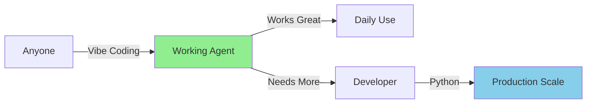

# Automagik Hive

**Vibe your AI agents into existence** - The only framework where natural language creates production-ready multi-agent systems. Describe what you want, get coordinated AI teams that actually work together.

<div align="center">

⚡ Built on Agno's blazing-fast core (3μs agent instantiation)  
🤖 Currently supports vibe coding via Claude Code (more AI assistants coming soon)

[](https://www.python.org/downloads/)
[](https://github.com/agno-agi/agno)
[](https://www.postgresql.org/)
[](https://fastapi.tiangolo.com/)
[](https://www.docker.com/)

[Get Started](#get-started-in-minutes) • [Watch Demo](#see-vibe-coding-in-action) • [Examples](#what-people-are-building) • [Join Community](#join-the-movement)

</div>

## See Vibe Coding in Action

[Placeholder: 30-second demo video showing natural language → working agent]
<!-- TODO: Add demo showing vibe coding creating a customer support team -->

Watch how describing "I need a customer support team" becomes a fully deployed multi-agent system with intelligent routing, shared context, and production-ready APIs.

## Get Started in Minutes

### Option 1: Vibe Coding (Claude Code)
```bash
# One-line install
curl -sSL https://raw.githubusercontent.com/namastexlabs/automagik-hive/main/install.sh | bash

# Launch in Claude Code
automagik-hive genie

# Vibe your first agent into existence
> I need a customer support agent that handles billing questions
```
*Currently available in Claude Code. Support for Cursor, Codex, and other AI assistants coming soon.*

### Option 2: YAML Configuration (Available Now for All)
```bash
# Create agents with simple YAML - no AI assistant required
automagik-hive --init my-workspace

# Edit ai/agents/*/config.yaml
automagik-hive --dev
```

**Ready to build your second agent? →** [View Examples](#what-people-are-building)

## The Multi-Agent Reality Check

### What Others Call "Multi-Agent"
❌ Simple agents chained with unreliable tool calling  
❌ No shared state between agents  
❌ Message passing that breaks under load  
❌ "No-code" that hits walls immediately  

### What We Built
✅ **True coordination** with shared memory and context  
✅ **Deterministic workflows** that validate and retry  
✅ **Vibe coding** that extends to real Python  
✅ **Production systems** running hundreds of agents  

## How We Compare

| Feature | Automagik Hive | LangChain | AutoGen | CrewAI |
|---------|---------------|-----------|---------|---------|
| **Vibe Coding** | ✅ Natural language | ❌ Code only | ❌ Code only | ❌ YAML only |
| **True Multi-Agent** | ✅ Shared state & memory | ⚠️ Tool calling | ⚠️ Message passing | ✅ Coordination |
| **Time to First Agent** | Minutes | 30+ minutes | 20+ minutes | 10+ minutes |
| **Agent Performance** | 3μs instantiation | Varies | Varies | Varies |
| **Production Ready** | ✅ Built-in | ⚠️ DIY | ⚠️ DIY | ✅ Yes |

## What People Are Building

### 🎯 Personal Assistant - Daily Task Management
**Challenge**: Keeping track of emails, calendar, and tasks across platforms  
**Solution**: Personal coordination agent that analyzes and prioritizes
```
Vibe: "I need an assistant that reads my emails, identifies action items, 
and creates calendar reminders for important deadlines"
```
**Result**: Never miss deadlines, automated task extraction

### 🏢 Customer Support Team - Intelligent Routing
**Challenge**: Handle diverse customer queries without hiring multiple specialists  
**Solution**: Multi-agent team with automatic routing
```yaml
team:
  mode: route  # Automatic intelligent routing
  name: "Customer Service AI"
  members:
    - billing-specialist
    - technical-support
    - account-manager
```
**Result**: 24/7 support, 70% query resolution without human intervention

### 💼 Enterprise Workflow - Order Processing
**Challenge**: Complex order fulfillment with multiple validation steps  
**Solution**: Deterministic workflow with parallel processing
```yaml
workflow:
  name: "Order Fulfillment"
  steps:
    - validate_input      # Ensure data is correct
    - parallel:           # Speed up independent tasks
        - check_inventory
        - verify_payment
        - calculate_shipping
    - process_order
    - send_notification
```
**Result**: 3x faster processing, automatic fraud detection

### 📊 SaaS Lead Qualification
**Prototype**: Natural language lead scoring rules  
**Production**: Python integration with CRM and enrichment APIs
```python
# Started with vibe coding, extended with Python
def enhance_lead_scorer():
    agent = Agent.from_yaml("lead-scorer/config.yaml")
    agent.add_tool(enrich_company_data)  # Custom API integration
    agent.add_tool(calculate_lead_score)  # Proprietary scoring
    return agent
```
**Result**: Sales team iterates on scoring rules without dev help, 40% better conversion

**Found your use case? Start building →** [Get Started](#get-started-in-minutes)

## Why It's Fast

Built on **Agno's blazing-fast core**:
- **3 microseconds** agent instantiation (spawn 1000s of agents instantly)
- **6.5KB** memory per agent (run entire teams on minimal infrastructure)
- **Model agnostic** - Use any LLM without vendor lock-in
- **True multi-agent coordination** - Shared context and memory (not just tool calling)

Unlike other "multi-agent" frameworks that just chain simple agents with unreliable tool calling, Automagik Hive provides genuine team coordination with shared state and deterministic workflows.

## Your Journey

**Discover (1 min)** → **First Agent (5 min)** → **Understanding (30 min)** → **Production (Your pace)**

No overwhelming documentation. Learn as you build.

### Phase 1: Rapid Prototyping
- Vibe agents into existence with natural language (Claude Code)
- Or define agents in YAML - no AI assistant needed
- Test behaviors instantly via REST API
- Iterate without complex code

### Phase 2: Enhancement (When Needed)
- Add custom tools and integrations
- Implement business logic in Python
- Connect to your databases
- Extend with pure Python

### Phase 3: Production Deployment
- Use `automagik-hive --serve` for Docker deployment
- PostgreSQL + pgvector included
- Authentication built-in
- Scale horizontally

**No rewrites. No migrations. No platform lock-in.**

## Architecture That Scales



### Start Simple with YAML
```yaml
# ai/agents/support-agent/config.yaml
agent:
  name: "Customer Support"
  agent_id: "support-agent"
  
instructions: |
  You help customers with billing and account issues.
  You have access to the knowledge base.
  
knowledge_filter:
  business_unit_filter: "customer_support"
```

### Extend with Python When Needed
```python
# ai/agents/support-agent/agent.py
from agno.agent import Agent

def get_support_agent() -> Agent:
    # Start with YAML config
    agent = Agent.from_yaml("config.yaml")
    
    # Add custom logic when needed
    agent.add_tool(check_billing_system)
    agent.add_tool(create_support_ticket)
    
    # Full Agno API available - no restrictions!
    return agent
```

**See the power? Install now →** [Installation Guide](#get-started-in-minutes)

## Deterministic Workflows

While vibe coding handles 80% of use cases, sometimes you need guarantees:

### Teams vs Workflows
**Use Teams** for intelligent routing and collaboration  
**Use Workflows** for deterministic, validated execution

```yaml
# Chain agents like LEGO blocks with guarantees
workflow:
  name: "Order Processing"
  steps:
    - validate_input      # Ensure data is correct
    - process_payment     # With retry logic
    - parallel:           # Speed up independent tasks
        - check_inventory
        - calculate_shipping
        - verify_fraud
    - validate_output     # Confirm results
    - retry_if_failed     # Automatic recovery
```

### Why Workflows Matter
- **Deterministic Results**: Same input → same output, every time
- **Input/Output Validation**: Catch errors before they propagate
- **Automatic Retry**: Built-in recovery from transient failures
- **Parallel Performance**: Run independent steps simultaneously
- **Audit Trail**: Track every step for compliance

## Built by Practitioners, for Practitioners

We created Automagik Hive to solve our own frustrations at Namastex Labs. After building multi-agent systems for clients ranging from startups to Fortune 500 companies, we were tired of:

- Rewriting the same boilerplate for every project
- "Multi-agent" tools that were just simple agents with flaky tool calling
- Prototypes that needed complete rewrites for production

So we built the framework we wished existed. Now we're sharing it with you.

**In Production**: Powering hundreds of agents for real businesses  
**Battle-Tested**: From startup MVPs to enterprise-scale deployments  
**Continuously Improved**: We use this daily, so we keep it working

## Who's Using Automagik Hive?

### 🎯 Individual Developers
**Tired of**: Writing 1000 lines of boilerplate for simple agents  
**With Hive**: Vibe your idea → Working agent in minutes  
**Result**: Ship AI features 10x faster

### 🏢 Product Teams
**Tired of**: Waiting weeks for dev resources to prototype  
**With Hive**: Natural language → Testable agents immediately  
**Result**: Validate ideas before writing code

### 🚀 Enterprises
**Tired of**: Prototypes that can't scale to production  
**With Hive**: Same YAML from prototype to millions of requests  
**Result**: Innovation at startup speed, enterprise reliability

## GENIE: Your Vibe Coding Companion

GENIE transforms natural language into working AI systems through vibe coding.

```bash
# Launch GENIE in Claude Code
automagik-hive genie

# Vibe your agents into existence
> I need a data pipeline agent that processes CSV files and sends summaries to Slack

# GENIE creates:
# - YAML configuration
# - Python extension points
# - REST API endpoints
# - Documentation
```

**Currently Available**: Claude Code users can vibe agents today  
**Coming Soon**: Cursor, Codex, Gemini CLI, Open Coder

Even without GENIE, you can:
- Build with YAML configuration (no AI assistant needed)
- Use templates to get started quickly
- Extend with Python when ready

*GENIE accelerates development but isn't required - the framework stands on its own.*

## Installation

### Quick Install (Recommended)
```bash
# One-line installation
curl -sSL https://raw.githubusercontent.com/namastexlabs/automagik-hive/main/install.sh | bash

# Initialize your workspace
automagik-hive --init my-ai-workspace

# Start building
automagik-hive --dev
```

### Manual Installation
```bash
# Clone the repository
git clone https://github.com/namastexlabs/automagik-hive.git
cd automagik-hive

# Install with UV (recommended)
uv sync

# Or with pip
pip install -e .

# Set up environment
cp .env.example .env
# Edit .env with your configuration

# Start development server
uv run automagik-hive --dev
```

### Docker Deployment
```bash
# Production deployment with Docker
automagik-hive --serve

# Your agents are now live!
# API: http://localhost:8886
# Database: PostgreSQL with pgvector
# Auth: Built-in API key authentication
```

## Project Structure

```
my-ai-workspace/
├── ai/
│   ├── agents/           # Your AI agents
│   │   └── my-agent/
│   │       ├── config.yaml    # Agent definition
│   │       └── agent.py       # Optional Python extensions
│   ├── teams/            # Multi-agent teams
│   │   └── my-team/
│   │       └── config.yaml    # Team routing logic
│   └── workflows/        # Business workflows
│       └── my-workflow/
│           └── config.yaml    # Step definitions
├── knowledge/            # RAG knowledge base
│   └── data.csv         # Your knowledge data
└── .env                 # Configuration
```

## API Endpoints

Every agent, team, and workflow automatically gets REST API endpoints:

```bash
# Single agent
POST /v1/agents/{agent_id}/run
GET  /v1/agents/{agent_id}/sessions

# Team routing
POST /v1/teams/{team_id}/run

# Workflow execution
POST /v1/workflows/{workflow_id}/run

# Knowledge management
POST /v1/knowledge/upsert
GET  /v1/knowledge/search
```

## Advanced Features

### Knowledge RAG System
```python
# Automatic vector search from CSV data
agent.knowledge_filter = {
    "business_unit_filter": "customer_support",
    "product_filter": "billing"
}
```

### Session Management
```python
# Maintain conversation context
session = agent.create_session(user_id="customer-123")
response = session.run("What's my billing status?")
```

### Custom Tools
```python
# Add any Python function as a tool
@agent.tool
def check_inventory(product_id: str) -> dict:
    """Check product availability"""
    return {"available": True, "quantity": 42}
```

### Model Flexibility
```yaml
# Use any LLM provider
agent:
  model: "gpt-4"  # or claude-3, gemini-pro, llama-3, etc.
  provider: "openai"  # 23+ providers supported via Agno
```

## Roadmap

### Available Now
- ✅ YAML-first agent configuration
- ✅ Python extensibility
- ✅ Auto-generated REST APIs
- ✅ PostgreSQL + pgvector integration
- ✅ Docker deployment
- ✅ GENIE with Claude Code (vibe coding support)

### Coming Soon
- 🔄 GENIE for Cursor
- 🔄 GENIE for Codex
- 🔄 GENIE for Gemini CLI
- 🔄 GENIE for Open Coder
- 🔄 Visual workflow designer
- 🔄 Agent marketplace
- 🔄 One-click cloud deployment

### Under Consideration
- 💭 WebSocket streaming improvements
- 💭 GraphQL API generation
- 💭 Kubernetes operators
- 💭 Monitoring dashboard

## Join the Movement

We're preparing for public launch. Be among the first:

### Early Access Benefits
- 🎯 **Priority Support** - Direct access to the team building this
- 🚀 **Shape the Framework** - Your feedback drives our roadmap
- 📚 **Exclusive Resources** - Early access to templates and guides
- 🤝 **Founding Member Status** - Recognition in the community

### Get Involved
- ⭐ **Star this repo** to show support
- 👀 **Watch** for updates and releases
- 🐛 **Report issues** to help us improve
- 🔀 **Submit PRs** - we welcome contributions!

## Contributing

We welcome contributions! Whether it's bug fixes, new features, or documentation improvements, we appreciate your help.

### Development Setup
```bash
# Clone and install dev dependencies
git clone https://github.com/namastexlabs/automagik-hive.git
cd automagik-hive
uv sync

# Run tests
uv run pytest

# Run linting
uv run ruff check --fix

# Run type checking
uv run mypy .
```

### Contribution Guidelines
1. Fork the repository
2. Create a feature branch (`git checkout -b feature/amazing-feature`)
3. Commit your changes (`git commit -m 'Add amazing feature'`)
4. Push to the branch (`git push origin feature/amazing-feature`)
5. Open a Pull Request

## License

Automagik Hive is MIT licensed. See [LICENSE](LICENSE) file for details.

## Support

- 📖 [Documentation](https://github.com/namastexlabs/automagik-hive/wiki)
- 💬 [Discord Community](https://discord.gg/CEbzP5Hteh) 
- 🐛 [Issue Tracker](https://github.com/namastexlabs/automagik-hive/issues)
- 💬 [Discussions](https://github.com/namastexlabs/automagik-hive/discussions)

## Acknowledgments

Built with ❤️ by [Namastex Labs](https://namastexlabs.com) using:
- [Agno](https://agno.com) - The blazing-fast multi-agent framework
- [PostgreSQL](https://www.postgresql.org/) - The world's most advanced open source database
- [pgvector](https://github.com/pgvector/pgvector) - Vector similarity search for PostgreSQL
- [FastAPI](https://fastapi.tiangolo.com/) - Modern, fast web framework for building APIs

---

<div align="center">

**Ready to vibe your first agent into existence?**

[🚀 Get Started Now](#get-started-in-minutes) | [📺 Watch Demo](#see-vibe-coding-in-action) | [⭐ Star on GitHub](https://github.com/namastexlabs/automagik-hive)

*The first framework bringing vibe coding to true multi-agent systems. Natural language creates production-ready AI teams with genuine coordination.*

Made with ❤️ by the **Automagik Team**

</div>