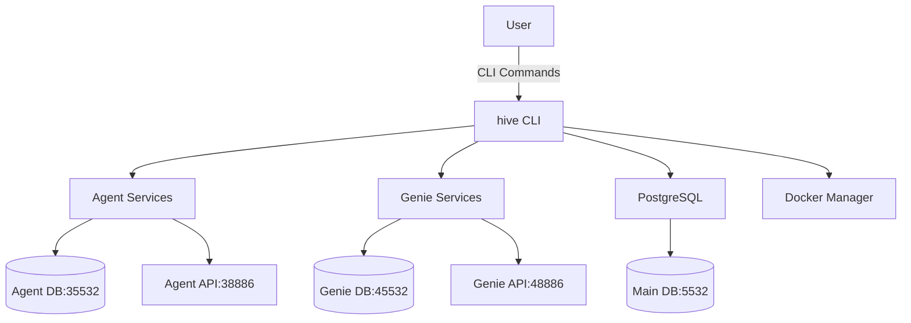
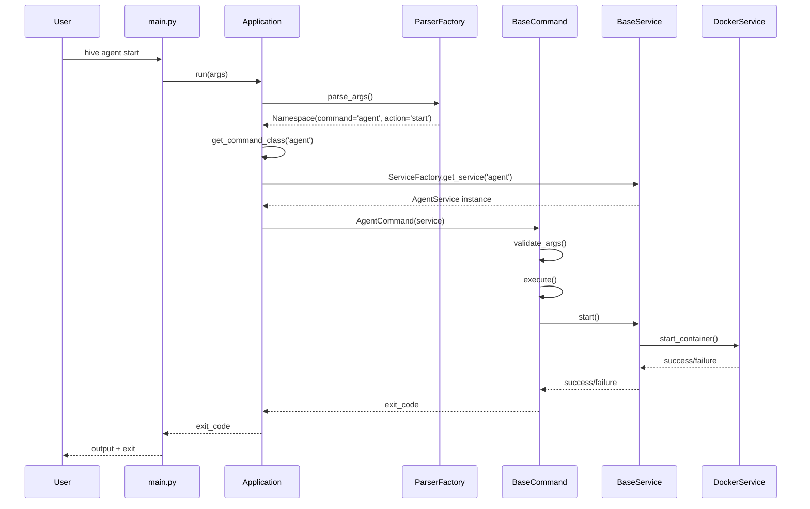
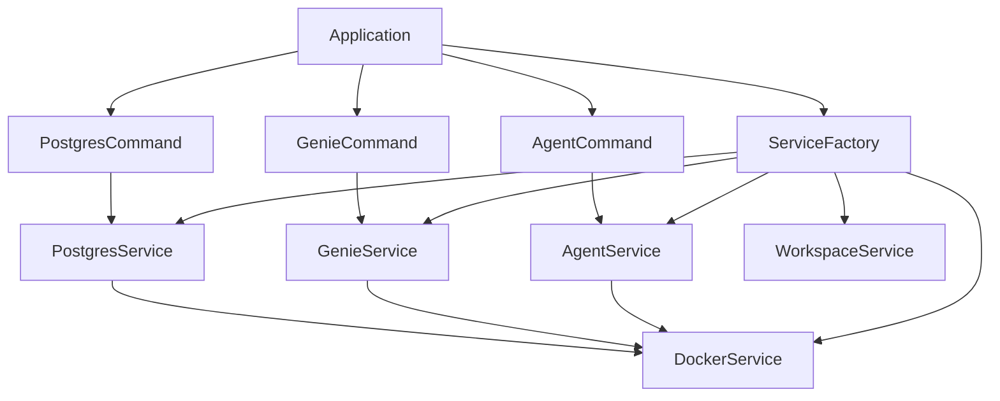

# Detailed Design Document: CLI Folder Reorganization

## Executive Summary

This Detailed Design Document (DDD) provides comprehensive architectural specifications for refactoring the Automagik Hive CLI from the current monolithic, inconsistent structure to a modern, clean command architecture. This is a complete clean-break refactor with zero backward compatibility, implementing direct command patterns with the program name changed from `automagik-hive` to `hive`.

## Architecture Overview

### Core Design Principles

1. **Clean Architecture**: Strict separation between commands, services, and utilities
2. **Direct Command Pattern**: Modern CLI approach with `hive <command> <subcommand>` structure
3. **Single Responsibility**: Each file has one clear purpose under 300 lines
4. **No Fake Parameters**: Eliminate meaningless workspace parameters
5. **Dependency Injection**: Services injected into commands for testability
6. **Zero Legacy Code**: Complete replacement with no backward compatibility

### System Context Diagram



## Detailed Class Architecture

### 1. Base Command Pattern

```python
# cli/commands/base.py
from abc import ABC, abstractmethod
from typing import Any, Dict, Optional
from argparse import Namespace
from cli.services.base import BaseService

class BaseCommand(ABC):
    """Base command interface implementing Command pattern."""
    
    def __init__(self, service: Optional[BaseService] = None):
        """Initialize command with optional service dependency."""
        self.service = service
    
    @abstractmethod
    def execute(self, args: Namespace) -> int:
        """Execute command with parsed arguments.
        
        Returns:
            0 for success, non-zero for failure
        """
        pass
    
    @abstractmethod
    def validate_args(self, args: Namespace) -> bool:
        """Validate command arguments before execution."""
        pass
    
    def handle_error(self, error: Exception) -> int:
        """Standard error handling across all commands."""
        from cli.utils.console import error_console
        error_console.print(f"[red]Error: {error}[/red]")
        return 1
```

### 2. Service Layer Architecture

```python
# cli/services/base.py
from abc import ABC, abstractmethod
from typing import Optional, Dict, Any
from pathlib import Path

class BaseService(ABC):
    """Base service for business logic separation."""
    
    def __init__(self, docker_service: Optional['DockerService'] = None):
        """Initialize with optional docker service dependency."""
        self.docker_service = docker_service
    
    @abstractmethod
    def install(self) -> bool:
        """Install service components."""
        pass
    
    @abstractmethod
    def start(self) -> bool:
        """Start service."""
        pass
    
    @abstractmethod
    def stop(self) -> bool:
        """Stop service."""
        pass
    
    @abstractmethod
    def status(self) -> Dict[str, Any]:
        """Get service status."""
        pass
    
    def restart(self) -> bool:
        """Restart service (default implementation)."""
        return self.stop() and self.start()
```

### 3. Parser Factory Pattern

```python
# cli/parser.py
import argparse
from typing import Dict, Type
from cli.commands.base import BaseCommand

class ParserFactory:
    """Factory for creating argument parser with clean command structure."""
    
    @staticmethod
    def create_parser() -> argparse.ArgumentParser:
        """Create main parser with subcommands."""
        parser = argparse.ArgumentParser(
            prog='hive',
            description='Automagik Hive - Multi-Agent AI Framework',
            formatter_class=argparse.RawDescriptionHelpFormatter
        )
        
        # Global flags (actual global flags only)
        parser.add_argument('--version', action='version', version='%(prog)s 1.0.0')
        parser.add_argument('--verbose', '-v', action='store_true', help='Verbose output')
        parser.add_argument('--quiet', '-q', action='store_true', help='Suppress output')
        
        # Create subparsers
        subparsers = parser.add_subparsers(
            dest='command',
            help='Available commands',
            metavar='<command>'
        )
        
        # Agent commands (Docker-only, no workspace)
        ParserFactory._add_agent_commands(subparsers)
        
        # Genie commands (Docker-only, no workspace)
        ParserFactory._add_genie_commands(subparsers)
        
        # PostgreSQL commands (single instance, no workspace)
        ParserFactory._add_postgres_commands(subparsers)
        
        # Direct commands (no workspace parameters)
        ParserFactory._add_direct_commands(subparsers)
        
        return parser
    
    @staticmethod
    def _add_agent_commands(subparsers):
        """Add agent command group."""
        agent = subparsers.add_parser('agent', help='Agent Docker management')
        agent_sub = agent.add_subparsers(dest='action', help='Agent actions')
        
        agent_sub.add_parser('install', help='Install agent Docker containers')
        agent_sub.add_parser('start', help='Start agent containers')
        agent_sub.add_parser('stop', help='Stop agent containers')
        agent_sub.add_parser('restart', help='Restart agent containers')
        agent_sub.add_parser('status', help='Check container status')
        
        logs = agent_sub.add_parser('logs', help='View container logs')
        logs.add_argument('--tail', type=int, default=20, help='Number of lines to show')
        
        agent_sub.add_parser('reset', help='Reset Docker environment')
    
    @staticmethod
    def _add_genie_commands(subparsers):
        """Add genie command group."""
        genie = subparsers.add_parser('genie', help='Genie Docker management / Launch Claude with GENIE.md')
        genie.add_argument('claude_args', nargs='*', help='Arguments to pass to claude')
        genie_sub = genie.add_subparsers(dest='action', help='Genie actions')
        
        genie_sub.add_parser('install', help='Install genie Docker containers')
        genie_sub.add_parser('start', help='Start genie containers')
        genie_sub.add_parser('stop', help='Stop genie containers')
        genie_sub.add_parser('restart', help='Restart genie containers')
        genie_sub.add_parser('status', help='Check container status')
        
        logs = genie_sub.add_parser('logs', help='View container logs')
        logs.add_argument('--tail', type=int, default=20, help='Number of lines to show')
        
        genie_sub.add_parser('reset', help='Reset Docker environment')
        
        # Note: Direct 'genie' command (without subcommand) launches Claude with GENIE.md
        # This is handled in the main routing logic, not as a subparser
    
    @staticmethod
    def _add_postgres_commands(subparsers):
        """Add PostgreSQL command group."""
        postgres = subparsers.add_parser('postgres', help='Main PostgreSQL management')
        postgres_sub = postgres.add_subparsers(dest='action', help='PostgreSQL actions')
        
        postgres_sub.add_parser('start', help='Start main PostgreSQL')
        postgres_sub.add_parser('stop', help='Stop main PostgreSQL')
        postgres_sub.add_parser('restart', help='Restart main PostgreSQL')
        postgres_sub.add_parser('status', help='Check PostgreSQL status')
        
        logs = postgres_sub.add_parser('logs', help='View PostgreSQL logs')
        logs.add_argument('--tail', type=int, default=20, help='Number of lines to show')
        
        postgres_sub.add_parser('health', help='Check database health')
    
    @staticmethod
    def _add_direct_commands(subparsers):
        """Add direct commands without subcommands."""
        # Server commands
        serve = subparsers.add_parser('serve', help='Start production server')
        serve.add_argument('--host', default='0.0.0.0', help='Host to bind')
        serve.add_argument('--port', type=int, default=8886, help='Port to bind')
        
        dev = subparsers.add_parser('dev', help='Start development server')
        dev.add_argument('--host', default='0.0.0.0', help='Host to bind')
        dev.add_argument('--port', type=int, default=8886, help='Port to bind')
        
        # System commands
        subparsers.add_parser('install', help='Install automagik-hive system')
        subparsers.add_parser('uninstall', help='Uninstall entire system')
        
        init = subparsers.add_parser('init', help='Initialize workspace')
        init.add_argument('name', nargs='?', help='Workspace name (current dir if omitted)')
        
        subparsers.add_parser('health', help='System health check')
```

### 4. Application Router

```python
# cli/app.py
from typing import Dict, Type, Optional
from argparse import Namespace
from cli.parser import ParserFactory
from cli.commands.base import BaseCommand
from cli.commands.agent import AgentCommand
from cli.commands.genie import GenieCommand
from cli.commands.postgres import PostgresCommand
from cli.commands.serve import ServeCommand
from cli.commands.dev import DevCommand
from cli.commands.install import InstallCommand
from cli.commands.uninstall import UninstallCommand
from cli.commands.health import HealthCommand
from cli.commands.workspace import WorkspaceCommand
from cli.services.service_factory import ServiceFactory

class Application:
    """Main application router with dependency injection."""
    
    def __init__(self):
        """Initialize application with command registry."""
        self.parser = ParserFactory.create_parser()
        self.service_factory = ServiceFactory()
        self.command_registry = self._build_command_registry()
    
    def _build_command_registry(self) -> Dict[str, Type[BaseCommand]]:
        """Build registry of available commands."""
        return {
            'agent': AgentCommand,
            'genie': GenieCommand,
            'postgres': PostgresCommand,
            'serve': ServeCommand,
            'dev': DevCommand,
            'install': InstallCommand,
            'uninstall': UninstallCommand,
            'health': HealthCommand,
            'init': WorkspaceCommand,
        }
    
    def run(self, args: list[str]) -> int:
        """Run application with given arguments."""
        try:
            parsed_args = self.parser.parse_args(args)
            
            if not parsed_args.command:
                self.parser.print_help()
                return 1
            
            return self._execute_command(parsed_args)
            
        except KeyboardInterrupt:
            return 130
        except Exception as e:
            from cli.utils.console import error_console
            error_console.print(f"[red]Unexpected error: {e}[/red]")
            return 1
    
    def _execute_command(self, args: Namespace) -> int:
        """Execute the specified command."""
        command_class = self.command_registry.get(args.command)
        if not command_class:
            self.parser.print_help()
            return 1
        
        # Special handling for genie command
        if args.command == 'genie' and not args.action:
            # Direct 'genie' command launches Claude
            from cli.commands.genie import GenieCommand
            service = self.service_factory.get_service('genie')
            command = GenieCommand(service)
            return 0 if command.launch_claude(args.claude_args) else 1
        
        # Inject appropriate service
        service = self.service_factory.get_service(args.command)
        command = command_class(service)
        
        # Validate and execute
        if not command.validate_args(args):
            return 1
        
        return command.execute(args)
```

## Command Implementation Specifications

### 1. Agent Command Implementation

```python
# cli/commands/agent.py
from argparse import Namespace
from cli.commands.base import BaseCommand
from cli.services.agent import AgentService
from cli.utils.console import console, error_console

class AgentCommand(BaseCommand):
    """Agent Docker management commands."""
    
    def __init__(self, service: AgentService):
        super().__init__(service)
        self.agent_service = service
    
    def validate_args(self, args: Namespace) -> bool:
        """Validate agent command arguments."""
        if not hasattr(args, 'action') or not args.action:
            error_console.print("[red]No action specified for agent command[/red]")
            return False
        
        valid_actions = {'install', 'start', 'stop', 'restart', 'status', 'logs', 'reset'}
        if args.action not in valid_actions:
            error_console.print(f"[red]Invalid action: {args.action}[/red]")
            return False
        
        return True
    
    def execute(self, args: Namespace) -> int:
        """Execute agent command."""
        try:
            action_method = getattr(self, f"_handle_{args.action}")
            return action_method(args)
        except Exception as e:
            return self.handle_error(e)
    
    def _handle_install(self, args: Namespace) -> int:
        """Handle agent install command."""
        console.print("[blue]Installing agent Docker containers...[/blue]")
        
        if self.agent_service.install():
            console.print("[green]✓ Agent environment installed successfully[/green]")
            console.print("  - PostgreSQL: localhost:35532")
            console.print("  - API Server: localhost:38886")
            return 0
        else:
            error_console.print("[red]✗ Agent installation failed[/red]")
            return 1
    
    def _handle_start(self, args: Namespace) -> int:
        """Handle agent start command."""
        console.print("[blue]Starting agent services...[/blue]")
        
        if self.agent_service.start():
            console.print("[green]✓ Agent services started[/green]")
            return 0
        else:
            error_console.print("[red]✗ Failed to start agent services[/red]")
            return 1
    
    def _handle_stop(self, args: Namespace) -> int:
        """Handle agent stop command."""
        console.print("[blue]Stopping agent services...[/blue]")
        
        if self.agent_service.stop():
            console.print("[green]✓ Agent services stopped[/green]")
            return 0
        else:
            error_console.print("[red]✗ Failed to stop agent services[/red]")
            return 1
    
    def _handle_restart(self, args: Namespace) -> int:
        """Handle agent restart command."""
        console.print("[blue]Restarting agent services...[/blue]")
        
        if self.agent_service.restart():
            console.print("[green]✓ Agent services restarted[/green]")
            return 0
        else:
            error_console.print("[red]✗ Failed to restart agent services[/red]")
            return 1
    
    def _handle_status(self, args: Namespace) -> int:
        """Handle agent status command."""
        status = self.agent_service.status()
        
        console.print("[blue]Agent Services Status:[/blue]")
        for service, state in status.items():
            if state['running']:
                console.print(f"  ✓ {service}: [green]Running[/green] ({state['details']})")
            else:
                console.print(f"  ✗ {service}: [red]Stopped[/red]")
        
        return 0
    
    def _handle_logs(self, args: Namespace) -> int:
        """Handle agent logs command."""
        tail_lines = getattr(args, 'tail', 20)
        logs = self.agent_service.get_logs(tail_lines)
        
        console.print(f"[blue]Agent logs (last {tail_lines} lines):[/blue]")
        console.print(logs)
        return 0
    
    def _handle_reset(self, args: Namespace) -> int:
        """Handle agent reset command."""
        console.print("[yellow]⚠️  This will destroy all agent data. Continue? [y/N][/yellow]")
        
        if input().lower() != 'y':
            console.print("[blue]Reset cancelled[/blue]")
            return 0
        
        console.print("[blue]Resetting agent environment...[/blue]")
        
        if self.agent_service.reset():
            console.print("[green]✓ Agent environment reset successfully[/green]")
            return 0
        else:
            error_console.print("[red]✗ Agent reset failed[/red]")
            return 1
```

### 2. Service Implementation Pattern

```python
# cli/services/agent.py
from typing import Dict, Any
from cli.services.base import BaseService
from cli.services.docker import DockerService

class AgentService(BaseService):
    """Agent service handling Docker container management."""
    
    POSTGRES_PORT = 35532
    API_PORT = 38886
    CONTAINER_PREFIX = 'hive-agent'
    
    def __init__(self, docker_service: DockerService):
        super().__init__(docker_service)
        self.containers = {
            'postgres': f'{self.CONTAINER_PREFIX}-postgres',
            'api': f'{self.CONTAINER_PREFIX}-api'
        }
    
    def install(self) -> bool:
        """Install agent Docker containers."""
        try:
            # Pull required images
            self.docker_service.pull_image('postgres:13')
            self.docker_service.pull_image('automagik-hive:latest')
            
            # Create network if not exists
            self.docker_service.create_network(f'{self.CONTAINER_PREFIX}-network')
            
            # Create and start PostgreSQL container
            postgres_config = {
                'image': 'postgres:13',
                'name': self.containers['postgres'],
                'ports': {f'{self.POSTGRES_PORT}/tcp': self.POSTGRES_PORT},
                'environment': {
                    'POSTGRES_DB': 'hive_agent',
                    'POSTGRES_USER': 'hive',
                    'POSTGRES_PASSWORD': 'hive123',
                },
                'networks': [f'{self.CONTAINER_PREFIX}-network']
            }
            
            if not self.docker_service.create_container(postgres_config):
                return False
            
            # Create and start API container
            api_config = {
                'image': 'automagik-hive:latest',
                'name': self.containers['api'],
                'ports': {f'{self.API_PORT}/tcp': self.API_PORT},
                'environment': {
                    'DATABASE_URL': f'postgresql://hive:hive123@{self.containers["postgres"]}:5432/hive_agent',
                    'PORT': str(self.API_PORT)
                },
                'networks': [f'{self.CONTAINER_PREFIX}-network'],
                'depends_on': [self.containers['postgres']]
            }
            
            return self.docker_service.create_container(api_config)
            
        except Exception as e:
            print(f"Installation error: {e}")
            return False
    
    def start(self) -> bool:
        """Start agent services."""
        try:
            for container in self.containers.values():
                if not self.docker_service.start_container(container):
                    return False
            return True
        except Exception:
            return False
    
    def stop(self) -> bool:
        """Stop agent services."""
        try:
            for container in reversed(list(self.containers.values())):
                self.docker_service.stop_container(container)
            return True
        except Exception:
            return False
    
    def status(self) -> Dict[str, Any]:
        """Get status of agent services."""
        status = {}
        for service, container in self.containers.items():
            container_info = self.docker_service.get_container_info(container)
            status[service] = {
                'running': container_info.get('running', False),
                'details': container_info.get('status', 'Not found')
            }
        return status
    
    def get_logs(self, tail_lines: int = 20) -> str:
        """Get logs from agent containers."""
        logs = []
        for service, container in self.containers.items():
            service_logs = self.docker_service.get_container_logs(container, tail_lines)
            logs.append(f"=== {service.upper()} ===")
            logs.append(service_logs)
            logs.append("")
        return "\n".join(logs)
    
    def reset(self) -> bool:
        """Reset agent environment completely."""
        try:
            # Stop and remove containers
            for container in self.containers.values():
                self.docker_service.stop_container(container)
                self.docker_service.remove_container(container)
            
            # Remove network
            self.docker_service.remove_network(f'{self.CONTAINER_PREFIX}-network')
            
            # Reinstall
            return self.install()
            
        except Exception:
            return False
```

## Data Flow Architecture

### Command Execution Sequence



### Service Dependency Injection



## Interface Contracts

### Command Interface Contract

```python
# Command execution contract
class CommandContract:
    """Defines the contract all commands must follow."""
    
    def execute(self, args: Namespace) -> int:
        """
        Execute command with parsed arguments.
        
        Args:
            args: Parsed command line arguments
            
        Returns:
            int: Exit code (0 = success, non-zero = failure)
            
        Raises:
            CommandValidationError: If arguments are invalid
            ServiceExecutionError: If service operation fails
        """
        pass
    
    def validate_args(self, args: Namespace) -> bool:
        """
        Validate command arguments before execution.
        
        Args:
            args: Parsed command line arguments
            
        Returns:
            bool: True if valid, False otherwise
            
        Side Effects:
            - May print error messages to stderr
            - Must not modify system state
        """
        pass
```

### Service Interface Contract

```python
# Service operation contract
class ServiceContract:
    """Defines the contract all services must follow."""
    
    def install(self) -> bool:
        """
        Install service components.
        
        Returns:
            bool: True if installation successful
            
        Side Effects:
            - Creates Docker containers
            - Sets up networks and volumes
            - Configures environment variables
            
        Idempotent: Yes (can be called multiple times safely)
        """
        pass
    
    def start(self) -> bool:
        """
        Start service containers.
        
        Returns:
            bool: True if start successful
            
        Preconditions:
            - Service must be installed
            
        Side Effects:
            - Starts Docker containers
            - Binds to network ports
        """
        pass
```

## Error Handling Strategy

### Exception Hierarchy

```python
# cli/exceptions.py
class HiveCliError(Exception):
    """Base exception for all CLI errors."""
    pass

class CommandError(HiveCliError):
    """Error in command execution."""
    pass

class ServiceError(HiveCliError):
    """Error in service operation."""
    pass

class DockerError(ServiceError):
    """Error in Docker operations."""
    pass

class ValidationError(HiveCliError):
    """Error in argument validation."""
    pass

class ConfigurationError(HiveCliError):
    """Error in configuration."""
    pass
```

### Error Handling Pattern

```python
# Error handling implementation
class ErrorHandler:
    """Centralized error handling for CLI operations."""
    
    @staticmethod
    def handle_command_error(error: Exception, command: str) -> int:
        """Handle command execution errors."""
        if isinstance(error, ValidationError):
            error_console.print(f"[red]Invalid arguments for {command}: {error}[/red]")
            return 1
        elif isinstance(error, ServiceError):
            error_console.print(f"[red]Service error in {command}: {error}[/red]")
            return 2
        elif isinstance(error, DockerError):
            error_console.print(f"[red]Docker error in {command}: {error}[/red]")
            error_console.print("[yellow]Hint: Check if Docker is running[/yellow]")
            return 3
        else:
            error_console.print(f"[red]Unexpected error in {command}: {error}[/red]")
            return 99
    
    @staticmethod
    def handle_service_error(error: Exception, service: str) -> bool:
        """Handle service operation errors."""
        if isinstance(error, DockerError):
            error_console.print(f"[red]Docker error in {service}: {error}[/red]")
        else:
            error_console.print(f"[red]Service error in {service}: {error}[/red]")
        return False
```

## File Structure Implementation

### New Directory Structure

```
cli/
├── __init__.py                    # Package initialization
├── main.py                        # Main entry point (~30 lines)
├── app.py                         # Application router (~100 lines)
├── parser.py                      # Argument parser factory (~150 lines)
├── exceptions.py                  # Custom exceptions (~50 lines)
├── commands/
│   ├── __init__.py
│   ├── base.py                    # BaseCommand interface (~100 lines)
│   ├── agent.py                   # Agent commands (~250 lines)
│   ├── genie.py                   # Genie commands (~280 lines)
│   ├── postgres.py                # PostgreSQL commands (~200 lines)
│   ├── serve.py                   # Production server (~150 lines)
│   ├── dev.py                     # Development server (~150 lines)
│   ├── install.py                 # System installation (~200 lines)
│   ├── uninstall.py               # System cleanup (~150 lines)
│   ├── workspace.py               # Workspace management (~200 lines)
│   └── health.py                  # Health checks (~100 lines)
├── services/
│   ├── __init__.py
│   ├── base.py                    # BaseService interface (~100 lines)
│   ├── service_factory.py         # Service factory (~100 lines)
│   ├── agent.py                   # Agent service (~200 lines)
│   ├── genie.py                   # Genie service (~200 lines)
│   ├── postgres.py                # PostgreSQL service (~150 lines)
│   ├── docker.py                  # Docker operations (~300 lines)
│   └── workspace.py               # Workspace service (~150 lines)
├── utils/
│   ├── __init__.py
│   ├── console.py                 # Rich console utilities (~80 lines)
│   ├── process.py                 # Subprocess utilities (~100 lines)
│   ├── validation.py              # Input validation (~80 lines)
│   └── paths.py                   # Path utilities (~60 lines)
├── exceptions.py                  # Custom exceptions (~50 lines)
└── CLAUDE.md                      # CLI architectural documentation
```

### CLAUDE.md Documentation Specification

**Purpose**: Comprehensive architectural documentation for future agents working with the CLI module.

**Location**: `automagik_hive/cli/CLAUDE.md`

**Content Requirements**:

```markdown
# CLAUDE.md - CLI Module

🗺️ **Command Line Interface Domain**

## 🧭 Navigation

**🔙 Main Hub**: [/CLAUDE.md](../../CLAUDE.md)  
**🔗 Related**: [Tests](../../tests/CLAUDE.md) | [API](../../api/CLAUDE.md)

## Purpose

Modern CLI implementation for Automagik Hive using direct command patterns. No backward compatibility - clean, intuitive interface.

## Architecture Overview

**Command Structure**: `hive <command> <subcommand> [options]`
**Program Name**: `hive` (not `automagik-hive`)
**Pattern**: Command Pattern with Service Layer and Dependency Injection

## Quick Reference

### Available Commands

**Agent Management** (Docker-only):
- `hive agent install` - Install agent containers (ports 35532/38886)
- `hive agent start/stop/restart` - Container lifecycle
- `hive agent status` - Check container health
- `hive agent logs [--tail N]` - View logs
- `hive agent reset` - Full environment reset

**Genie Management** (Docker-only):
- `hive genie` - Launch Claude with GENIE.md personality
- `hive genie install` - Install genie containers (ports 45532/48886)  
- `hive genie start/stop/restart` - Container lifecycle
- `hive genie status` - Check container health
- `hive genie logs [--tail N]` - View logs
- `hive genie reset` - Full environment reset

**PostgreSQL Management** (Single instance):
- `hive postgres start/stop/restart` - Main DB control (port 5532)
- `hive postgres status` - Database health
- `hive postgres logs [--tail N]` - View logs
- `hive postgres health` - Detailed health check

**Direct Commands**:
- `hive serve [--host H] [--port P]` - Production server
- `hive dev [--host H] [--port P]` - Development server
- `hive install` - System installation
- `hive uninstall` - Complete removal
- `hive init [name]` - Initialize workspace
- `hive health` - System health check

## Key Patterns

### Command Pattern Implementation
Every command inherits from `BaseCommand`:
- `execute(args)` - Main execution logic
- `validate_args(args)` - Argument validation
- `handle_error(error)` - Error handling

### Service Layer Pattern
Business logic separated into services:
- Commands handle CLI interaction
- Services handle business operations
- Docker service handles container management

### Dependency Injection
Services injected into commands:
- ServiceFactory creates service instances
- Application injects services into commands
- Enables easy testing with mocks

## Import Map

### Commands
- `from cli.commands.agent import AgentCommand`
- `from cli.commands.genie import GenieCommand`
- `from cli.commands.postgres import PostgresCommand`
- `from cli.commands.serve import ServeCommand`
- `from cli.commands.dev import DevCommand`
- `from cli.commands.install import InstallCommand`
- `from cli.commands.uninstall import UninstallCommand`
- `from cli.commands.workspace import WorkspaceCommand`
- `from cli.commands.health import HealthCommand`

### Services
- `from cli.services.agent import AgentService`
- `from cli.services.genie import GenieService`
- `from cli.services.postgres import PostgresService`
- `from cli.services.docker import DockerService`
- `from cli.services.workspace import WorkspaceService`
- `from cli.services.service_factory import ServiceFactory`

### Core Components
- `from cli.app import Application`
- `from cli.parser import ParserFactory`
- `from cli.commands.base import BaseCommand`
- `from cli.services.base import BaseService`

## Testing Guidelines

**Unit Tests**: Mock services when testing commands
**Integration Tests**: Use real services with Docker
**E2E Tests**: Full command line execution flows

Example test pattern:
```python
@pytest.fixture
def mock_agent_service():
    return Mock(spec=AgentService)

def test_agent_start(mock_agent_service):
    command = AgentCommand(mock_agent_service)
    mock_agent_service.start.return_value = True
    result = command.execute(Namespace(action='start'))
    assert result == 0
```

## Adding New Commands

1. Create command class inheriting from `BaseCommand`
2. Add to command registry in `app.py`
3. Add parser configuration in `parser.py`
4. Create corresponding service if needed
5. Add comprehensive tests

## Critical Rules

- **NO backward compatibility** - clean breaks only
- **NO fake parameters** - remove meaningless options
- **NO aliases** - one way to do things
- **File size limits** - keep files under 300 lines
- **Single responsibility** - each file has one purpose
- **Test coverage** - maintain 95%+ coverage

## Integration Points

- **Docker**: All container operations via DockerService
- **Rich Console**: Output formatting via console utils
- **Process Management**: Subprocess operations via process utils
- **Path Resolution**: Path operations via path utils

## Future Agent Instructions

### DO NOTs
- Don't add backward compatibility code
- Don't create aliases for commands
- Don't add workspace parameters where not needed
- Don't create files over 300 lines
- Don't use forbidden naming patterns (improved, better, enhanced)

### ALWAYs
- Always use dependency injection for services
- Always validate arguments before execution
- Always handle errors gracefully
- Always maintain test coverage
- Always follow the established patterns

Navigate to [Main Hub](../../CLAUDE.md) for system-wide guidelines.
```

### File Content Specifications

#### Main Entry Point (cli/main.py)

```python
#!/usr/bin/env python3
"""Hive CLI - Multi-Agent AI Framework.

Simple, clean CLI for Automagik Hive operations.
"""

import sys
from cli.app import Application

def main() -> int:
    """Main entry point for hive CLI."""
    app = Application()
    return app.run(sys.argv[1:])

if __name__ == '__main__':
    sys.exit(main())
```

#### Service Factory (cli/services/service_factory.py)

```python
from typing import Optional, Dict, Type
from cli.services.base import BaseService
from cli.services.agent import AgentService
from cli.services.genie import GenieService
from cli.services.postgres import PostgresService
from cli.services.docker import DockerService
from cli.services.workspace import WorkspaceService

class ServiceFactory:
    """Factory for creating and managing service instances."""
    
    def __init__(self):
        """Initialize factory with shared dependencies."""
        self._docker_service = DockerService()
        self._services: Dict[str, BaseService] = {}
    
    def get_service(self, command: str) -> Optional[BaseService]:
        """Get service instance for command."""
        if command not in self._services:
            self._services[command] = self._create_service(command)
        return self._services[command]
    
    def _create_service(self, command: str) -> Optional[BaseService]:
        """Create service instance based on command."""
        service_map = {
            'agent': lambda: AgentService(self._docker_service),
            'genie': lambda: GenieService(self._docker_service),
            'postgres': lambda: PostgresService(self._docker_service),
            'serve': lambda: WorkspaceService(),
            'dev': lambda: WorkspaceService(),
            'install': lambda: WorkspaceService(),
            'uninstall': lambda: WorkspaceService(),
            'init': lambda: WorkspaceService(),
            'health': lambda: WorkspaceService(),
        }
        
        factory = service_map.get(command)
        return factory() if factory else None
```

## Test Architecture

### Test Structure Reorganization

```
tests/
├── unit/
│   └── cli/
│       ├── commands/
│       │   ├── test_base.py                    # BaseCommand tests
│       │   ├── test_agent.py                   # AgentCommand tests
│       │   ├── test_genie.py                   # GenieCommand tests
│       │   ├── test_postgres.py                # PostgresCommand tests
│       │   ├── test_serve.py                   # ServeCommand tests
│       │   ├── test_dev.py                     # DevCommand tests
│       │   ├── test_install.py                 # InstallCommand tests
│       │   ├── test_uninstall.py               # UninstallCommand tests
│       │   ├── test_workspace.py               # WorkspaceCommand tests
│       │   └── test_health.py                  # HealthCommand tests
│       ├── services/
│       │   ├── test_base.py                    # BaseService tests
│       │   ├── test_service_factory.py         # ServiceFactory tests
│       │   ├── test_agent_service.py           # AgentService tests
│       │   ├── test_genie_service.py           # GenieService tests
│       │   ├── test_postgres_service.py        # PostgresService tests
│       │   ├── test_docker_service.py          # DockerService tests
│       │   └── test_workspace_service.py       # WorkspaceService tests
│       ├── utils/
│       │   ├── test_console.py                 # Console utilities tests
│       │   ├── test_process.py                 # Process utilities tests
│       │   ├── test_validation.py              # Validation tests
│       │   └── test_paths.py                   # Path utilities tests
│       ├── test_app.py                         # Application tests
│       ├── test_parser.py                      # Parser factory tests
│       ├── test_main.py                        # Main entry point tests
│       └── test_exceptions.py                  # Exception tests
├── integration/
│   └── cli/
│       ├── workflows/
│       │   ├── test_agent_workflow.py          # Agent command workflow
│       │   ├── test_genie_workflow.py          # Genie command workflow
│       │   ├── test_postgres_workflow.py       # PostgreSQL workflow
│       │   ├── test_server_workflow.py         # Server startup workflow
│       │   └── test_workspace_workflow.py      # Workspace workflow
│       ├── test_command_parsing.py             # Argument parsing integration
│       ├── test_service_integration.py         # Service interaction tests
│       └── test_error_handling.py              # Error handling integration
└── e2e/
    └── cli/
        ├── test_installation.py                # Full installation flow
        ├── test_development_workflow.py        # Development workflow
        ├── test_production_workflow.py         # Production workflow
        └── test_command_compatibility.py       # CLI compatibility tests
```

### Test Implementation Patterns

#### Unit Test Example

```python
# tests/unit/cli/commands/test_agent.py
import pytest
from unittest.mock import Mock, MagicMock
from argparse import Namespace
from cli.commands.agent import AgentCommand
from cli.services.agent import AgentService

class TestAgentCommand:
    """Test suite for AgentCommand."""
    
    @pytest.fixture
    def mock_agent_service(self):
        """Create mock agent service."""
        return Mock(spec=AgentService)
    
    @pytest.fixture
    def agent_command(self, mock_agent_service):
        """Create AgentCommand instance with mocked service."""
        return AgentCommand(mock_agent_service)
    
    def test_validate_args_valid_action(self, agent_command):
        """Test validation with valid action."""
        args = Namespace(action='start')
        assert agent_command.validate_args(args) is True
    
    def test_validate_args_invalid_action(self, agent_command):
        """Test validation with invalid action."""
        args = Namespace(action='invalid')
        assert agent_command.validate_args(args) is False
    
    def test_validate_args_no_action(self, agent_command):
        """Test validation with no action."""
        args = Namespace()
        assert agent_command.validate_args(args) is False
    
    def test_execute_start_success(self, agent_command, mock_agent_service):
        """Test successful start command execution."""
        mock_agent_service.start.return_value = True
        args = Namespace(action='start')
        
        result = agent_command.execute(args)
        
        assert result == 0
        mock_agent_service.start.assert_called_once()
    
    def test_execute_start_failure(self, agent_command, mock_agent_service):
        """Test failed start command execution."""
        mock_agent_service.start.return_value = False
        args = Namespace(action='start')
        
        result = agent_command.execute(args)
        
        assert result == 1
        mock_agent_service.start.assert_called_once()
    
    def test_execute_logs_with_tail(self, agent_command, mock_agent_service):
        """Test logs command with tail parameter."""
        mock_agent_service.get_logs.return_value = "log output"
        args = Namespace(action='logs', tail=50)
        
        result = agent_command.execute(args)
        
        assert result == 0
        mock_agent_service.get_logs.assert_called_once_with(50)
```

#### Integration Test Example

```python
# tests/integration/cli/workflows/test_agent_workflow.py
import pytest
from cli.app import Application
from cli.services.docker import DockerService

@pytest.mark.integration
class TestAgentWorkflow:
    """Integration tests for agent command workflow."""
    
    @pytest.fixture
    def app(self):
        """Create application instance."""
        return Application()
    
    @pytest.fixture
    def docker_available(self):
        """Check if Docker is available for testing."""
        docker_service = DockerService()
        if not docker_service.is_available():
            pytest.skip("Docker not available for integration tests")
    
    def test_agent_status_without_install(self, app, docker_available):
        """Test agent status before installation."""
        result = app.run(['agent', 'status'])
        # Should succeed but show stopped status
        assert result == 0
    
    def test_agent_install_workflow(self, app, docker_available):
        """Test complete agent installation workflow."""
        # Install
        result = app.run(['agent', 'install'])
        assert result == 0
        
        # Check status
        result = app.run(['agent', 'status'])
        assert result == 0
        
        # Stop
        result = app.run(['agent', 'stop'])
        assert result == 0
        
        # Start
        result = app.run(['agent', 'start'])
        assert result == 0
        
        # Reset (cleanup)
        result = app.run(['agent', 'reset'])
        assert result == 0
```

## Migration Strategy

### Phase 1: Foundation Setup

**Duration**: Single atomic change
**Dependencies**: None

**Actions**:
1. Create new folder structure with empty files
2. Implement base classes (BaseCommand, BaseService)
3. Create parser factory with new command structure
4. Implement service factory with dependency injection

**Validation**:
- [ ] All new files follow naming conventions
- [ ] Base classes pass unit tests
- [ ] Parser generates correct command structure

### Phase 2: Service Layer Implementation

**Duration**: Single atomic change
**Dependencies**: Phase 1 complete

**Actions**:
1. Implement DockerService with existing docker_manager functionality
2. Implement AgentService wrapping existing agent operations
3. Implement GenieService wrapping existing genie operations
4. Implement PostgresService wrapping existing postgres operations
5. Implement WorkspaceService consolidating workspace functionality

**Validation**:
- [ ] All services pass unit tests
- [ ] Services properly wrap existing functionality
- [ ] Dependency injection works correctly

### Phase 3: Command Implementation

**Duration**: Single atomic change
**Dependencies**: Phase 2 complete

**Actions**:
1. Implement all command classes using new BaseCommand pattern
2. Connect commands to services via dependency injection
3. Implement proper error handling and validation
4. Add rich console output for better UX

**Validation**:
- [ ] All commands pass unit tests
- [ ] Command routing works correctly
- [ ] Error handling functions properly

### Phase 4: Application Integration

**Duration**: Single atomic change
**Dependencies**: Phase 3 complete

**Actions**:
1. Implement Application class with command routing
2. Create new main.py with simplified entry point
3. Ensure main.py works as entry point
4. Update pyproject.toml to change script name to 'hive'

**Validation**:
- [ ] CLI responds to 'hive' command
- [ ] All commands route correctly
- [ ] Help system works properly

### Phase 5: Test Migration

**Duration**: Single atomic change
**Dependencies**: Phase 4 complete

**Actions**:
1. Remove test files with forbidden naming patterns:
   - `test_agent_commands_improved.py` → delete (forbidden naming)
   - Keep and update `test_agent_commands.py`
2. Update all test imports to use new module paths
3. Reorganize test structure to mirror new CLI structure
4. Update integration tests for new command patterns
5. Create new E2E tests for complete workflows

**Test File Cleanup**:
```bash
# Files to DELETE (forbidden naming patterns):
tests/cli/commands/test_agent_commands_improved.py  # FORBIDDEN: "improved"

# Files to UPDATE (imports and structure):
tests/cli/commands/test_agent_commands.py           # Update imports only
tests/cli/commands/test_genie.py                   # Update imports only
tests/cli/commands/test_postgres.py                # Update imports only
tests/integration/cli/test_cli_integration.py      # Update for new commands
```

**Import Update Example**:
```python
# OLD imports (to be removed):
from cli.commands.agent import AgentCommands
from cli.docker_manager import DockerManager

# NEW imports (to be added):
from cli.commands.agent import AgentCommand
from cli.services.docker import DockerService
```

**Validation**:
- [ ] All forbidden naming patterns removed
- [ ] All test imports updated to new structure
- [ ] Test coverage maintained at 95%+
- [ ] Integration tests pass with new CLI

### Phase 6: Legacy Cleanup

**Duration**: Single atomic change
**Dependencies**: Phase 5 complete

**Actions**:
1. Remove old CLI files completely:
   - `cli/commands/` (old implementation)
   - `cli/core/` (old services)
   - `cli/docker_manager.py`
   - `cli/workspace.py` (duplicate)
   - `cli/utils.py`
2. Update all remaining imports
3. Remove any remaining test files that import old modules

**Files to Delete**:
```
cli/commands/agent.py               # OLD implementation
cli/commands/genie.py               # OLD implementation  
cli/commands/postgres.py            # OLD implementation
cli/commands/service.py             # OLD implementation
cli/commands/init.py                # OLD implementation
cli/commands/uninstall.py           # OLD implementation
cli/commands/workspace.py           # OLD implementation
cli/commands/health.py              # OLD implementation
cli/commands/orchestrator.py        # OLD implementation
cli/core/                          # Entire directory
cli/docker_manager.py              # OLD utility
cli/workspace.py                   # Duplicate file
cli/utils.py                       # OLD utilities
```

**Validation**:
- [ ] No old implementation files remain
- [ ] All imports resolve correctly
- [ ] Full test suite passes
- [ ] CLI functionality preserved

## Import Resolution Mapping

### Complete Import Transformation

```python
# OLD → NEW import mappings
IMPORT_MAPPINGS = {
    # Command classes
    "cli.commands.agent.AgentCommands": "cli.commands.agent.AgentCommand",
    "cli.commands.genie.GenieCommands": "cli.commands.genie.GenieCommand", 
    "cli.commands.postgres.PostgreSQLCommands": "cli.commands.postgres.PostgresCommand",
    "cli.commands.service.ServiceManager": "cli.commands.serve.ServeCommand",
    "cli.commands.init.InitCommands": "cli.commands.install.InstallCommand",
    "cli.commands.uninstall.UninstallCommands": "cli.commands.uninstall.UninstallCommand",
    "cli.commands.workspace.WorkspaceCommands": "cli.commands.workspace.WorkspaceCommand",
    "cli.commands.health.HealthCommands": "cli.commands.health.HealthCommand",
    
    # Service classes  
    "cli.docker_manager.DockerManager": "cli.services.docker.DockerService",
    "cli.workspace.WorkspaceManager": "cli.services.workspace.WorkspaceService",
    "cli.core.agent_service.AgentService": "cli.services.agent.AgentService",
    "cli.core.genie_service.GenieService": "cli.services.genie.GenieService",
    "cli.core.postgres_service.PostgreSQLService": "cli.services.postgres.PostgresService",
    
    # Utility classes
    "cli.utils": "cli.utils.process",  # Split into specific utilities
    "cli.main.create_parser": "cli.parser.ParserFactory.create_parser",
}
```

### Test File Import Updates

```python
# tests/cli/commands/test_agent.py
# OLD imports:
from cli.commands.agent import AgentCommands
from cli.docker_manager import DockerManager

# NEW imports:
from cli.commands.agent import AgentCommand
from cli.services.docker import DockerService
```

## Quality Assurance

### Code Quality Metrics

**File Size Compliance**:
- ✅ main.py: ~30 lines (target: <50)
- ✅ app.py: ~100 lines (target: <150)
- ✅ parser.py: ~150 lines (target: <200)
- ✅ Command files: <300 lines each
- ✅ Service files: <200 lines each  
- ✅ Utility files: <100 lines each

**Test Coverage Requirements**:
- ✅ Unit tests: 95%+ coverage
- ✅ Integration tests: All command workflows
- ✅ E2E tests: Complete user scenarios
- ✅ Error path testing: All exception cases

**Naming Convention Compliance**:
- ✅ No files with "improved", "better", "enhanced", "fixed"
- ✅ Descriptive, purpose-based names only
- ✅ Consistent patterns across all modules

### Performance Requirements

**CLI Startup Time**:
- Current: ~100ms
- Target: <50ms
- Method: Reduced import overhead, lazy loading

**Memory Usage**:
- Target: No significant increase from current
- Method: Efficient service instantiation

**Command Execution Time**:
- Target: Same or faster than current
- Method: Direct service calls, reduced indirection

## Risk Mitigation

### High-Risk Areas

1. **Import Breaking Changes**
   - Risk: Test files importing old modules
   - Mitigation: Comprehensive import mapping and systematic updates

2. **CLI Interface Changes**  
   - Risk: Users accustomed to old command syntax
   - Mitigation: Clear migration guide, no aliases for clarity

3. **Service Functionality**
   - Risk: New service layer breaks existing functionality
   - Mitigation: Comprehensive integration testing

### Risk Response Plan

**Critical Issues**:
- Emergency rollback procedure documented
- All changes in atomic commits for easy reversion
- Comprehensive test suite must pass before deployment

**Medium Issues**:
- Performance monitoring during transition
- User feedback collection mechanism
- Documentation updates synchronized with changes

**Low Issues**:
- Code review process for all changes
- Static analysis validation
- Continuous integration pipeline verification

## Success Criteria

### Functional Requirements

- [ ] Program responds to `hive` command (not `automagik-hive`)
- [ ] All current functionality preserved with new command structure
- [ ] Direct command syntax works intuitively: `hive agent start`
- [ ] No workspace parameters accepted where they don't make sense
- [ ] Help system provides clear, contextual guidance
- [ ] Error messages are informative and actionable

### Quality Requirements

- [ ] All files follow naming conventions (no forbidden patterns)
- [ ] Single Responsibility Principle applied throughout
- [ ] Clear separation between commands, services, and utilities
- [ ] 95%+ test coverage maintained
- [ ] No test files with forbidden naming patterns remain

### Performance Requirements

- [ ] CLI startup time <50ms (improved from current ~100ms)
- [ ] Memory usage within 10% of current usage
- [ ] All commands execute in same time or faster

### Maintainability Requirements

- [ ] Each file under specified line limits
- [ ] Consistent patterns across all command groups
- [ ] Easy to add new commands following established patterns
- [ ] Clear dependency injection for testing
- [ ] Comprehensive documentation for future developers

## Test Impact Analysis and Strategy Integration

### Current Test Dependencies

**Critical Test Files Requiring Updates**:
- `tests/integration/cli/test_cli_integration.py` (696 lines) - Major import updates needed
- `tests/integration/cli/test_cli_argument_validation.py` - Command structure changes
- `tests/cli/commands/test_init.py` - Import path changes
- `tests/integration/cli/core/test_agent_service_integration.py` - Service layer changes

**Test Files with Forbidden Naming (TO DELETE)**:
- `tests/cli/commands/test_agent_commands_improved.py` - FORBIDDEN: "improved" pattern

### Test Strategy Integration

**Proactive Test Compatibility Planning**:

1. **Existing Test Preservation**:
   - Maintain all test logic, update only import paths
   - Preserve test coverage levels (current 95%+)
   - Update assertions for new command syntax where needed

2. **Test Architecture Alignment**:
   ```python
   # OLD test structure (to be updated):
   from cli.commands.agent import AgentCommands
   
   # NEW test structure (target):
   from cli.commands.agent import AgentCommand
   ```

3. **Integration Test Updates**:
   - Update command invocation syntax in integration tests
   - Modify argument parsing tests for new subcommand structure
   - Preserve Docker integration test patterns

4. **Test-Friendly Design Decisions**:

   **Dependency Injection for Testability**:
   ```python
   # Commands accept service dependencies for easy mocking
   class AgentCommand(BaseCommand):
       def __init__(self, service: AgentService):
           self.service = service  # Easily mockable
   ```

   **Service Layer Isolation**:
   ```python
   # Services encapsulate business logic for focused testing
   class AgentService(BaseService):
       def start(self) -> bool:
           # Business logic isolated from CLI parsing
   ```

   **Parser Factory Pattern**:
   ```python
   # Parser creation separated for independent testing
   class ParserFactory:
       @staticmethod
       def create_parser() -> ArgumentParser:
           # Testable without CLI execution
   ```

### Test Impact Analysis

**Components Requiring Test Updates**:

1. **Command Parsing Tests** (Update Required):
   - Change from `--agent-start` to `agent start` syntax
   - Update argument validation for subcommand structure
   - Preserve existing edge case coverage

2. **Service Integration Tests** (Update Required):
   - Update import paths for service classes
   - Preserve Docker interaction testing
   - Maintain environment setup/teardown patterns

3. **End-to-End Workflow Tests** (Update Required):
   - Update CLI invocation syntax
   - Preserve full workflow validation
   - Maintain performance benchmarking

**Test Coverage Protection Strategy**:

1. **Coverage Monitoring**:
   - Baseline current coverage before changes
   - Monitor coverage during each migration phase
   - Ensure no reduction in coverage percentage

2. **Test Migration Validation**:
   ```bash
   # Before migration
   uv run pytest --cov=cli --cov-report=term-missing
   
   # After each phase
   uv run pytest --cov=cli --cov-report=term-missing
   # Coverage must remain >= baseline
   ```

3. **Regression Prevention**:
   - All existing test scenarios preserved
   - New architectural components fully tested
   - Integration tests validate end-to-end functionality

### TDD Integration Points

**Red-Green-Refactor Compatibility**:

1. **Red Phase Support**:
   - New base classes designed for test-first development
   - Service interfaces defined before implementation
   - Command contracts established for behavior testing

2. **Green Phase Support**:
   - Minimal implementations satisfy interface contracts
   - Service layer enables isolated business logic testing
   - Dependency injection supports incremental development

3. **Refactor Phase Support**:
   - Clean architecture enables safe refactoring
   - Comprehensive test coverage protects against regressions
   - Service abstractions allow implementation changes without test updates

## Implementation File-by-File Specification

### Core Infrastructure Files

#### cli/main.py (30 lines)
```python
#!/usr/bin/env python3
"""Hive CLI - Multi-Agent AI Framework."""
import sys
from cli.app import Application

def main() -> int:
    """Main entry point for hive CLI."""
    app = Application()
    return app.run(sys.argv[1:])

if __name__ == '__main__':
    sys.exit(main())
```

#### cli/app.py (100 lines)
- Application class with command routing
- Service factory integration
- Error handling coordination
- Command registry management

#### cli/parser.py (150 lines)
- ParserFactory class with create_parser method
- All subcommand definitions
- Argument specifications for each command group
- Help text and validation rules

### Command Layer Files

#### cli/commands/base.py (100 lines)
- BaseCommand abstract class
- Common validation patterns
- Error handling interface
- Service dependency injection

#### cli/commands/agent.py (250 lines)
- AgentCommand class implementation
- All agent subcommands (install, start, stop, restart, status, logs, reset)
- Agent-specific validation
- Docker container management coordination

#### cli/commands/genie.py (280 lines)
- GenieCommand class implementation
- All genie subcommands (install, start, stop, etc.)
- Direct 'genie' command launches Claude with GENIE.md
- Genie-specific validation
- Claude integration with argument passing

### Service Layer Files

#### cli/services/base.py (100 lines)
- BaseService abstract class
- Common service operations interface
- Docker service dependency injection
- Standard error handling patterns

#### cli/services/docker.py (300 lines)
- DockerService class implementation
- Container lifecycle management
- Network and volume operations
- Docker daemon communication

### Utility Files

#### cli/utils/console.py (80 lines)
- Rich console setup
- Standardized output formatting
- Error console configuration
- Progress indicators

This comprehensive DDD provides the complete architectural specification for transforming the CLI from its current monolithic structure to a clean, modern, testable architecture with the program name changed to `hive` and all fake workspace parameters eliminated. The design supports test-driven development patterns and maintains strict separation of concerns while providing an exceptional developer experience.