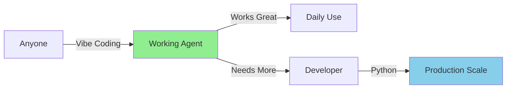
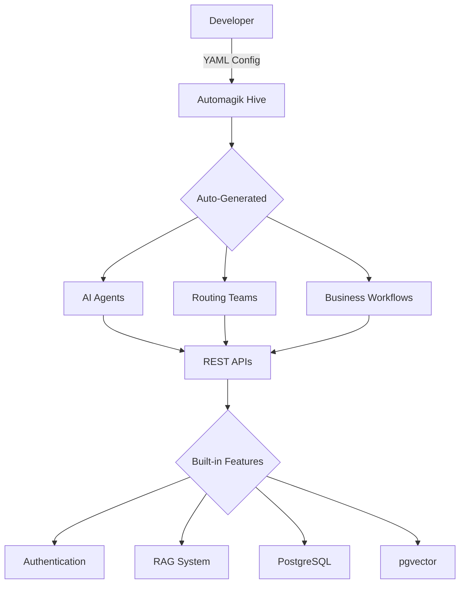

# 🚀 README Transformation Plan: Vibe Coding for Multi-Agent AI

**Created**: January 22, 2025  
**Status**: Planning Phase - IMPLEMENTATION READY  
**Objective**: Position Automagik Hive as the first framework bringing vibe coding to true multi-agent systems

## 🎯 CORE INSIGHT: Vibe Coding Meets True Multi-Agent Coordination

**Automagik Hive brings vibe coding to multi-agent systems - a revolutionary application:**
- **Vibe your agents into existence** - Natural language creates working AI teams
- **True multi-agent coordination** - Shared state and memory (not just tool calling)
- **Production-ready from day one** - Same code from prototype to scale
- **Dog-fooded solution**: Built to solve our own problems, now shared with you

## 📊 Who This Is For & What They Want

### Individual Users Want:
- Personal AI assistants that actually help with daily tasks
- Quick solutions without learning complex tools
- Automation for boring, repetitive work
- Smart helpers that understand their specific needs

### Students & Learners Want:
- Study aids and research assistants
- Tools to organize and analyze information
- Help with projects without coding knowledge
- AI that adapts to their learning style

### Developers Want:
- Clean, maintainable code
- No proprietary abstractions
- Full control when needed
- Easy path to production

### Businesses Want:
- Custom AI solutions for specific workflows
- Professional deployment capabilities
- Enterprise-grade security and scalability
- Cost-effective automation

### What Automagik Hive Delivers:
- **For Everyone**: Vibe coding with `/wish` command = instant useful agents
- **For Individuals**: Natural language → personal AI helpers (no technical knowledge needed)
- **For Developers**: Vibe first, extend with Python when needed
- **For Organizations**: Scale from personal tools to enterprise systems
- **The Revolution**: First framework to bring vibe coding to coordinated AI systems

## 📊 Current State Analysis

### What We Have
- **Reality**: Framework for building multi-agent AI systems
- **Core Value**: Start with YAML, extend with Python - full flexibility
- **Installation**: Universal installer from GitHub
- **Examples**: Template agents/teams that developers copy and customize
- **Infrastructure**: PostgreSQL + pgvector, FastAPI, Docker support
- **Foundation**: Powered by Agno for proven reliability

## 🎯 New Positioning Strategy

### Primary Hook (Vibe Coding for Agentic AI)
**"The first framework to bring vibe coding to multi-agent AI systems—describe what you want in natural language, get coordinated AI teams instantly"**

### Supporting Messages
- 🚀 **10x faster prototyping** than coding from scratch
- 🔄 **Zero-friction transition** to production code
- 👥 **Both teams enabled**: Product can prototype, Dev can productionize
- 🎯 **No vendor lock-in**: It's just Python under the hood
- 🤝 **Built by practitioners**: We use this in production at Namastex Labs

## 📝 README Structure - Reimagined

### Section 1: The Hero (Problem → Solution)
```markdown
# Automagik Hive

**Vibe your AI agents into existence** - The only framework where natural language creates production-ready multi-agent systems. Describe what you want, get coordinated AI teams that actually work together.

⚡ Built on Agno's blazing-fast core (3μs agent instantiation)
🤖 Currently supports vibe coding via Claude Code (more AI assistants coming soon)

## See Vibe Coding in Action

[Placeholder: 30-second demo video showing natural language → working agent]
<!-- TODO: Add demo showing vibe coding creating a customer support team -->

Watch how describing "I need a customer support team" becomes a fully deployed multi-agent system.

## 🤖 Two Ways to Build AI Agents

### 1. **Vibe Coding with GENIE** (Claude Code)
```bash
# One-line install
curl -sSL https://raw.githubusercontent.com/namastexlabs/automagik-hive/main/install.sh | bash

# Launch in Claude Code
automagik-hive genie

# Vibe your first agent into existence
> I need a customer support agent that handles billing questions
```
*Currently available in Claude Code. Support for Cursor, Codex, and other AI assistants coming soon.*

### 2. **YAML Configuration** (Available Now for All)
```bash  
# Create agents with simple YAML - no AI assistant required
automagik-hive --init my-workspace
# Edit ai/agents/*/config.yaml
automagik-hive --dev
```

**The first framework enabling true multi-agent coordination through vibe coding.**

```

### Section 2: Show Don't Tell (Quick Win)
```markdown
## Get Started in Minutes

### Option 1: Vibe Coding (Claude Code)
```bash
# One-line install
curl -sSL https://raw.githubusercontent.com/namastexlabs/automagik-hive/main/install.sh | bash

# Launch in Claude Code
automagik-hive genie

# Vibe your first agent into existence
> I need an agent that analyzes customer support tickets 
  and suggests appropriate responses based on our knowledge base

🧞 GENIE is building your assistant...
🤖 Agent "support-analyst" created
📊 Knowledge base integration configured
🎯 Response suggestion logic ready
```
*Currently available in Claude Code. Support for Cursor, Codex, and other AI assistants coming soon.*

### Option 2: YAML Configuration (Available Now for All)
```bash
# Initialize workspace
automagik-hive --init my-ai-workspace

# Create agent configuration
cat > ai/agents/support-analyst/config.yaml << 'EOF'
agent:
  name: "Support Analyst"
  agent_id: "support-analyst"
instructions: |
  Analyze customer support tickets and suggest responses
  based on our knowledge base
EOF

# Start the agent
automagik-hive --dev
# Your agent is live at http://localhost:8886/agents/support-analyst
```

### For Developers (Optional Enhancement):
```python
# Vibe coding created the foundation, extend with Python when needed
def enhance_support_agent():
    agent = Agent.from_yaml("support-analyst/config.yaml")
    agent.add_custom_filter(priority_algorithm)
    return agent
```
```

### Section 3: The Journey (Prototype → Production)
```markdown
## Your Journey

**Discover (1 min)** → **First Agent (5 min)** → **Understanding (30 min)** → **Production (Your pace)**

No overwhelming documentation. Learn as you build.

### Phase 1: Rapid Prototyping
- Vibe agents into existence with natural language (Claude Code)
- Or define agents in YAML - no AI assistant needed
- Test behaviors instantly via REST API
- Iterate without complex code

### Phase 2: Enhancement (When Needed)
- Add custom tools and integrations
- Implement business logic in Python
- Connect to your databases
- Extend with pure Python

### Phase 3: Production Deployment
- Use `automagik-hive --serve` for Docker deployment
- PostgreSQL + pgvector included
- Authentication built-in
- Scale horizontally

**No rewrites. No migrations. No platform lock-in.**
```

### Section 4: Real Use Cases
```markdown
## What People Are Building

### Personal Assistant - Daily Task Management
**Challenge**: Keeping track of emails, calendar, and important tasks across multiple platforms
**Solution**: Personal coordination agent that analyzes and prioritizes
```
Vibe: "I need an assistant that reads my emails, identifies action items, 
and creates calendar reminders for important deadlines"
```
**Result**: Never miss important deadlines, automated task extraction from communications

### Student Research Helper - Academic Paper Analysis  
**Challenge**: Processing and organizing research from multiple academic sources
**Solution**: Research analysis agent with intelligent summarization
```
Vibe: "Create a research assistant that finds papers on machine learning ethics,
summarizes key findings, and identifies common themes across studies"
```
**Result**: Faster literature reviews, better organized research notes

### Small Business - Customer Inquiry Routing
**Challenge**: Handle customer questions efficiently without hiring multiple support staff
**Solution**: Intelligent routing system that categorizes and responds appropriately
```
Vibe: "Create a customer support team that handles billing questions,
technical issues, and general inquiries with appropriate responses"
```
**Result**: 24/7 customer support, consistent responses, reduced workload

### Financial Services - Multi-Domain Customer Support (Enterprise)
**Challenge**: Handle complex customer queries across credit cards, payments, and merchant services
**Solution**: Intelligent routing team with specialized domain agents
```yaml
# Routing team that analyzes queries and delegates to specialists
team:
  mode: route  # Automatic intelligent routing
  name: "Customer Service AI"
  members:
    - credit-card-specialist    # Handles limits, billing, international use
    - payment-specialist         # Merchant payments, receivables
    - escalation-agent          # Human handoff when needed
```
**Result**: 24/7 intelligent support, 70% query resolution without human intervention

### E-commerce Platform - Order Processing Workflow  
**Challenge**: Complex order fulfillment with multiple validation steps
**Solution**: Multi-step workflow with parallel processing
```yaml
workflow:
  name: "Order Fulfillment"
  steps:
    - parallel:
      - agent: inventory-checker
      - agent: fraud-detector
      - agent: payment-processor
    - agent: shipping-coordinator
    - agent: notification-sender
```
**Result**: 3x faster order processing, automatic fraud detection

### Personal Finance - Expense Analysis System  
**Challenge**: Understanding spending patterns and finding ways to save money
**Solution**: Financial analysis agent that categorizes and analyzes expenses
```
Vibe: "Create an expense analyzer that reviews my bank transactions,
categorizes spending, and suggests budget improvements"
```
**Result**: Clear spending insights, automated budget tracking, personalized savings suggestions

### Freelancer Productivity - Project Management
**Challenge**: Tracking multiple client projects and deadlines simultaneously  
**Solution**: Project coordination workflow with client communication tracking
```
Vibe: "Create a project manager that tracks client deadlines, sends progress updates,
and reminds me about upcoming deliverables"
```
**Result**: Never miss client deadlines, professional communication, better project organization

### SaaS Company - Lead Qualification System (Enterprise)
**Prototype**: Natural language lead scoring rules
**Production**: Python integration with CRM and enrichment APIs
```python
# Started with YAML, extended with Python
def get_lead_scorer():
    agent = Agent.from_yaml("config.yaml")
    agent.add_tool(enrich_company_data)  # Custom API integration
    agent.add_tool(calculate_lead_score)  # Proprietary scoring
    return agent
```
**Result**: Sales team iterated on scoring rules without dev help, 40% better lead conversion

### Content Creator - Social Media Management
**Challenge**: Creating consistent content across multiple platforms with different audiences
**Solution**: Content adaptation agent that repurposes content for different channels
```
Vibe: "Create a content manager that takes my blog posts and creates 
Twitter threads, LinkedIn posts, and Instagram captions tailored for each platform"
```
**Result**: Consistent multi-platform presence, time savings, platform-optimized content

### Healthcare Startup - Patient Intake Automation (Enterprise)
**Prototype**: Natural language patient questionnaire via vibe coding
**Production**: HIPAA-compliant data handling with Python extensions
**Result**: Reduced intake time from 20 minutes to 5 minutes, improved data quality
```

### Section 5: Why It Works (Architecture)
```markdown
## Why It's Fast

Built on **Agno's blazing-fast core**:
- **3 microseconds** agent instantiation (spawn 1000s of agents instantly)
- **6.5KB** memory per agent (run entire teams on minimal infrastructure)
- **Model agnostic** - Use any LLM without vendor lock-in
- **True multi-agent coordination** - Shared context and memory (not just tool calling)

Unlike other "multi-agent" frameworks that just chain simple agents with unreliable tool calling, Automagik Hive provides genuine team coordination with shared state and deterministic workflows.

## Best of Both Worlds Architecture



- **Natural language first**: Vibe your agents into existence
- **YAML configuration**: Define behavior without code
- **Python-extensible**: Add complexity only when needed
- **Production-ready**: Docker, PostgreSQL, authentication included
```

### Section 6: How We Compare
```markdown
## How We Compare

| Feature | Automagik Hive | LangChain | AutoGen | CrewAI |
|---------|---------------|-----------|---------|---------|
| **Vibe Coding** | ✅ Natural language | ❌ Code only | ❌ Code only | ❌ YAML only |
| **True Multi-Agent** | ✅ Shared state & memory | ⚠️ Tool calling | ⚠️ Message passing | ✅ Coordination |
| **Time to First Agent** | Minutes | 30+ minutes | 20+ minutes | 10+ minutes |
| **Agent Performance** | 3μs instantiation | Varies | Varies | Varies |
| **Production Ready** | ✅ Built-in | ⚠️ DIY | ⚠️ DIY | ✅ Yes |
```

### Section 7: The Multi-Agent Reality Check
```markdown
## The Multi-Agent Reality Check

### What Others Call "Multi-Agent" 
❌ Simple agents chained with unreliable tool calling
❌ No shared state between agents
❌ Message passing that breaks under load
❌ "No-code" that hits walls immediately

### What We Built
✅ **True coordination** with shared memory and context
✅ **Deterministic workflows** that validate and retry
✅ **Vibe coding** that extends to real Python
✅ **Production systems** running hundreds of agents
```

### Section 8: Feature Roadmap
```markdown
## 📍 Roadmap

### Available Now
- ✅ YAML-first agent configuration
- ✅ Python extensibility  
- ✅ Auto-generated REST APIs
- ✅ PostgreSQL + pgvector integration
- ✅ Docker deployment
- ✅ GENIE with Claude Code (vibe coding support)

### Coming Soon
- 🔄 GENIE for Cursor
- 🔄 GENIE for Codex  
- 🔄 GENIE for Gemini CLI
- 🔄 GENIE for Open Coder
- 🔄 Visual workflow designer
- 🔄 Agent marketplace
- 🔄 One-click cloud deployment
- 🔄 Team collaboration features

### Under Consideration
- 💭 WebSocket streaming improvements
- 💭 GraphQL API generation
- 💭 Kubernetes operators
- 💭 Monitoring dashboard
```

### Section 9: Built by Practitioners, for Practitioners
```markdown
## 🤝 Built by Practitioners, for Practitioners

We created Automagik Hive to solve our own frustrations at Namastex Labs. After building multi-agent systems for clients ranging from startups to Fortune 500 companies, we were tired of:
- Rewriting the same boilerplate for every project
- "Multi-agent" tools that were just simple agents with flaky tool calling
- Prototypes that needed complete rewrites for production

So we built the framework we wished existed. Now we're sharing it with you.

**In Production:** Powering hundreds of agents for real businesses
**Battle-Tested:** From startup MVPs to enterprise-scale deployments
**Continuously Improved:** We use this daily, so we keep it working

**Our commitment:**
- ✅ Always open source (MIT license)
- ✅ Regular updates and bug fixes
- ✅ No hidden premium features
- ✅ Transparent development on GitHub

Join us in building the future of multi-agent development. Because the best tools are built by the people who actually use them.
```

### Section 10: GENIE - Your Vibe Coding Companion
```markdown
## GENIE: Your Vibe Coding Companion

GENIE transforms natural language into working AI systems through vibe coding.

```bash
# Launch GENIE in Claude Code
automagik-hive genie

# Vibe your agents into existence
> I need a data pipeline agent that processes CSV files and sends summaries to Slack

# GENIE creates:
# - YAML configuration
# - Python extension points  
# - REST API endpoints
# - Documentation

# You get a working agent in minutes, ready to extend
```

**Currently Available**: Claude Code users can vibe agents today
**Coming Soon**: Cursor, Codex, Gemini CLI, Open Coder

Even without GENIE, you can:
- Build with YAML configuration (no AI assistant needed)
- Use templates to get started quickly
- Extend with Python when ready

*GENIE accelerates development but isn't required - the framework stands on its own.*
```

### Section 11: Join the Movement
```markdown
## Join the Movement

We're preparing for public launch. Be among the first:

### Early Access Benefits
- 🎯 **Priority Support** - Direct access to the team building this
- 🚀 **Shape the Framework** - Your feedback drives our roadmap  
- 📚 **Exclusive Resources** - Early access to templates and guides
- 🤝 **Founding Member Status** - Recognition in the community

### Get Involved
- **GitHub**: Star & watch for updates
- **Discord**: Join early adopters (link coming at launch)
- **Contribute**: We welcome PRs from day one
```

### Section 12: Who's Using Automagik Hive?
```markdown
## Who's Using Automagik Hive?

### 🎯 Individual Developers
**Tired of:** Writing 1000 lines of boilerplate for simple agents
**With Hive:** Vibe your idea → Working agent in minutes
**Result:** Ship AI features 10x faster

### 🏢 Product Teams  
**Tired of:** Waiting weeks for dev resources to prototype
**With Hive:** Natural language → Testable agents immediately
**Result:** Validate ideas before writing code

### 🚀 Enterprises
**Tired of:** Prototypes that can't scale to production
**With Hive:** Same YAML from prototype to millions of requests
**Result:** Innovation at startup speed, enterprise reliability
```

## 🎬 Key Differentiators to Emphasize

### Unique Value Props
1. **Vibe Coding Pioneer**: First framework bringing vibe coding to multi-agent systems
2. **True Multi-Agent**: Shared state and memory, not just tool calling
3. **Performance**: 3μs agent instantiation on Agno's blazing-fast core
4. **Dog-fooded**: Built to solve our own problems, battle-tested in production
5. **No Lock-in**: Pure Python, standard tools (PostgreSQL, Docker)
6. **Deterministic Workflows**: Validate, retry, and guarantee execution

### What We DON'T Say
- ❌ "Production-ready in minutes" (sounds like hype)
- ❌ "No code required" (devs will run away)
- ❌ "Enterprise-grade" (unless showing specific features)
- ❌ "Powered by Agno" (implementation detail)

### What We DO Say
- ✅ "Prototype fast, ship with confidence"
- ✅ "Both your teams will love it"
- ✅ "From YAML to Python, naturally"
- ✅ "No roadblocks to production"


## 📋 Key Content Sections

### 🧞 GENIE: Your Vibe Coding Companion
```markdown
## Meet GENIE - Vibe Your AI Into Existence

GENIE transforms natural language into production-ready multi-agent systems:
- 🤖 **Intelligent Agents** - Autonomous assistants with specific capabilities
- 👥 **Coordinated Teams** - True multi-agent collaboration with shared state
- ⚡ **Deterministic Workflows** - Validated, retryable execution patterns

### Vibe Coding in Action:

```
# Create an Agent
"I want an agent that analyzes Hacker News articles and identifies 
trends relevant to our AI development stack"

# Build a Team
"Create a customer support team with specialists for billing, 
technical issues, and general inquiries that routes automatically"

# Design a Workflow
"I need a workflow that processes new signups: validate data, 
create account, and send welcome email"

# Build Smart Analysis
"Create an agent that monitors our GitHub repos and suggests 
solutions for common issue patterns"
```

### How Vibe Coding Works:
1. **Natural Language Input**: Describe what you want in plain English
2. **Intelligent Generation**: GENIE creates appropriate configurations
3. **Automatic Wiring**: Sets up integrations and connections
4. **API Deployment**: Your AI system becomes accessible via REST endpoints
5. **Python Extension**: Add custom logic when needed

### Who Benefits from Vibe Coding?
- **Individuals**: Create personal assistants for daily tasks
- **Students**: Build study aids and research helpers
- **Professionals**: Automate repetitive work processes
- **Developers**: Skip boilerplate, focus on custom logic
- **Businesses**: Transform ideas into working prototypes
- **Anyone with Ideas**: If you can describe it, vibe it into existence
```

### The Power of Deterministic Workflows
```markdown
## Deterministic Control When You Need It

While vibe coding handles 80% of use cases, sometimes you need guarantees:

### Teams vs Workflows
**Use Teams** for intelligent routing and collaboration
**Use Workflows** for deterministic, validated execution

### Real Example: Validated Order Processing
```yaml
# Chain agents like LEGO blocks with guarantees
workflow:
  name: "Order Processing"
  steps:
    - validate_input      # Ensure data is correct
    - process_payment     # With retry logic
    - parallel:           # Speed up independent tasks
        - check_inventory
        - calculate_shipping
        - verify_fraud
    - validate_output     # Confirm results
    - retry_if_failed     # Automatic recovery
```

### Why Workflows Matter
- **Deterministic Results**: Same input → same output, every time
- **Input/Output Validation**: Catch errors before they propagate
- **Automatic Retry**: Built-in recovery from transient failures
- **Parallel Performance**: Run independent steps simultaneously
- **Audit Trail**: Track every step for compliance

### Simple Yet Powerful
```python
# Start with YAML
workflow = Workflow.from_yaml("order-processing.yaml")

# Extend with Python when needed
workflow.add_validator(custom_fraud_check)
workflow.add_retry_policy(exponential_backoff)
```

Chain agents like LEGO blocks. Get predictable results.

### Advanced Workflow Example: Order Processing
```python
from agno.workflow.v2 import Workflow, Step, Parallel, Condition

# Mix agents, teams, and custom functions
workflow = Workflow(
    name="Order Processing",
    steps=[
        fraud_detection_team,           # Team for complex analysis
        Condition(                       # Conditional branching
            condition=lambda x: x.risk_score > 0.7,
            if_true=manual_review_agent,
            if_false=Parallel(           # Parallel execution
                inventory_check_agent,
                payment_processor,
                shipping_calculator
            )
        ),
        notification_sender             # Final step
    ]
)
```
```

### Progressive Examples

**Example 1: Start Simple with YAML**
```yaml
# ai/agents/support-agent/config.yaml
agent:
  name: "Customer Support Specialist"
  agent_id: "support-agent"
  
instructions: |
  You help customers with billing and account issues.
  You have access to the knowledge base.
  
knowledge_filter:
  business_unit_filter: "customer_support"
```

**Extend with Python when needed:**
```python
# ai/agents/support-agent/agent.py
from agno.agent import Agent

def get_support_agent() -> Agent:
    # Start with YAML config
    agent = Agent.from_yaml("config.yaml")
    
    # Extend with custom logic if needed
    # Full Agno API available - no restrictions!
    return agent
```

**Example 2: Intelligent Routing Team**
```yaml
# ai/teams/routing-team/config.yaml
team:
  mode: route  # Automatic routing!
  name: "Support Router"
  
members:
  - billing-specialist
  - technical-support
  - account-manager
  
instructions: |
  Route billing questions to billing-specialist
  Route technical issues to technical-support
```

**Example 3: Multi-Step Workflow**
```yaml
# ai/workflows/onboarding/config.yaml
workflow:
  name: "Customer Onboarding"
  
steps:
  - agent: data-validator
    action: "Validate customer data"
  - agent: account-creator
    action: "Create account"
  - agent: welcome-sender
    action: "Send welcome email"
```

### Architecture & Technical Depth

#### What Automagik Hive Provides (The Framework)


#### Performance & Scale
| Feature | What You Get |
|---------|--------------|
| **Zero Code Orchestration** | Define complex flows in YAML |
| **Auto API Generation** | Agents → REST endpoints instantly |
| **Production Ready** | Docker, auth, logging included |
| **Knowledge RAG** | CSV → Vector search automatically |
| **Streaming Support** | Real-time SSE/WebSocket built-in |

### Developer Experience Focus

**Learning Path**:
1. **Discovery**: Install → Copy template → Edit YAML
2. **First Agent**: Modify instructions → Test endpoint
3. **Team Building**: Create routing logic → Auto-coordination
4. **Workflows**: Chain agents → Business automation
5. **Production**: Docker deploy → Scale horizontally

## 🚀 Implementation Plan

### Content Creation
- [ ] Rewrite hero section with vibe coding focus
- [ ] Add placeholder video after hero section
- [ ] Create performance section with Agno metrics
- [ ] Add comparison table with other frameworks
- [ ] Write emotional triggers section
- [ ] Include dog-fooding story

### Examples & Proof
- [ ] Update all examples to use vibe coding language
- [ ] Show real transition from natural language to Python
- [ ] Include deterministic workflow examples
- [ ] Add CTAs after each major section

### Technical Documentation
- [ ] Explain true multi-agent vs tool calling
- [ ] Document shared state and memory architecture
- [ ] Show 3μs performance metrics prominently
- [ ] Include validation and retry patterns

### Community Building
- [ ] Create pre-launch community strategy
- [ ] Design early access benefits
- [ ] Plan founding member recognition
- [ ] Prepare Discord structure for launch

### GitHub Repository Updates
- [ ] Rewrite GitHub "About" section with vibe coding focus
- [ ] Update repository description and topics
- [ ] Add vibe coding keywords for discoverability
- [ ] Create compelling one-liner for GitHub preview

## 📝 Copy Examples

### GitHub About Section Rewrite

**New Description**:
```
🧞 Vibe AI agents into existence - The first framework bringing vibe coding to multi-agent systems. Natural language creates production-ready AI teams with true coordination.
```

**New Topics**:
```
vibe-coding, multi-agent, natural-language-ai, agent-coordination, autonomous-agents,
ai-teams, ai-workflows, genie-framework, production-ready, true-multiagent,
deterministic-workflows, agent-orchestration, vibe-ai, agno-powered
```

**Repository Settings**:
- **Website**: https://github.com/namastexlabs/automagik-hive
- **Description**: Vibe coding for multi-agent AI - natural language creates coordinated AI teams
- **Include in GitHub Archive**: ✅ Yes

### Taglines
- "Vibe your AI into existence™"
- "The first vibe coding framework for multi-agent systems"
- "Describe it. Vibe it. Deploy it."
- "Natural language → Production AI teams"
- "True multi-agent coordination, not just tool calling"
- "Built by practitioners, powered by Agno"

### Value Props
- "Deploy agents in minutes, not hours"
- "True multi-agent with shared state and memory"
- "3μs agent instantiation - spawn thousands instantly"
- "From vibe coding to production API in one smooth flow"
- "The framework that makes both product and dev teams happy"

### Call to Action
- "Vibe your first agent in minutes"
- "See true multi-agent coordination"
- "Join the vibe coding revolution"
- "Get early access to the future"

## 📊 Success Metrics

### Immediate (First Impression)
- Reader understands vibe coding concept immediately
- Grasps true multi-agent vs tool calling distinction
- Wants to try vibe coding their first agent

### Short Term (First Experience)
- Successfully vibes first agent into existence
- Understands performance advantages (3μs)
- Sees clear path from prototype to production

### Long Term (Adoption)
- Early access community actively engaged
- GitHub stars growing organically
- Production deployments with hundreds of agents

## 🚀 Key Messages to Emphasize

### What Automagik Hive IS
1. **Framework for Building** - Multi-agent AI systems
2. **YAML-First Development** - No orchestration code needed
3. **Production Boilerplate** - Enterprise-ready from day one
4. **Template System** - Copy, customize, deploy
5. **Python Extensible** - Full control when you need it
6. **Open Source Forever** - Built by Namastex Labs, maintained by community

### What It's NOT
- NOT a collection of pre-built agents
- NOT about the GENIE system (that's dev tooling)
- NOT a hosted service
- NOT requiring orchestration code

## 📝 Content Strategy

### Keep & Enhance
- Universal installer from GitHub
- Docker deployment
- Tech stack with Agno as underlying framework
- Template examples

### Transform Completely
- Current hook → Framework-focused hook
- Config examples → "What you can build" examples
- Architecture → Developer workflow diagram
- Features → Framework capabilities

### Add New
- Template gallery concept
- YAML schema documentation
- Framework architecture powered by Agno
- Use case examples (customer support, DevOps, analytics)
- Comparison with other frameworks
- Living agents concept with Spark
- Personal Jarvis vision

### Focus Areas
- GENIE as optional developer productivity tool
- Templates as starting points for custom agents
- Simple YAML → API flow
- Ecosystem integration for living agents

## 🎬 Action Items for Impact

### Immediate Actions
1. **Update hero section** - Focus on productivity multiplier
2. **Showcase dual-audience value** - Product + Dev teams
3. **Add "Build with YAML, extend with Python"** messaging
4. **Feature living agents concept**

### Foundation Phase
1. **Create framework diagram with ecosystem**
2. **Write personal Jarvis examples**
3. **Document YAML schemas**
4. **Explain Agno foundation**

### Enhancement Phase
1. **Build template gallery**
2. **Create video tutorials**
3. **Demonstrate living agents**
4. **Launch ecosystem story**

## 📚 Reference Patterns to Follow

### From CrewAI
- Clear framework positioning
- Template-based approach
- Performance metrics

### From LangChain
- Framework comparison tables
- Integration ecosystem
- Clear abstractions

### From AutoGen
- Multi-agent patterns
- Configuration examples
- Architectural diagrams

### Unique to Automagik Hive
- Start simple with YAML, extend with Python
- Auto-API generation from configs
- Production boilerplate included
- Built on proven Agno framework for reliability

## 🏁 Success Criteria

The transformed README succeeds when:
1. **Developers** understand it's a framework for BUILDING agents
2. **First agent** successfully created from template
3. **API endpoint** tested within minutes
4. **Community** starts sharing YAML templates
5. **Positioning** clear vs LangChain/AutoGen/CrewAI

## 🎨 Automagik Ecosystem Strategy

### Core Positioning: Hive is Complete, Ecosystem Adds Superpowers

**Hive Standalone**: Full-featured AI development through natural language
**With Ecosystem**: Transform your AI into autonomous, always-on assistants

### 🌟 The Automagik Suite - Optional Enhancements

#### Automagik Spark - Make Your AI Autonomous
When you're ready to make your agents work independently:
- **24/7 Operation**: Heartbeat monitoring keeps agents alive continuously
- **Scheduled Intelligence**: Cron jobs, intervals, event triggers
- **Background Processing**: Long-running tasks without blocking
- **Worker Management**: Health checks, auto-recovery, task queues

**Example Use Cases with Spark:**
```bash
# Native Hive creates the agent, Spark makes it autonomous
/wish create a personal assistant that manages my calendar and sends me morning briefings

# With Spark integration:
- Morning briefings run automatically at 7 AM
- System monitors check health every 5 minutes  
- Research assistants gather information overnight
- Background processors handle heavy computations
```

[Learn more about Spark →](https://github.com/namastexlabs/automagik-spark)

#### Automagik Omni - Deploy Your AI Everywhere
Connect your agents to the world:
- **WhatsApp Integration**: Chat with your AI assistants
- **Multi-Channel Support**: Same agent, multiple platforms
- **Natural Conversations**: No APIs, just chat
- **Multi-Tenant**: Different agents for different teams

**Example Use Cases with Omni:**
- Customer support bots on WhatsApp
- Personal assistants accessible via SMS
- Team collaboration through messaging apps
- Multi-department service desks

[Learn more about Omni →](https://github.com/namastexlabs/automagik-omni)

#### Complete Stack = Hive + Spark + Omni
When combined, you get:
- **Build** with natural language (Hive)
- **Automate** with scheduling and triggers (Spark)
- **Connect** through any channel (Omni)

Perfect for building your personal Jarvis or enterprise AI operations.

### README Ecosystem Section (Separate from Core Features)

```markdown
## 🌟 The Automagik Ecosystem

Hive is powerful standalone, but you can extend it with:

### Optional Enhancements

#### 🚀 Automagik Spark - Autonomous Operations
Make your AI work independently:
- Schedule agents to run at specific times
- Background processing for heavy tasks
- Event-driven triggers and webhooks
- 24/7 operation with health monitoring

[Explore Spark →](https://github.com/namastexlabs/automagik-spark)

#### 💬 Automagik Omni - Omnichannel Deployment
Connect your AI to any channel:
- WhatsApp, Telegram, SMS integrations
- Multi-tenant support for different teams
- Natural conversation interfaces
- No API complexity, just chat

[Explore Omni →](https://github.com/namastexlabs/automagik-omni)

#### 🎯 Complete Stack
Combine all three for enterprise AI operations:
1. **Build** agents with natural language (Hive)
2. **Automate** with scheduling (Spark)
3. **Deploy** everywhere (Omni)

```bash
# Get the complete Automagik suite
curl -sSL https://raw.githubusercontent.com/namastexlabs/automagik-bundle/main/install.sh | bash
```
```

### Where to Place This Section
Position after main features but before technical details:
1. Hero/Hook
2. Quick Start
3. Core Features
4. **→ Ecosystem (HERE)**
5. Architecture/Technical
6. Deployment

### Messaging Guidelines
- **DO**: Focus on capabilities and outcomes
- **DO**: Show concrete use cases
- **DO**: Keep it optional ("unlock superpowers")
- **DON'T**: Make it seem required
- **DON'T**: Get into technical details
- **DON'T**: Overwhelm with all components

## 🎯 Orchestration Strategy

### Agent Execution Plan

**Phase 1 - Strategic Planning**:
- **hive-dev-planner**: Create TSD focusing on dual-audience value + ecosystem
- **hive-dev-designer**: Design README flow with ecosystem section

**Phase 2 - Content Creation**:
- **hive-dev-coder**: Implement new README with bundle section
- **hive-testing-maker**: Create validation for all code samples

**Phase 3 - Polish**:
- **hive-quality-ruff**: Format all code examples
- **hive-claudemd**: Ensure documentation consistency

**Phase 4 - Launch**:
- **hive-qa-tester**: Validate all examples work
- **hive-release-manager**: Coordinate launch

### Success Criteria
- Readers understand Hive works standalone
- They see clear value in Spark (autonomous agents)
- They see clear value in Omni (omnichannel deployment)
- Bundle feels like natural progression, not upsell

---

## 📊 Final Status

**Document Status**: ✅ IMPLEMENTATION READY - All feedback incorporated  
**Core Focus**: Vibe coding for true multi-agent systems with shared state  
**Key Innovation**: First framework bringing vibe coding to genuine multi-agent coordination  
**Performance Edge**: 3μs agent instantiation on Agno's blazing-fast core  
**Market Position**: Pioneer in multi-agent vibe coding with production readiness  
**Next Step**: Execute implementation plan for README transformation

### What Makes Us Different:
- ✅ **True Multi-Agent**: Shared state and memory, not just tool calling
- ✅ **Vibe Coding Pioneer**: First to bring natural language to multi-agent systems
- ✅ **Performance Leader**: 3μs instantiation, spawn thousands of agents
- ✅ **Dog-fooded Solution**: Built to solve our own problems, battle-tested
- ✅ **Deterministic Workflows**: Validate, retry, and guarantee execution
- ✅ **Production Ready**: Powering hundreds of agents in real businesses

### The Positioning:
**"Vibe your AI agents into existence - The first framework enabling true multi-agent coordination through natural language. Built on Agno's 3μs core, powering hundreds of production agents."**

### Implementation Priorities:
1. **Hero Section**: Vibe coding + performance metrics
2. **Video Placeholder**: Visual proof early
3. **Comparison Table**: Clear differentiation
4. **Dog-fooding Story**: Authenticity and trust
5. **Pre-launch Community**: Early access engagement
6. **CTAs Throughout**: Guide readers to action