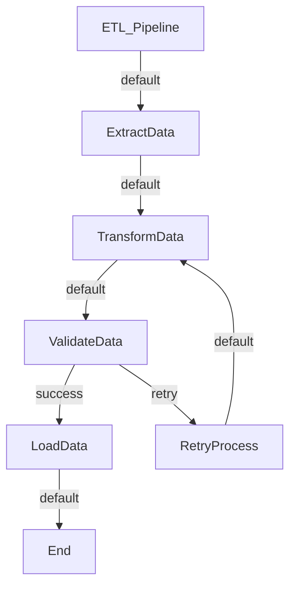

# broflow

A workflow-agnostic Python library for building readable, maintainable pipelines and workflows. broflow provides an intuitive framework for orchestrating complex data processing, ML pipelines, web scraping, automation tasks, and more.

**Learn once, use everywhere** - from data science to web automation, broflow adapts to your workflow needs with a consistent, readable syntax.

## What is broflow?

broflow is a lightweight workflow orchestration library that lets you:
- **Chain actions** using the intuitive `>>` operator
- **Run tasks in parallel** with built-in concurrency support
- **Branch conditionally** based on action results
- **Share state** across all workflow steps
- **Visualize workflows** with automatic Mermaid diagram generation
- **Debug easily** with built-in logging and state inspection

Unlike heavy workflow engines, broflow focuses on simplicity and readability while providing powerful orchestration capabilities.

## Key Features

- 🔄 **Sequential Workflows**: Chain actions with simple `>>` operator
- ⚡ **Parallel Execution**: Run independent actions simultaneously with `ParallelAction`
- 🔀 **Conditional Branching**: Route workflows based on action results
- 🌐 **Global State Management**: Share data across actions with built-in state
- 🛠️ **Tool Integration**: Built-in utilities for parameter validation and extraction
- 📊 **Visual Flow Charts**: Generate Mermaid diagrams of your workflows

## Quick Start

### Basic Sequential Workflow

```python
from broflow import Action, Flow, Start, End

# Define custom actions
class LoadData(Action):
    def run(self, shared):
        # Simulate data loading
        shared['data'] = [1, 2, 3, 4, 5]
        print(f"Loaded {len(shared['data'])} items")
        return shared

class ProcessData(Action):
    def run(self, shared):
        # Process the data
        shared['processed'] = [x * 2 for x in shared['data']]
        print(f"Processed data: {shared['processed']}")
        return shared

class SaveResult(Action):
    def run(self, shared):
        # Save results
        print(f"Saved {len(shared['processed'])} processed items")
        shared['saved'] = True
        return shared

# Build and execute workflow
start = Start("🚀 Starting data pipeline")
load = LoadData()
process = ProcessData()
save = SaveResult()
end = End("✅ Pipeline completed successfully")

# Chain actions with >> operator
start >> load >> process >> save >> end

# Execute the workflow
flow = Flow(start, name="DataPipeline")
result = flow.run({})
```

**Output:**
```
🚀 Starting data pipeline
Loaded 5 items
Processed data: [2, 4, 6, 8, 10]
Saved 5 processed items
✅ Pipeline completed successfully
```

## Parallel Processing

Run independent tasks simultaneously to improve performance:

```python
from broflow import Action, Flow, Start, End
from broflow.parallel_action import ParallelAction
import time

class FetchUserData(Action):
    def run(self, shared):
        time.sleep(1)  # Simulate API call
        return {'users': ['alice', 'bob', 'charlie']}

class FetchProductData(Action):
    def run(self, shared):
        time.sleep(1)  # Simulate API call
        return {'products': ['laptop', 'mouse', 'keyboard']}

class FetchOrderData(Action):
    def run(self, shared):
        time.sleep(1)  # Simulate API call
        return {'orders': [101, 102, 103]}

class MergeData(Action):
    def run(self, shared):
        # Access parallel results
        parallel_results = shared.get('parallel', {})
        shared['merged'] = {
            'total_users': len(parallel_results.get('fetchuserdata', {}).get('users', [])),
            'total_products': len(parallel_results.get('fetchproductdata', {}).get('products', [])),
            'total_orders': len(parallel_results.get('fetchorderdata', {}).get('orders', []))
        }
        print(f"Merged data: {shared['merged']}")
        return shared

# Create parallel action
parallel_fetch = ParallelAction(
    FetchUserData(),
    FetchProductData(), 
    FetchOrderData(),
    result_key='parallel'
)

# Build workflow
start = Start("🔄 Fetching data in parallel")
merge = MergeData()
end = End("📊 Data aggregation complete")

start >> parallel_fetch >> merge >> end

# Execute (runs in ~1 second instead of 3)
flow = Flow(start)
flow.run({})
```

## Use Cases

broflow excels in various domains:

### 🤖 Machine Learning
- Feature engineering pipelines
- Model training workflows
- Data preprocessing chains
- Hyperparameter optimization

### 🌐 Web Automation
- Multi-site web scraping
- API data aggregation
- Content processing pipelines
- Notification systems

### 📊 Data Processing
- ETL pipelines
- Data validation workflows
- Report generation
- Multi-source data integration

### 🔧 DevOps & Automation
- Deployment pipelines
- Testing workflows
- Monitoring systems
- Batch processing jobs

## Advanced Features

### Conditional Workflows

Route workflow execution based on action results:

```python
class ValidateData(Action):
    def run(self, shared):
        data_quality = shared.get('quality_score', 0)
        print(f"Data quality score: {data_quality}")
        
        if data_quality >= 0.8:
            self.next_action = 'high_quality'
            print("✅ High quality data - proceeding directly")
        else:
            self.next_action = 'needs_cleaning'
            print("⚠️ Low quality data - cleaning required")
        return shared

class CleanData(Action):
    def run(self, shared):
        print("🧹 Cleaning data...")
        shared['quality_score'] = 0.9  # Improved after cleaning
        return shared

class ProcessCleanData(Action):
    def run(self, shared):
        print("⚡ Processing clean data")
        shared['processed'] = True
        return shared

# Build conditional workflow
start = Start("🔍 Starting data validation")
validator = ValidateData()
clean = CleanData()
process = ProcessCleanData()
end = End("🎯 Processing complete")

# Set up conditional branches
validator - 'high_quality' >> process >> end
validator - 'needs_cleaning' >> clean >> process >> end

start >> validator

# Test with low quality data
flow = Flow(start)
flow.run({'quality_score': 0.5})

print("\n" + "="*50 + "\n")

# Test with high quality data  
flow2 = Flow(start)
flow2.run({'quality_score': 0.9})
```

### Global State & Configuration

Manage configuration and shared state across your entire workflow:

```python
from broflow import Action, Flow, Start, End, state
from broflow.config import load_config, save_config

# Create a config file
config_data = {
    'debug': True,
    'api_endpoint': 'https://api.example.com',
    'batch_size': 100,
    'retry_count': 3
}

# Save config
save_config('workflow_config.json')

class ConfigurableAction(Action):
    def run(self, shared):
        # Access global configuration
        endpoint = state.get('api_endpoint')
        batch_size = state.get('batch_size', 50)
        debug = state.get('debug', False)
        
        if debug:
            print(f"🔧 Using endpoint: {endpoint}")
            print(f"📦 Batch size: {batch_size}")
        
        # Update global state
        state.set('last_run', 'success')
        return shared

# Load configuration at startup
load_config('workflow_config.json')

# Use in workflow
start = Start("⚙️ Configurable workflow")
action = ConfigurableAction()
end = End("🏁 Workflow finished")

start >> action >> end

flow = Flow(start)
flow.run({})

# Check updated state
print(f"Last run status: {state.get('last_run')}")
```

### Visual Workflow Documentation

Automatically generate visual documentation of your workflows:

```python
from broflow import Action, Flow, Start, End
from broflow.parallel_action import ParallelAction

class ExtractData(Action):
    pass

class TransformData(Action):
    pass

class ValidateData(Action):
    def run(self, shared):
        # Conditional logic
        if shared.get('valid', True):
            self.next_action = 'success'
        else:
            self.next_action = 'retry'
        return shared

class LoadData(Action):
    pass

class RetryProcess(Action):
    pass

# Build complex workflow
start = Start("ETL Pipeline")
extract = ExtractData()
transform = TransformData()
validate = ValidateData()
load = LoadData()
retry = RetryProcess()
end = End("Pipeline Complete")

# Chain with conditional branching
start >> extract >> transform >> validate
validate - 'success' >> load >> end
validate - 'retry' >> retry >> transform

# Generate visual documentation
flow = Flow(start, name="ETL_Pipeline")
print(flow.to_mermaid())

# Save to file
flow.save_mermaid('etl_workflow.md')
```

**Generated Mermaid Diagram:**


## Installation

```bash
pip install broflow
```

## Documentation

- [Future Use Cases](FUTURE.md) - Comprehensive examples and patterns
- [API Reference](docs/) - Detailed API documentation
- [Examples](examples/) - Real-world workflow examples

## Real-World Examples

### Machine Learning Pipeline

```python
from broflow import Action, Flow, Start, End
from broflow.parallel_action import ParallelAction

class LoadDataset(Action):
    def run(self, shared):
        # Load your dataset
        shared['raw_data'] = "dataset.csv"  # Placeholder
        return shared

class FeatureEngineering(Action):
    def run(self, shared):
        return {'features': 'engineered_features'}

class ScaleFeatures(Action):
    def run(self, shared):
        return {'scaled': 'scaled_features'}

class SelectFeatures(Action):
    def run(self, shared):
        return {'selected': 'selected_features'}

class TrainModel(Action):
    def run(self, shared):
        parallel_results = shared.get('parallel', {})
        print("🤖 Training model with processed features")
        shared['model'] = 'trained_model'
        return shared

class EvaluateModel(Action):
    def run(self, shared):
        print("📊 Model accuracy: 94.5%")
        shared['accuracy'] = 0.945
        return shared

# Build ML pipeline
start = Start("🧠 ML Pipeline Started")
load = LoadDataset()

# Parallel feature processing
feature_pipeline = ParallelAction(
    FeatureEngineering(),
    ScaleFeatures(),
    SelectFeatures()
)

train = TrainModel()
evaluate = EvaluateModel()
end = End("🎉 ML Pipeline Complete")

start >> load >> feature_pipeline >> train >> evaluate >> end

flow = Flow(start, name="ML_Pipeline")
flow.run({})
```

### Web Scraping Pipeline

```python
class ScrapeWebsite(Action):
    def run(self, shared):
        url = shared.get('url')
        print(f"🕷️ Scraping {url}")
        return {'scraped_data': f'data_from_{url}'}

class ParseContent(Action):
    def run(self, shared):
        parallel_results = shared.get('parallel', {})
        print("📝 Parsing scraped content")
        return shared

class SaveToDatabase(Action):
    def run(self, shared):
        print("💾 Saving to database")
        return shared

# Scrape multiple sites in parallel
scrape_parallel = ParallelAction(
    ScrapeWebsite(),
    ScrapeWebsite(),
    ScrapeWebsite()
)

start = Start("🌐 Web Scraping Started")
parse = ParseContent()
save = SaveToDatabase()
end = End("📚 Data Collection Complete")

start >> scrape_parallel >> parse >> save >> end

flow = Flow(start)
flow.run({
    'urls': ['site1.com', 'site2.com', 'site3.com']
})
```

## Why Choose broflow?

### 🎯 **Readable & Intuitive**
Workflows read like natural language:
```python
start >> load_data >> clean_data >> ParallelAction(feature1, feature2, feature3) >> train_model >> save_model >> end
```

### 🔧 **Flexible Architecture**
- **Sequential processing**: Chain actions with `>>`
- **Parallel execution**: Use `ParallelAction` for concurrency
- **Conditional branching**: Route based on results with `-`
- **State management**: Share data across all actions
- **Mixed patterns**: Combine all approaches seamlessly

### 🐛 **Easy Debugging**
- Built-in debug logging
- Visual workflow generation
- State inspection at any point
- Clear error propagation

### 📈 **Scalable Design**
- From simple scripts to complex production pipelines
- Lightweight with minimal dependencies
- Extensible action system
- Framework-agnostic approach

## Advanced Features

### Custom Action Base Classes

```python
from broflow import Action

class DatabaseAction(Action):
    """Base class for database operations"""
    def __init__(self, connection_string):
        super().__init__()
        self.connection_string = connection_string
    
    def connect(self):
        # Database connection logic
        pass

class QueryAction(DatabaseAction):
    def __init__(self, query, connection_string):
        super().__init__(connection_string)
        self.query = query
    
    def run(self, shared):
        # Execute query
        shared['query_result'] = f"Results for: {self.query}"
        return shared
```

### Error Handling & Retries

```python
class RobustAction(Action):
    def __init__(self, max_retries=3):
        super().__init__()
        self.max_retries = max_retries
    
    def run(self, shared):
        for attempt in range(self.max_retries):
            try:
                # Your action logic here
                return self.execute_logic(shared)
            except Exception as e:
                if attempt == self.max_retries - 1:
                    raise e
                print(f"Attempt {attempt + 1} failed, retrying...")
        return shared
    
    def execute_logic(self, shared):
        # Implement your logic
        return shared
```

## Contributing

We welcome contributions! Please see our [Contributing Guidelines](CONTRIBUTING.md) for details on:

- Setting up the development environment
- Running tests
- Submitting pull requests
- Code style guidelines

### Development Setup

```bash
git clone https://github.com/yourusername/broflow.git
cd broflow
pip install -e .
```

## License

MIT License - see [LICENSE](LICENSE) for details.
