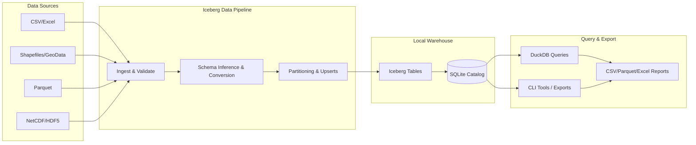

# Iceberg Data Pipeline

[](https://github.com/GSIEnvironmental/iceberg/actions/workflows/ci-cd.yaml)

A Python-based data pipeline for ingesting, cataloging, and querying geospatial and tabular data using Apache Iceberg as the storage format and DuckDB for lightweight analytics.

This project is designed for local-first, schema-aware data management, making it easy to:

- Convert files like CSV, Excel, Parquet, Shapefiles into versioned Iceberg tables.
- Automatically infer schemas, track snapshots, and support upserts via primary keys.
- Maintain a lightweight metadata catalog in SQLite—no heavy cluster needed.
- Run fast SQL queries locally via DuckDB and export results in multiple formats.

In addition, the project supports using S3 as a remote storage option for the Iceberg catalog.

## Why This Stack?

- **Apache Iceberg** – Modern table format for structured data, enabling schema evolution, snapshots, and partitioned tables without a full database engine.
- **SQLite Catalog** – Simple, portable metadata tracking that works without Hadoop, Hive Metastore, or Glue.
- **DuckDB** – In-process OLAP engine perfect for local queries and analytics.
- **PyArrow / Polars / GeoPandas** – Flexible file reading, conversion, and geospatial support.
- **Local-first design** – Works fully offline, minimal dependencies, cloud-ready if needed.

This combination makes it easy to manage data lakes without big data overhead.

## Architecture

The Iceberg Data Pipeline follows a local-first, modular architecture:

- **Raw Data Files** (CSV, Excel, Parquet, Shapefile) are the source.
- **Pipeline CLI** (`iceberg`) handles ingestion, schema inference, validation, and optional upserts.
- **Apache Iceberg Lakehouse** stores versioned, schema-evolving tables in a folder structure.
- **SQLite Catalog** tracks metadata and snapshots for all tables.
- **DuckDB Query Layer** allows local SQL queries and data exports without a full database server.



### Data Flow Summary

1. Ingest: CLI converts source files into Iceberg tables, inferring schema and optionally applying upserts.
2. Catalog: Every table is tracked in SQLite with snapshots, schemas, and partitions.
3. Query & Export: DuckDB reads Iceberg tables and the catalog to enable local SQL queries and export in various formats.

### S3 Support

The Iceberg Data Pipeline can also use S3 for remote storage of the Iceberg catalog and warehouse. This allows you to:

- Use S3 as a remote warehouse for Iceberg tables, enabling cloud-based data lakes.
- Access Iceberg tables directly from S3 using the same CLI commands.

## Quick Start

### 1. Installation

 ```bash
 git clone https://github.com/GSIEnvironmental/iceberg.git
 cd iceberg

 python -m venv venv
 source venv/bin/activate  # On Windows: venv\Scripts\activate

 pip install .
 ```

### 2. Configure

Create a `.pyiceberg.yaml` in the repo root.

#### Example Local SQLite Catalog

```yaml
catalog:
  default:
    # Catalog type (default is SQL catalog)
    type: sql
    # SQLite catalog URI
    uri: sqlite:///warehouse/catalog.db
    # Optional: Initialize catalog tables on first run
    init_catalog_tables: true
    # Path to the Iceberg warehouse directory
    warehouse: ./warehouse
    # Root namespace for tables
    namespace: shell-nigeria
    # Optional: Enable schema evolution (add new columns, delete columns, change data types)
    enable_schema_evolution: true
```

#### Example S3 Catalog

```yaml
catalog:
  aws:
    type: glue
    warehouse: s3://shell-nigeria/warehouse
    namespace: shell-nigeria
    enable_schema_evolution: true
    s3.region: ${AWS_REGION}
    s3.access-key-id: ${AWS_ACCESS_KEY_ID}
    s3.secret-access-key: ${AWS_SECRET_ACCESS_KEY}
```

### 3. Define Datasets

Define your datasets in `datasets.yaml`:

```yaml
datasets:
  example_dataset:
    # Path to the file for this dataset
    file: path/to/data/file.csv

    # Namespace in the catalog (project or folder structure)
    namespace: my.project.namespace

    # Table name in the namespace
    table: example_table

    # List of columns to use as the primary key (or null if no upserts)
    primary_key: [id]

    # Column to use for partitioning (or null if not partitioned)
    partition_field: year

    # Optional preprocessing step before loading
    preprocess:
      # Type of preprocessing (e.g., 'python', 'sql', etc.)
      type: python
      # Path to the preprocessing script or SQL query.
      script: path/to/preprocess_script.py
      # Arguments to pass to the script as a list
      args: []
```

> You can run `iceberg utils generate-datasets-template` to create a sample `datasets.yaml`.

### 4. Run the Pipeline

```bash
# Ingest data and update the Iceberg catalog
iceberg run

# Inspect the catalog
iceberg info

# Query a table (via DuckDB)
iceberg table query my_namespace.my_table "SELECT COUNT(*) FROM t"

# Export to CSV/Parquet
iceberg export my_namespace.my_table --format csv
```

## CLI Overview

```bash
$ iceberg --help

Commands:
run         Run the data pipeline
validate    Validate datasets or catalog configs
info        Manage and inspect the catalog
table       Inspect, export, and query tables
clean       Maintenance and cleanup
export      Export tables and indexes
utils       Utility commands for generating templates, etc.
```

## Docker

A Docker image is available for running the Iceberg CLI in a container. Below is an example of how to use it:

```bash
docker run \
    --rm \
    -it \
    -v $(pwd)/.pyiceberg.yaml:/app/.pyiceberg.yaml \
    -v $(pwd)/datasets.yaml:/app/datasets.yaml \
    -v $(pwd)/warehouse:/app/warehouse \
    -v $(pwd)/data:/app/data \
    -v $(pwd)/preprocess:/app/preprocess \
    ghcr.io/gsienvironmental/iceberg:latest \
    --help
```

>- `--rm`: Automatically remove the container after it exits.
>- `-it`: Run in interactive mode with a terminal.
>- `-v`: Mount local directories into the container for configuration and data access.
>- `$(pwd)/.pyiceberg.yaml`: Iceberg configuration file.
>- `$(pwd)/warehouse`: Local warehouse directory. This is where Iceberg tables will be stored (depending on the `warehouse` setting in your `.pyiceberg.yaml`).
>- `$(pwd)/datasets.yaml`: Datasets configuration file.
>- `$(pwd)/data`: Data directory.
>- `$(pwd)/preprocess`: Directory for any preprocessing scripts.
>- `ghcr.io/gsienvironmental/iceberg:latest`: The Docker image to use.
>- `--help`: Show the CLI help message and exit.

## Testing

```bash
pytest           # run tests
tox -e py313     # run in isolated environment
make test        # optional make target
```

## Documentation

This project uses [MkDocs](https://www.mkdocs.org/) for documentation. You can build and serve the docs locally:

```bash
# Build the documentation
make build-docs
# or
mkdocs build -c -q

# Preview the documentation locally
make preview-docs
# or
mkdocs serve -w .
```

## Notes

- Warehouse data is stored under `warehouse/<namespace>/<table>/` as Iceberg tables (default).
- Shapefile geometries are converted to WKT. Spatial queries are planned for future releases.
- Local-first design makes it easy to sync/ship the warehouse to cloud storage later.

## Resources

- [Tutorial - Building an Apache Iceberg Table](https://towardsdev.com/building-an-apache-iceberg-table-from-parquet-with-daft-pyiceberg-sqlite-catalog-and-duckdb-fc1623a9571a)
- [Apache Iceberg Documentation](https://iceberg.apache.org/)
- [pyiceberg Documentation](https://py.iceberg.apache.org/)
- [DuckDB Documentation](https://duckdb.org/docs/)
- [PyArrow Documentation](https://arrow.apache.org/docs/python/)
