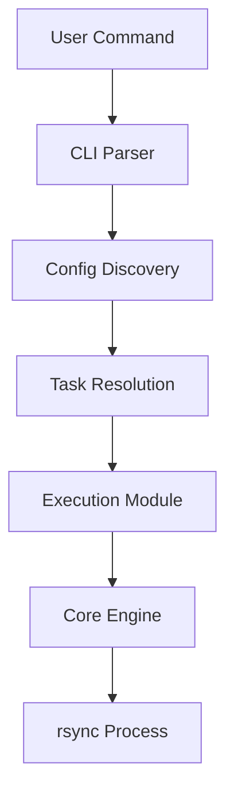
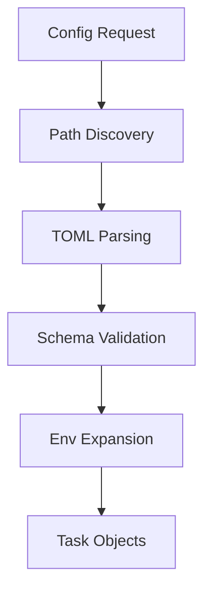
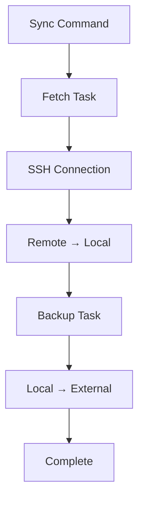

# Architecture

fnb is a modular Python package designed for efficient backup workflows. This page explains the core design and implementation details.

## Overall Structure

fnb consists of the following main components:

```
src/fnb/
├── __init__.py      # Package initialization and version
├── backuper.py      # Backup execution logic
├── cli.py           # Command-line interface with Typer
├── config.py        # Configuration models with Pydantic
├── env.py           # Environment variable handling
├── fetcher.py       # Fetch execution logic
├── gear.py          # Core rsync execution utilities
├── generator.py     # Configuration file generation
└── reader.py        # Configuration discovery and loading
```

## Component Overview

### CLI Interface (cli.py)

The command-line interface built with Typer framework that provides:

- **Main Commands**: `fetch`, `backup`, `sync`, `init`, `status`, `version`
- **Argument Validation**: Type checking and error handling
- **Delegate Pattern**: Routes commands to appropriate modules
- **User Feedback**: Progress messages and error reporting

Key design principles:
- Single responsibility for each command
- Consistent error handling across all commands
- Help documentation integrated into command definitions

### Configuration Models (config.py)

Pydantic-based data models for type-safe configuration:

#### `RsyncTaskConfig`
Represents a single rsync task with validation:

```python
@dataclass
class RsyncTaskConfig:
    label: str           # Unique task identifier
    summary: str         # Human-readable description
    host: str           # SSH host or "none" for local
    source: str         # Source path
    target: str         # Target path
    options: list[str]  # rsync options
    enabled: bool       # Task activation status
```

#### `FnbConfig`
Top-level configuration container:

```python
class FnbConfig(BaseModel):
    fetch: dict[str, RsyncTaskConfig] = {}
    backup: dict[str, RsyncTaskConfig] = {}

    def get_task_by_label(self, section: str, label: str) -> RsyncTaskConfig | None
    def get_enabled_tasks(self, section: str) -> list[RsyncTaskConfig]
```

### Configuration Discovery (reader.py)

Handles configuration file discovery and loading:

#### `ConfigReader`
Main configuration management class:

- **Auto-discovery**: Searches multiple standard locations
- **Environment Expansion**: Supports `$HOME`, `${VAR}` syntax
- **Validation**: TOML parsing and schema validation
- **Status Reporting**: Configuration overview and diagnostics

Search order:
1. `./fnb.toml` (project-local)
2. `./config.toml`
3. `./config/*.toml` (split configurations)
4. `~/.config/fnb/config.toml` (user configuration)
5. Platform-specific user directories

### Core Execution Engine (gear.py)

The heart of fnb's backup operations:

#### `run_rsync()`
Main execution function with features:

- **SSH Password Automation**: Uses `pexpect` for password handling
- **Process Management**: Signal handling and cleanup
- **Error Detection**: rsync exit code interpretation
- **Dry-run Support**: Preview mode for all operations

#### SSH Automation
Implements secure SSH password handling:

```python
def run_rsync(task: RsyncTaskConfig,
              dry_run: bool = False,
              ssh_password: str | None = None,
              create_dirs: bool = False) -> None
```

Key features:
- Timeout handling for SSH connections
- Secure password masking in logs
- Signal-based process termination
- Comprehensive error reporting

### Task Execution Modules

#### Fetcher (fetcher.py)
Handles remote-to-local data retrieval:

- Validates remote connectivity
- Manages SSH authentication
- Creates local target directories
- Delegates to `gear.run_rsync()`

#### Backuper (backuper.py)
Handles local-to-external backup operations:

- Validates local source paths
- Creates backup target directories
- Supports various backup destinations
- Delegates to `gear.run_rsync()`

### Utility Modules

#### Environment Handler (env.py)
Manages environment variables and secrets:

- **Password Discovery**: Multiple `.env` file locations
- **Variable Normalization**: Hostname to env var mapping
- **Secure Loading**: Uses `python-dotenv` for parsing
- **Fallback Strategy**: Command-line → `.env` → prompt

#### Configuration Generator (generator.py)
Creates initial configuration files:

- **Template System**: Predefined configuration templates
- **File Type Support**: Generates `fnb.toml` and `.env` files
- **Interactive Mode**: User prompts for configuration
- **Force Overwrite**: Option to replace existing files

## Data Flow Architecture

### 1. Command Processing Flow



### 2. Configuration Loading



### 3. Sync Workflow



## Design Principles

### Modularity
- Each module has a single, well-defined responsibility
- Clear interfaces between components
- Minimal coupling between modules
- Easy to test and maintain

### Type Safety
- Comprehensive type hints throughout codebase
- Pydantic for runtime type validation
- mypy compatibility for static analysis
- Clear error messages for type mismatches

### Error Handling
- Consistent error reporting across modules
- User-friendly error messages
- Graceful degradation when possible
- Detailed logging for debugging

### Extensibility
- Plugin-like architecture for new task types
- Configuration-driven behavior
- Easy addition of new rsync options
- Support for custom validation rules

## Security Considerations

### Password Handling
- Passwords never stored in plaintext files
- Environment variable isolation
- Process memory cleanup
- Secure inter-process communication

### Path Validation
- Prevention of directory traversal attacks
- Validation of local vs. remote paths
- Safe expansion of environment variables
- Protection against malicious rsync options

### Process Security
- Controlled subprocess execution
- Signal handling for clean termination
- Resource cleanup on errors
- Minimal privilege requirements

## Performance Characteristics

### Memory Usage
- Minimal memory footprint (< 10MB typical)
- Streaming-based file operations
- Efficient configuration caching
- Low overhead for multiple tasks

### Execution Speed
- Fast configuration loading (< 100ms)
- Parallel-ready architecture
- Minimal startup overhead
- Efficient rsync delegation

### Scalability
- Handles hundreds of tasks efficiently
- Configuration file size not a bottleneck
- Suitable for automated/scripted usage
- Resource usage scales linearly

## Testing Architecture

### Test Structure
```
tests/
├── unit/           # Component isolation tests
├── integration/    # End-to-end workflow tests
└── fixtures/       # Shared test utilities
```

### Test Strategy
- **Unit Tests**: Individual module validation
- **Integration Tests**: Complete workflow validation
- **Mocking Strategy**: External dependency isolation
- **Coverage Target**: 85%+ code coverage

### Key Test Areas
- Configuration validation and error cases
- SSH authentication scenarios
- File system operations
- Error propagation and handling
- CLI argument processing

## Future Architecture Considerations

### Planned Improvements
- Plugin system for custom backup destinations
- Configuration templating and inheritance
- Enhanced progress reporting and logging
- Support for parallel task execution

### Extension Points
- Custom rsync option validators
- Alternative SSH authentication methods
- Integration with cloud storage APIs
- Configuration management via web interface

This architecture provides a solid foundation for reliable, secure, and maintainable backup workflows while remaining simple enough for individual users and robust enough for production environments.
