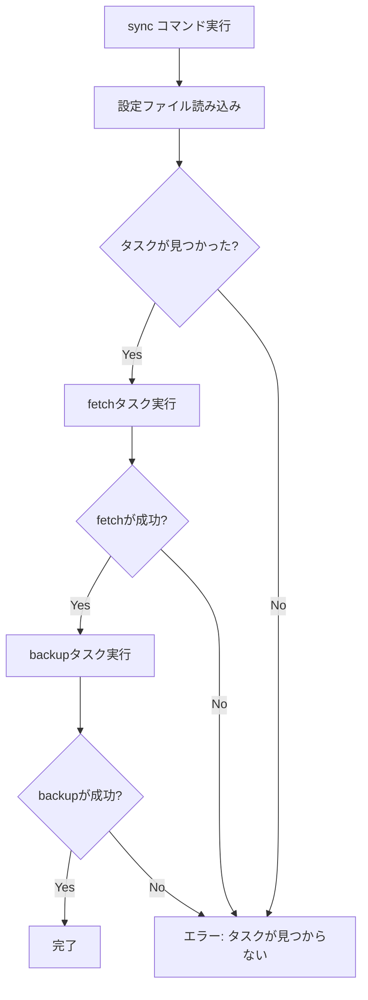

# アーキテクチャ

rfbはモジュラー設計のPythonパッケージです。このページではコア設計と仕組みを説明します。

## 全体構造

rfbは以下の主要コンポーネントで構成されています：

```
rfb/
├── __init__.py      # パッケージ初期化
├── backuper.py      # バックアップ実行ロジック
├── cli.py           # コマンドラインインターフェース
├── config.py        # 設定モデルと読み込み機能
├── fetcher.py       # フェッチ実行ロジック
├── gear.py          # rsync実行ユーティリティ
├── generator.py     # 設定ファイル生成
└── reader.py        # 設定ファイル読み込み
```

## コンポーネント概要

### CLI (cli.py)

Typerを使用したコマンドラインインターフェース。主要コマンド（fetch, backup, sync, init, status）を定義し、適切なモジュールに処理を委譲します。

### 設定モデル (config.py)

Pydanticを使用した設定データモデル：

- `RsyncTaskConfig` - 単一のrsyncタスク設定
- `RfbConfig` - 全体の設定モデル（fetchとbackupセクションを含む）

### 設定ローダー (reader.py)

設定ファイルの検索と読み込みを担当：

- `ConfigReader` - 複数の候補パスから設定を検索
- 環境変数の展開機能
- 設定ステータスの出力

### rsync実行エンジン (gear.py)

rsyncコマンドの実行を担当：

- `run_rsync()` - シンプルなrsync実行
- `_run_rsync_with_password()` - パスワード入力の自動化

### フェッチャー (fetcher.py)

リモートからローカルへのデータ取得を担当：

- SSH接続によるリモートデータ取得
- 設定からrsyncオプションの適用

### バックアッパー (backuper.py)

ローカルから外部ストレージへのバックアップを担当：

- 主にローカルディスク間の転送
- OneDriveなどのクラウドストレージへの転送

### 設定ジェネレーター (generator.py)

新規設定ファイルの生成を担当：

- テンプレートからの設定生成
- 開発用と本番用の区別

## 認証フロー

SSHパスワード認証は`pexpect`ライブラリを使用して自動化されています：

1. rsyncコマンドがSSH接続を開始
2. pexpectがパスワードプロンプトを検出
3. 環境変数または`--ssh-password`オプションからパスワードを取得
4. パスワードを自動入力

## ファイルパス解決

設定ファイルの読み込みは以下の優先順位で試行されます：

1. コマンドライン引数で明示的に指定されたパス
2. カレントディレクトリの`rfb.toml`
3. XDG規格に沿ったユーザー設定ディレクトリ
4. Windowsの場合はAppDataディレクトリ
5. 開発用の`examples/config.toml`

## 主な処理フロー

### syncコマンドの処理フロー



## エラーハンドリング

各コンポーネントは適切な例外を発生させ、上位レベルのコンポーネントでキャッチして処理します：

- `FileNotFoundError` - 設定ファイルが見つからない
- `ValueError` - 設定内容が無効
- `subprocess.CalledProcessError` - rsyncコマンドの実行エラー
- `pexpect.TIMEOUT` - SSHパスワードプロンプトのタイムアウト

## 将来の拡張性

コード設計は以下の将来の拡張を考慮しています：

1. クラウドストレージAPIの直接サポート
2. スナップショット機能（日付付きバックアップ）
3. バックアップ検証機能
4. 通知システム（エラー発生時のメール/Slack通知）
5. バックアップスケジューリング
