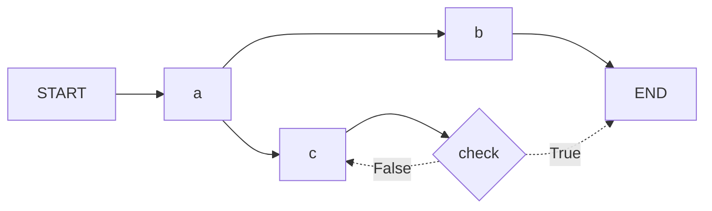

# graph_topper

[](https://pypi.org/project/graph_topper/)

`graph-topper` is a small extension to the `lang-graph` library that allows for graph definitions via decorators, 
bringing flow-control and logic to one place.

Mostly a hobby project, but aims to fulfill all expectations of a fully fledged python library, such as clean code,
tests, docs and a pypi release.

---

## ✨ Features
- Define node logic and node connections in one place
- Stops circular references in the graph via native python syntax (node directionality is implied by the order in which
the methods are defined)
- More compact graph definition (define node and incoming edges in one line)
- Avoids error-prone string references (by using method names by default)
- Retails all functionality of `lang-graph`
 
---

## 📦 Installation

```bash
pip install graph_topper
```

## ⚡ Quick Examples
**Goal:** construct the following graph 

### with graph_topper

```python
from graph_topper import Topper
from langgraph.constants import END

from somewhere import State

topper = Topper(State)

@topper.node()
def a(state: State): ...

@topper.node(dependencies=[a])
def b(state: State): ...

@topper.node(dependencies=[a])
def c(state: State): ...

@topper.branch(c, {True: END, False: c})
def check(state: State): ...
```

### without graph_topper
```python
from langgraph.constants import END, START
from langgraph.graph import StateGraph

from somewhere import State

def a(state: State): ...

def b(state: State): ...

def c(state: State): ...

def check(state: State): ...

graph = StateGraph(State)
graph.add_node("a", a)
graph.add_node("b", b)
graph.add_node("c", c)

graph.add_edge(START, "a")
graph.add_edge("a", "b")
graph.add_edge("a", "c")

graph.add_conditional_edges("c", check, {True: END, False: "c"})
```

## 🤝 Contributing

Contributions are welcome! Feel free to open issues, suggest improvements, or submit pull requests.
