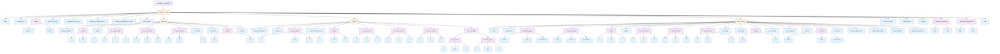

```mermaid
flowchart TD
    root["camera_x_rays IDS"]

    n1(camera_x_rays)
    root --> n1
    class n1 complexNode
    n2[name]
    n1 --> n2
    class n2 leafNode
    n3[description]
    n1 --> n3
    class n3 leafNode
    n4[frame]
    n1 --> n4
    class n4 normalNode
    n5[counts_n]
    n4 --> n5
    class n5 leafNode
    n6[time]
    n4 --> n6
    class n6 leafNode
    n7[photon_energy]
    n1 --> n7
    class n7 leafNode
    n8[quantum_efficiency]
    n1 --> n8
    class n8 leafNode
    n9[energy_threshold_lower]
    n1 --> n9
    class n9 leafNode
    n10[energy_configuration_name]
    n1 --> n10
    class n10 leafNode
    n11[pixel_status]
    n1 --> n11
    class n11 leafNode
    n12(aperture)
    n1 --> n12
    class n12 complexNode
    n13[geometry_type]
    n12 --> n13
    class n13 leafNode
    n14[centre]
    n12 --> n14
    class n14 normalNode
    n15[r]
    n14 --> n15
    class n15 leafNode
    n16[phi]
    n14 --> n16
    class n16 leafNode
    n17[z]
    n14 --> n17
    class n17 leafNode
    n18[radius]
    n12 --> n18
    class n18 leafNode
    n19[x1_unit_vector]
    n12 --> n19
    class n19 normalNode
    n20[x]
    n19 --> n20
    class n20 leafNode
    n21[y]
    n19 --> n21
    class n21 leafNode
    n22[z]
    n19 --> n22
    class n22 leafNode
    n23[x2_unit_vector]
    n12 --> n23
    class n23 normalNode
    n24[x]
    n23 --> n24
    class n24 leafNode
    n25[y]
    n23 --> n25
    class n25 leafNode
    n26[z]
    n23 --> n26
    class n26 leafNode
    n27[x3_unit_vector]
    n12 --> n27
    class n27 normalNode
    n28[x]
    n27 --> n28
    class n28 leafNode
    n29[y]
    n27 --> n29
    class n29 leafNode
    n30[z]
    n27 --> n30
    class n30 leafNode
    n31[x1_width]
    n12 --> n31
    class n31 leafNode
    n32[x2_width]
    n12 --> n32
    class n32 leafNode
    n33[outline]
    n12 --> n33
    class n33 normalNode
    n34[x1]
    n33 --> n34
    class n34 leafNode
    n35[x2]
    n33 --> n35
    class n35 leafNode
    n36[surface]
    n12 --> n36
    class n36 leafNode
    n37(camera)
    n1 --> n37
    class n37 complexNode
    n38[pixel_dimensions]
    n37 --> n38
    class n38 leafNode
    n39[pixels_n]
    n37 --> n39
    class n39 leafNode
    n40[pixel_position]
    n37 --> n40
    class n40 normalNode
    n41[r]
    n40 --> n41
    class n41 leafNode
    n42[phi]
    n40 --> n42
    class n42 leafNode
    n43[z]
    n40 --> n43
    class n43 leafNode
    n44[camera_dimensions]
    n37 --> n44
    class n44 leafNode
    n45[centre]
    n37 --> n45
    class n45 normalNode
    n46[r]
    n45 --> n46
    class n46 leafNode
    n47[phi]
    n45 --> n47
    class n47 leafNode
    n48[z]
    n45 --> n48
    class n48 leafNode
    n49[x1_unit_vector]
    n37 --> n49
    class n49 normalNode
    n50[x]
    n49 --> n50
    class n50 leafNode
    n51[y]
    n49 --> n51
    class n51 leafNode
    n52[z]
    n49 --> n52
    class n52 leafNode
    n53[x2_unit_vector]
    n37 --> n53
    class n53 normalNode
    n54[x]
    n53 --> n54
    class n54 leafNode
    n55[y]
    n53 --> n55
    class n55 leafNode
    n56[z]
    n53 --> n56
    class n56 leafNode
    n57[x3_unit_vector]
    n37 --> n57
    class n57 normalNode
    n58[x]
    n57 --> n58
    class n58 leafNode
    n59[y]
    n57 --> n59
    class n59 leafNode
    n60[z]
    n57 --> n60
    class n60 leafNode
    n61[line_of_sight]
    n37 --> n61
    class n61 normalNode
    n62[first_point]
    n61 --> n62
    class n62 normalNode
    n63[r]
    n62 --> n63
    class n63 leafNode
    n64[phi]
    n62 --> n64
    class n64 leafNode
    n65[z]
    n62 --> n65
    class n65 leafNode
    n66[second_point]
    n61 --> n66
    class n66 normalNode
    n67[r]
    n66 --> n67
    class n67 leafNode
    n68[phi]
    n66 --> n68
    class n68 leafNode
    n69[z]
    n66 --> n69
    class n69 leafNode
    n70(filter_window)
    n1 --> n70
    class n70 complexNode
    n71[name]
    n70 --> n71
    class n71 leafNode
    n72[description]
    n70 --> n72
    class n72 leafNode
    n73[geometry_type]
    n70 --> n73
    class n73 normalNode
    n74[name]
    n73 --> n74
    class n74 leafNode
    n75[index]
    n73 --> n75
    class n75 leafNode
    n76[description]
    n73 --> n76
    class n76 leafNode
    n77[curvature_type]
    n70 --> n77
    class n77 normalNode
    n78[name]
    n77 --> n78
    class n78 leafNode
    n79[index]
    n77 --> n79
    class n79 leafNode
    n80[description]
    n77 --> n80
    class n80 leafNode
    n81[centre]
    n70 --> n81
    class n81 normalNode
    n82[r]
    n81 --> n82
    class n82 leafNode
    n83[phi]
    n81 --> n83
    class n83 leafNode
    n84[z]
    n81 --> n84
    class n84 leafNode
    n85[radius]
    n70 --> n85
    class n85 leafNode
    n86[x1_unit_vector]
    n70 --> n86
    class n86 normalNode
    n87[x]
    n86 --> n87
    class n87 leafNode
    n88[y]
    n86 --> n88
    class n88 leafNode
    n89[z]
    n86 --> n89
    class n89 leafNode
    n90[x2_unit_vector]
    n70 --> n90
    class n90 normalNode
    n91[x]
    n90 --> n91
    class n91 leafNode
    n92[y]
    n90 --> n92
    class n92 leafNode
    n93[z]
    n90 --> n93
    class n93 leafNode
    n94[x3_unit_vector]
    n70 --> n94
    class n94 normalNode
    n95[x]
    n94 --> n95
    class n95 leafNode
    n96[y]
    n94 --> n96
    class n96 leafNode
    n97[z]
    n94 --> n97
    class n97 leafNode
    n98[x1_width]
    n70 --> n98
    class n98 leafNode
    n99[x2_width]
    n70 --> n99
    class n99 leafNode
    n100[outline]
    n70 --> n100
    class n100 normalNode
    n101[x1]
    n100 --> n101
    class n101 leafNode
    n102[x2]
    n100 --> n102
    class n102 leafNode
    n103[x1_curvature]
    n70 --> n103
    class n103 leafNode
    n104[x2_curvature]
    n70 --> n104
    class n104 leafNode
    n105[surface]
    n70 --> n105
    class n105 leafNode
    n106[material]
    n70 --> n106
    class n106 normalNode
    n107[name]
    n106 --> n107
    class n107 leafNode
    n108[index]
    n106 --> n108
    class n108 leafNode
    n109[description]
    n106 --> n109
    class n109 leafNode
    n110[thickness]
    n70 --> n110
    class n110 leafNode
    n111[wavelength_lower]
    n70 --> n111
    class n111 leafNode
    n112[wavelength_upper]
    n70 --> n112
    class n112 leafNode
    n113[wavelengths]
    n70 --> n113
    class n113 leafNode
    n114[photon_absorption]
    n70 --> n114
    class n114 leafNode
    n115[exposure_time]
    n1 --> n115
    class n115 leafNode
    n116[readout_time]
    n1 --> n116
    class n116 leafNode
    n117[latency]
    n1 --> n117
    class n117 leafNode
    n118[detector_humidity]
    n1 --> n118
    class n118 normalNode
    n119[data]
    n118 --> n119
    class n119 leafNode
    n120[time]
    n118 --> n120
    class n120 leafNode
    n121[detector_temperature]
    n1 --> n121
    class n121 normalNode
    n122[data]
    n121 --> n122
    class n122 leafNode
    n123[time]
    n121 --> n123
    class n123 leafNode
    n124[time]
    n1 --> n124
    class n124 leafNode

    classDef leafNode fill:#e1f5fe
    classDef complexNode fill:#fff3e0
    classDef normalNode fill:#f3e5f5
    classDef moreNode fill:#f5f5f5,stroke-dasharray: 5 5
```