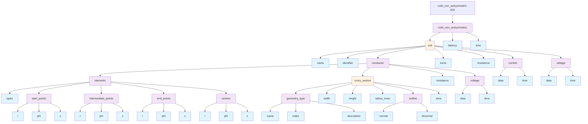

```mermaid
flowchart TD
    root["coils_non_axisymmetric IDS"]

    n1[coils_non_axisymmetric]
    root --> n1
    class n1 normalNode
    n2(coil)
    n1 --> n2
    class n2 complexNode
    n3[name]
    n2 --> n3
    class n3 leafNode
    n4[identifier]
    n2 --> n4
    class n4 leafNode
    n5[conductor]
    n2 --> n5
    class n5 normalNode
    n6[elements]
    n5 --> n6
    class n6 normalNode
    n7[types]
    n6 --> n7
    class n7 leafNode
    n8[start_points]
    n6 --> n8
    class n8 normalNode
    n9[r]
    n8 --> n9
    class n9 leafNode
    n10[phi]
    n8 --> n10
    class n10 leafNode
    n11[z]
    n8 --> n11
    class n11 leafNode
    n12[intermediate_points]
    n6 --> n12
    class n12 normalNode
    n13[r]
    n12 --> n13
    class n13 leafNode
    n14[phi]
    n12 --> n14
    class n14 leafNode
    n15[z]
    n12 --> n15
    class n15 leafNode
    n16[end_points]
    n6 --> n16
    class n16 normalNode
    n17[r]
    n16 --> n17
    class n17 leafNode
    n18[phi]
    n16 --> n18
    class n18 leafNode
    n19[z]
    n16 --> n19
    class n19 leafNode
    n20[centres]
    n6 --> n20
    class n20 normalNode
    n21[r]
    n20 --> n21
    class n21 leafNode
    n22[phi]
    n20 --> n22
    class n22 leafNode
    n23[z]
    n20 --> n23
    class n23 leafNode
    n24(cross_section)
    n5 --> n24
    class n24 complexNode
    n25[geometry_type]
    n24 --> n25
    class n25 normalNode
    n26[name]
    n25 --> n26
    class n26 leafNode
    n27[index]
    n25 --> n27
    class n27 leafNode
    n28[description]
    n25 --> n28
    class n28 leafNode
    n29[width]
    n24 --> n29
    class n29 leafNode
    n30[height]
    n24 --> n30
    class n30 leafNode
    n31[radius_inner]
    n24 --> n31
    class n31 leafNode
    n32[outline]
    n24 --> n32
    class n32 normalNode
    n33[normal]
    n32 --> n33
    class n33 leafNode
    n34[binormal]
    n32 --> n34
    class n34 leafNode
    n35[area]
    n24 --> n35
    class n35 leafNode
    n36[resistance]
    n5 --> n36
    class n36 leafNode
    n37[voltage]
    n5 --> n37
    class n37 normalNode
    n38[data]
    n37 --> n38
    class n38 leafNode
    n39[time]
    n37 --> n39
    class n39 leafNode
    n40[turns]
    n2 --> n40
    class n40 leafNode
    n41[resistance]
    n2 --> n41
    class n41 leafNode
    n42[current]
    n2 --> n42
    class n42 normalNode
    n43[data]
    n42 --> n43
    class n43 leafNode
    n44[time]
    n42 --> n44
    class n44 leafNode
    n45[voltage]
    n2 --> n45
    class n45 normalNode
    n46[data]
    n45 --> n46
    class n46 leafNode
    n47[time]
    n45 --> n47
    class n47 leafNode
    n48[latency]
    n1 --> n48
    class n48 leafNode
    n49[time]
    n1 --> n49
    class n49 leafNode

    classDef leafNode fill:#e1f5fe
    classDef complexNode fill:#fff3e0
    classDef normalNode fill:#f3e5f5
    classDef moreNode fill:#f5f5f5,stroke-dasharray: 5 5
```