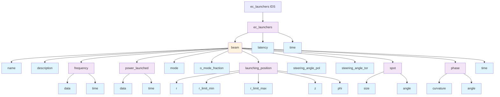

```mermaid
flowchart TD
    root["ec_launchers IDS"]

    n1[ec_launchers]
    root --> n1
    class n1 normalNode
    n2(beam)
    n1 --> n2
    class n2 complexNode
    n3[name]
    n2 --> n3
    class n3 leafNode
    n4[description]
    n2 --> n4
    class n4 leafNode
    n5[frequency]
    n2 --> n5
    class n5 normalNode
    n6[data]
    n5 --> n6
    class n6 leafNode
    n7[time]
    n5 --> n7
    class n7 leafNode
    n8[power_launched]
    n2 --> n8
    class n8 normalNode
    n9[data]
    n8 --> n9
    class n9 leafNode
    n10[time]
    n8 --> n10
    class n10 leafNode
    n11[mode]
    n2 --> n11
    class n11 leafNode
    n12[o_mode_fraction]
    n2 --> n12
    class n12 leafNode
    n13[launching_position]
    n2 --> n13
    class n13 normalNode
    n14[r]
    n13 --> n14
    class n14 leafNode
    n15[r_limit_min]
    n13 --> n15
    class n15 leafNode
    n16[r_limit_max]
    n13 --> n16
    class n16 leafNode
    n17[z]
    n13 --> n17
    class n17 leafNode
    n18[phi]
    n13 --> n18
    class n18 leafNode
    n19[steering_angle_pol]
    n2 --> n19
    class n19 leafNode
    n20[steering_angle_tor]
    n2 --> n20
    class n20 leafNode
    n21[spot]
    n2 --> n21
    class n21 normalNode
    n22[size]
    n21 --> n22
    class n22 leafNode
    n23[angle]
    n21 --> n23
    class n23 leafNode
    n24[phase]
    n2 --> n24
    class n24 normalNode
    n25[curvature]
    n24 --> n25
    class n25 leafNode
    n26[angle]
    n24 --> n26
    class n26 leafNode
    n27[time]
    n2 --> n27
    class n27 leafNode
    n28[latency]
    n1 --> n28
    class n28 leafNode
    n29[time]
    n1 --> n29
    class n29 leafNode

    classDef leafNode fill:#e1f5fe
    classDef complexNode fill:#fff3e0
    classDef normalNode fill:#f3e5f5
    classDef moreNode fill:#f5f5f5,stroke-dasharray: 5 5
```