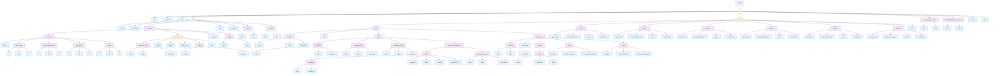

```mermaid
flowchart TD
    root["tf IDS"]

    n1(tf)
    root --> n1
    class n1 complexNode
    n2[r0]
    n1 --> n2
    class n2 leafNode
    n3[is_periodic]
    n1 --> n3
    class n3 leafNode
    n4[coils_n]
    n1 --> n4
    class n4 leafNode
    n5(coil)
    n1 --> n5
    class n5 complexNode
    n6[name]
    n5 --> n6
    class n6 leafNode
    n7[identifier]
    n5 --> n7
    class n7 leafNode
    n8[conductor]
    n5 --> n8
    class n8 normalNode
    n9[elements]
    n8 --> n9
    class n9 normalNode
    n10[types]
    n9 --> n10
    class n10 leafNode
    n11[start_points]
    n9 --> n11
    class n11 normalNode
    n12[r]
    n11 --> n12
    class n12 leafNode
    n13[phi]
    n11 --> n13
    class n13 leafNode
    n14[z]
    n11 --> n14
    class n14 leafNode
    n15[intermediate_points]
    n9 --> n15
    class n15 normalNode
    n16[r]
    n15 --> n16
    class n16 leafNode
    n17[phi]
    n15 --> n17
    class n17 leafNode
    n18[z]
    n15 --> n18
    class n18 leafNode
    n19[end_points]
    n9 --> n19
    class n19 normalNode
    n20[r]
    n19 --> n20
    class n20 leafNode
    n21[phi]
    n19 --> n21
    class n21 leafNode
    n22[z]
    n19 --> n22
    class n22 leafNode
    n23[centres]
    n9 --> n23
    class n23 normalNode
    n24[r]
    n23 --> n24
    class n24 leafNode
    n25[phi]
    n23 --> n25
    class n25 leafNode
    n26[z]
    n23 --> n26
    class n26 leafNode
    n27(cross_section)
    n8 --> n27
    class n27 complexNode
    n28[geometry_type]
    n27 --> n28
    class n28 normalNode
    n29[name]
    n28 --> n29
    class n29 leafNode
    n30[index]
    n28 --> n30
    class n30 leafNode
    n31[description]
    n28 --> n31
    class n31 leafNode
    n32[width]
    n27 --> n32
    class n32 leafNode
    n33[height]
    n27 --> n33
    class n33 leafNode
    n34[radius_inner]
    n27 --> n34
    class n34 leafNode
    n35[outline]
    n27 --> n35
    class n35 normalNode
    n36[normal]
    n35 --> n36
    class n36 leafNode
    n37[binormal]
    n35 --> n37
    class n37 leafNode
    n38[area]
    n27 --> n38
    class n38 leafNode
    n39[resistance]
    n8 --> n39
    class n39 leafNode
    n40[voltage]
    n8 --> n40
    class n40 normalNode
    n41[data]
    n40 --> n41
    class n41 leafNode
    n42[time]
    n40 --> n42
    class n42 leafNode
    n43[turns]
    n5 --> n43
    class n43 leafNode
    n44[resistance]
    n5 --> n44
    class n44 leafNode
    n45[current]
    n5 --> n45
    class n45 normalNode
    n46[data]
    n45 --> n46
    class n46 leafNode
    n47[time]
    n45 --> n47
    class n47 leafNode
    n48[voltage]
    n5 --> n48
    class n48 normalNode
    n49[data]
    n48 --> n49
    class n49 leafNode
    n50[time]
    n48 --> n50
    class n50 leafNode
    n51(field_map)
    n1 --> n51
    class n51 complexNode
    n52[grid]
    n51 --> n52
    class n52 normalNode
    n53[identifier]
    n52 --> n53
    class n53 normalNode
    n54[name]
    n53 --> n54
    class n54 leafNode
    n55[index]
    n53 --> n55
    class n55 leafNode
    n56[description]
    n53 --> n56
    class n56 leafNode
    n57[path]
    n52 --> n57
    class n57 leafNode
    n58[space]
    n52 --> n58
    class n58 normalNode
    n59[identifier]
    n58 --> n59
    class n59 normalNode
    n60[name]
    n59 --> n60
    class n60 leafNode
    n61[index]
    n59 --> n61
    class n61 leafNode
    n62[description]
    n59 --> n62
    class n62 leafNode
    n63[geometry_type]
    n58 --> n63
    class n63 normalNode
    n64[name]
    n63 --> n64
    class n64 leafNode
    n65[index]
    n63 --> n65
    class n65 leafNode
    n66[description]
    n63 --> n66
    class n66 leafNode
    n67[coordinates_type]
    n58 --> n67
    class n67 normalNode
    n68[name]
    n67 --> n68
    class n68 leafNode
    n69[index]
    n67 --> n69
    class n69 leafNode
    n70[description]
    n67 --> n70
    class n70 leafNode
    n71[objects_per_dimension]
    n58 --> n71
    class n71 normalNode
    n72[object]
    n71 --> n72
    class n72 normalNode
    n73[boundary]
    n72 --> n73
    class n73 normalNode
    n74[index]
    n73 --> n74
    class n74 leafNode
    n75[neighbours]
    n73 --> n75
    class n75 leafNode
    n76[geometry]
    n72 --> n76
    class n76 leafNode
    n77[nodes]
    n72 --> n77
    class n77 leafNode
    n78[measure]
    n72 --> n78
    class n78 leafNode
    n79[geometry_2d]
    n72 --> n79
    class n79 leafNode
    n80[geometry_content]
    n71 --> n80
    class n80 normalNode
    n81[name]
    n80 --> n81
    class n81 leafNode
    n82[index]
    n80 --> n82
    class n82 leafNode
    n83[description]
    n80 --> n83
    class n83 leafNode
    n84[grid_subset]
    n52 --> n84
    class n84 normalNode
    n85[identifier]
    n84 --> n85
    class n85 normalNode
    n86[name]
    n85 --> n86
    class n86 leafNode
    n87[index]
    n85 --> n87
    class n87 leafNode
    n88[description]
    n85 --> n88
    class n88 leafNode
    n89[dimension]
    n84 --> n89
    class n89 leafNode
    n90[element]
    n84 --> n90
    class n90 normalNode
    n91[object]
    n90 --> n91
    class n91 normalNode
    n92[space]
    n91 --> n92
    class n92 leafNode
    n93[dimension]
    n91 --> n93
    class n93 leafNode
    n94[index]
    n91 --> n94
    class n94 leafNode
    n95[base]
    n84 --> n95
    class n95 normalNode
    n96[jacobian]
    n95 --> n96
    class n96 leafNode
    n97[tensor_covariant]
    n95 --> n97
    class n97 leafNode
    n98[tensor_contravariant]
    n95 --> n98
    class n98 leafNode
    n99[metric]
    n84 --> n99
    class n99 normalNode
    n100[jacobian]
    n99 --> n100
    class n100 leafNode
    n101[tensor_covariant]
    n99 --> n101
    class n101 leafNode
    n102[tensor_contravariant]
    n99 --> n102
    class n102 leafNode
    n103[b_field_r]
    n51 --> n103
    class n103 normalNode
    n104[grid_index]
    n103 --> n104
    class n104 leafNode
    n105[grid_subset_index]
    n103 --> n105
    class n105 leafNode
    n106[values]
    n103 --> n106
    class n106 leafNode
    n107[coefficients]
    n103 --> n107
    class n107 leafNode
    n108[b_field_z]
    n51 --> n108
    class n108 normalNode
    n109[grid_index]
    n108 --> n109
    class n109 leafNode
    n110[grid_subset_index]
    n108 --> n110
    class n110 leafNode
    n111[values]
    n108 --> n111
    class n111 leafNode
    n112[coefficients]
    n108 --> n112
    class n112 leafNode
    n113[b_field_tor]
    n51 --> n113
    class n113 normalNode
    n114[grid_index]
    n113 --> n114
    class n114 leafNode
    n115[grid_subset_index]
    n113 --> n115
    class n115 leafNode
    n116[values]
    n113 --> n116
    class n116 leafNode
    n117[coefficients]
    n113 --> n117
    class n117 leafNode
    n118[a_field_r]
    n51 --> n118
    class n118 normalNode
    n119[grid_index]
    n118 --> n119
    class n119 leafNode
    n120[grid_subset_index]
    n118 --> n120
    class n120 leafNode
    n121[values]
    n118 --> n121
    class n121 leafNode
    n122[coefficients]
    n118 --> n122
    class n122 leafNode
    n123[a_field_z]
    n51 --> n123
    class n123 normalNode
    n124[grid_index]
    n123 --> n124
    class n124 leafNode
    n125[grid_subset_index]
    n123 --> n125
    class n125 leafNode
    n126[values]
    n123 --> n126
    class n126 leafNode
    n127[coefficients]
    n123 --> n127
    class n127 leafNode
    n128[a_field_tor]
    n51 --> n128
    class n128 normalNode
    n129[grid_index]
    n128 --> n129
    class n129 leafNode
    n130[grid_subset_index]
    n128 --> n130
    class n130 leafNode
    n131[values]
    n128 --> n131
    class n131 leafNode
    n132[coefficients]
    n128 --> n132
    class n132 leafNode
    n133[time]
    n51 --> n133
    class n133 leafNode
    n134[b_field_phi_vacuum_r]
    n1 --> n134
    class n134 normalNode
    n135[data]
    n134 --> n135
    class n135 leafNode
    n136[time]
    n134 --> n136
    class n136 leafNode
    n137[delta_b_field_phi_vacuum_r]
    n1 --> n137
    class n137 normalNode
    n138[data]
    n137 --> n138
    class n138 leafNode
    n139[time]
    n137 --> n139
    class n139 leafNode
    n140[latency]
    n1 --> n140
    class n140 leafNode
    n141[time]
    n1 --> n141
    class n141 leafNode

    classDef leafNode fill:#e1f5fe
    classDef complexNode fill:#fff3e0
    classDef normalNode fill:#f3e5f5
    classDef moreNode fill:#f5f5f5,stroke-dasharray: 5 5
```