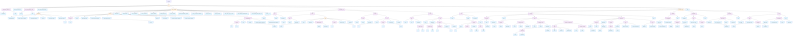

```mermaid
flowchart TD
    root["wall IDS"]

    n1(wall)
    root --> n1
    class n1 complexNode
    n2[temperature_reference]
    n1 --> n2
    class n2 normalNode
    n3[description]
    n2 --> n3
    class n3 leafNode
    n4[data]
    n2 --> n4
    class n4 leafNode
    n5[first_wall_surface_area]
    n1 --> n5
    class n5 leafNode
    n6[first_wall_power_flux_peak]
    n1 --> n6
    class n6 normalNode
    n7[data]
    n6 --> n7
    class n7 leafNode
    n8[time]
    n6 --> n8
    class n8 leafNode
    n9[first_wall_enclosed_volume]
    n1 --> n9
    class n9 leafNode
    n10(global_quantities)
    n1 --> n10
    class n10 complexNode
    n11(electrons)
    n10 --> n11
    class n11 complexNode
    n12[pumping_speed]
    n11 --> n12
    class n12 leafNode
    n13[particle_flux_from_plasma]
    n11 --> n13
    class n13 leafNode
    n14[particle_flux_from_wall]
    n11 --> n14
    class n14 leafNode
    n15[gas_puff]
    n11 --> n15
    class n15 leafNode
    n16[power_inner_target]
    n11 --> n16
    class n16 leafNode
    n17[power_outer_target]
    n11 --> n17
    class n17 leafNode
    n18(neutral)
    n10 --> n18
    class n18 complexNode
    n19[element]
    n18 --> n19
    class n19 normalNode
    n20[a]
    n19 --> n20
    class n20 leafNode
    n21[z_n]
    n19 --> n21
    class n21 leafNode
    n22[atoms_n]
    n19 --> n22
    class n22 leafNode
    n23[name]
    n18 --> n23
    class n23 leafNode
    n24[pumping_speed]
    n18 --> n24
    class n24 leafNode
    n25[particle_flux_from_plasma]
    n18 --> n25
    class n25 leafNode
    n26[particle_flux_from_wall]
    n18 --> n26
    class n26 leafNode
    n27[gas_puff]
    n18 --> n27
    class n27 leafNode
    n28[wall_inventory]
    n18 --> n28
    class n28 leafNode
    n29[recycling_particles_coefficient]
    n18 --> n29
    class n29 leafNode
    n30[recycling_energy_coefficient]
    n18 --> n30
    class n30 leafNode
    n31[incident_species]
    n18 --> n31
    class n31 normalNode
    n32[element]
    n31 --> n32
    class n32 normalNode
    n33[a]
    n32 --> n33
    class n33 leafNode
    n34[z_n]
    n32 --> n34
    class n34 leafNode
    n35[atoms_n]
    n32 --> n35
    class n35 leafNode
    n36[name]
    n31 --> n36
    class n36 leafNode
    n37[energies]
    n31 --> n37
    class n37 leafNode
    n38[sputtering_physical_coefficient]
    n31 --> n38
    class n38 leafNode
    n39[sputtering_chemical_coefficient]
    n31 --> n39
    class n39 leafNode
    n40[temperature]
    n10 --> n40
    class n40 leafNode
    n41[power_incident]
    n10 --> n41
    class n41 leafNode
    n42[power_conducted]
    n10 --> n42
    class n42 leafNode
    n43[power_convected]
    n10 --> n43
    class n43 leafNode
    n44[power_radiated]
    n10 --> n44
    class n44 leafNode
    n45[power_black_body]
    n10 --> n45
    class n45 leafNode
    n46[power_neutrals]
    n10 --> n46
    class n46 leafNode
    n47[power_recombination_plasma]
    n10 --> n47
    class n47 leafNode
    n48[power_recombination_neutrals]
    n10 --> n48
    class n48 leafNode
    n49[power_currents]
    n10 --> n49
    class n49 leafNode
    n50[power_to_cooling]
    n10 --> n50
    class n50 leafNode
    n51[power_inner_target_ion_total]
    n10 --> n51
    class n51 leafNode
    n52[power_density_inner_target_max]
    n10 --> n52
    class n52 leafNode
    n53[power_density_outer_target_max]
    n10 --> n53
    class n53 leafNode
    n54[current_phi]
    n10 --> n54
    class n54 leafNode
    n55[description_2d]
    n1 --> n55
    class n55 normalNode
    n56[type]
    n55 --> n56
    class n56 normalNode
    n57[name]
    n56 --> n57
    class n57 leafNode
    n58[index]
    n56 --> n58
    class n58 leafNode
    n59[description]
    n56 --> n59
    class n59 leafNode
    n60[limiter]
    n55 --> n60
    class n60 normalNode
    n61[type]
    n60 --> n61
    class n61 normalNode
    n62[name]
    n61 --> n62
    class n62 leafNode
    n63[index]
    n61 --> n63
    class n63 leafNode
    n64[description]
    n61 --> n64
    class n64 leafNode
    n65(unit)
    n60 --> n65
    class n65 complexNode
    n66[name]
    n65 --> n66
    class n66 leafNode
    n67[description]
    n65 --> n67
    class n67 leafNode
    n68[component_type]
    n65 --> n68
    class n68 normalNode
    n69[name]
    n68 --> n69
    class n69 leafNode
    n70[index]
    n68 --> n70
    class n70 leafNode
    n71[description]
    n68 --> n71
    class n71 leafNode
    n72[outline]
    n65 --> n72
    class n72 normalNode
    n73[r]
    n72 --> n73
    class n73 leafNode
    n74[z]
    n72 --> n74
    class n74 leafNode
    n75[phi_extensions]
    n65 --> n75
    class n75 leafNode
    n76[resistivity]
    n65 --> n76
    class n76 leafNode
    n77[mobile]
    n55 --> n77
    class n77 normalNode
    n78[type]
    n77 --> n78
    class n78 normalNode
    n79[name]
    n78 --> n79
    class n79 leafNode
    n80[index]
    n78 --> n80
    class n80 leafNode
    n81[description]
    n78 --> n81
    class n81 leafNode
    n82[unit]
    n77 --> n82
    class n82 normalNode
    n83[name]
    n82 --> n83
    class n83 leafNode
    n84[outline]
    n82 --> n84
    class n84 normalNode
    n85[r]
    n84 --> n85
    class n85 leafNode
    n86[z]
    n84 --> n86
    class n86 leafNode
    n87[time]
    n84 --> n87
    class n87 leafNode
    n88[phi_extensions]
    n82 --> n88
    class n88 leafNode
    n89[resistivity]
    n82 --> n89
    class n89 leafNode
    n90[vessel]
    n55 --> n90
    class n90 normalNode
    n91[type]
    n90 --> n91
    class n91 normalNode
    n92[name]
    n91 --> n92
    class n92 leafNode
    n93[index]
    n91 --> n93
    class n93 leafNode
    n94[description]
    n91 --> n94
    class n94 leafNode
    n95[unit]
    n90 --> n95
    class n95 normalNode
    n96[name]
    n95 --> n96
    class n96 leafNode
    n97[description]
    n95 --> n97
    class n97 leafNode
    n98[annular]
    n95 --> n98
    class n98 normalNode
    n99[outline_inner]
    n98 --> n99
    class n99 normalNode
    n100[r]
    n99 --> n100
    class n100 leafNode
    n101[z]
    n99 --> n101
    class n101 leafNode
    n102[outline_outer]
    n98 --> n102
    class n102 normalNode
    n103[r]
    n102 --> n103
    class n103 leafNode
    n104[z]
    n102 --> n104
    class n104 leafNode
    n105[centreline]
    n98 --> n105
    class n105 normalNode
    n106[r]
    n105 --> n106
    class n106 leafNode
    n107[z]
    n105 --> n107
    class n107 leafNode
    n108[thickness]
    n98 --> n108
    class n108 leafNode
    n109[resistivity]
    n98 --> n109
    class n109 leafNode
    n110[element]
    n95 --> n110
    class n110 normalNode
    n111[name]
    n110 --> n111
    class n111 leafNode
    n112[outline]
    n110 --> n112
    class n112 normalNode
    n113[r]
    n112 --> n113
    class n113 leafNode
    n114[z]
    n112 --> n114
    class n114 leafNode
    n115[resistivity]
    n110 --> n115
    class n115 leafNode
    n116[j_phi]
    n110 --> n116
    class n116 normalNode
    n117[data]
    n116 --> n117
    class n117 leafNode
    n118[time]
    n116 --> n118
    class n118 leafNode
    n119[resistance]
    n110 --> n119
    class n119 leafNode
    n120(description_ggd)
    n1 --> n120
    class n120 complexNode
    n121[type]
    n120 --> n121
    class n121 normalNode
    n122[name]
    n121 --> n122
    class n122 leafNode
    n123[index]
    n121 --> n123
    class n123 leafNode
    n124[description]
    n121 --> n124
    class n124 leafNode
    n125[grid_ggd]
    n120 --> n125
    class n125 normalNode
    n126[identifier]
    n125 --> n126
    class n126 normalNode
    n127[name]
    n126 --> n127
    class n127 leafNode
    n128[index]
    n126 --> n128
    class n128 leafNode
    n129[description]
    n126 --> n129
    class n129 leafNode
    n130[path]
    n125 --> n130
    class n130 leafNode
    n131[space]
    n125 --> n131
    class n131 normalNode
    n132[identifier]
    n131 --> n132
    class n132 normalNode
    n133[name]
    n132 --> n133
    class n133 leafNode
    n134[index]
    n132 --> n134
    class n134 leafNode
    n135[description]
    n132 --> n135
    class n135 leafNode
    n136[geometry_type]
    n131 --> n136
    class n136 normalNode
    n137[name]
    n136 --> n137
    class n137 leafNode
    n138[index]
    n136 --> n138
    class n138 leafNode
    n139[description]
    n136 --> n139
    class n139 leafNode
    n140[coordinates_type]
    n131 --> n140
    class n140 normalNode
    n141[name]
    n140 --> n141
    class n141 leafNode
    n142[index]
    n140 --> n142
    class n142 leafNode
    n143[description]
    n140 --> n143
    class n143 leafNode
    n144[objects_per_dimension]
    n131 --> n144
    class n144 normalNode
    n145[object]
    n144 --> n145
    class n145 normalNode
    n146[boundary]
    n145 --> n146
    class n146 normalNode
    n147[index]
    n146 --> n147
    class n147 leafNode
    n148[neighbours]
    n146 --> n148
    class n148 leafNode
    n149[geometry]
    n145 --> n149
    class n149 leafNode
    n150[nodes]
    n145 --> n150
    class n150 leafNode
    n151[measure]
    n145 --> n151
    class n151 leafNode
    n152[geometry_2d]
    n145 --> n152
    class n152 leafNode
    n153[geometry_content]
    n144 --> n153
    class n153 normalNode
    n154[name]
    n153 --> n154
    class n154 leafNode
    n155[index]
    n153 --> n155
    class n155 leafNode
    n156[description]
    n153 --> n156
    class n156 leafNode
    n157[grid_subset]
    n125 --> n157
    class n157 normalNode
    n158[identifier]
    n157 --> n158
    class n158 normalNode
    n159[name]
    n158 --> n159
    class n159 leafNode
    n160[index]
    n158 --> n160
    class n160 leafNode
    n161[description]
    n158 --> n161
    class n161 leafNode
    n162[dimension]
    n157 --> n162
    class n162 leafNode
    n163[element]
    n157 --> n163
    class n163 normalNode
    n164[object]
    n163 --> n164
    class n164 normalNode
    n165[space]
    n164 --> n165
    class n165 leafNode
    n166[dimension]
    n164 --> n166
    class n166 leafNode
    n167[index]
    n164 --> n167
    class n167 leafNode
    n168[base]
    n157 --> n168
    class n168 normalNode
    n169[jacobian]
    n168 --> n169
    class n169 leafNode
    n170[tensor_covariant]
    n168 --> n170
    class n170 leafNode
    n171[tensor_contravariant]
    n168 --> n171
    class n171 leafNode
    n172[metric]
    n157 --> n172
    class n172 normalNode
    n173[jacobian]
    n172 --> n173
    class n173 leafNode
    n174[tensor_covariant]
    n172 --> n174
    class n174 leafNode
    n175[tensor_contravariant]
    n172 --> n175
    class n175 leafNode
    n176[time]
    n125 --> n176
    class n176 leafNode
    n177[material]
    n120 --> n177
    class n177 normalNode
    n178[grid_subset]
    n177 --> n178
    class n178 normalNode
    n179[grid_index]
    n178 --> n179
    class n179 leafNode
    n180[grid_subset_index]
    n178 --> n180
    class n180 leafNode
    n181[identifiers]
    n178 --> n181
    class n181 normalNode
    n182[names]
    n181 --> n182
    class n182 leafNode
    n183[indices]
    n181 --> n183
    class n183 leafNode
    n184[descriptions]
    n181 --> n184
    class n184 leafNode
    n185[time]
    n177 --> n185
    class n185 leafNode
    n186[component]
    n120 --> n186
    class n186 normalNode
    n187[identifiers]
    n186 --> n187
    class n187 leafNode
    n188[type]
    n186 --> n188
    class n188 normalNode
    n189[grid_index]
    n188 --> n189
    class n189 leafNode
    n190[grid_subset_index]
    n188 --> n190
    class n190 leafNode
    n191[identifier]
    n188 --> n191
    class n191 normalNode
    n192[name]
    n191 --> n192
    class n192 leafNode
    n193[index]
    n191 --> n193
    class n193 leafNode
    n194[description]
    n191 --> n194
    class n194 leafNode
    n195[time]
    n186 --> n195
    class n195 leafNode
    n196[thickness]
    n120 --> n196
    class n196 normalNode
    n197[grid_subset]
    n196 --> n197
    class n197 normalNode
    n198[grid_index]
    n197 --> n198
    class n198 leafNode
    n199[grid_subset_index]
    n197 --> n199
    class n199 leafNode
    n200[values]
    n197 --> n200
    class n200 leafNode
    n201[coefficients]
    n197 --> n201
    class n201 leafNode
    n202[time]
    n196 --> n202
    class n202 leafNode
    n203[brdf]
    n120 --> n203
    class n203 normalNode
    n204[type]
    n203 --> n204
    class n204 normalNode
    n205[grid_index]
    n204 --> n205
    class n205 leafNode
    n206[grid_subset_index]
    n204 --> n206
    class n206 leafNode
    n207[identifiers]
    n204 --> n207
    class n207 normalNode
    n208[names]
    n207 --> n208
    class n208 leafNode
    n209[indices]
    n207 --> n209
    class n209 leafNode
    n210[descriptions]
    n207 --> n210
    class n210 leafNode
    n211[parameters]
    n203 --> n211
    class n211 normalNode
    n212[grid_index]
    n211 --> n212
    class n212 leafNode
    n213[grid_subset_index]
    n211 --> n213
    class n213 leafNode
    n214[values]
    n211 --> n214
    class n214 leafNode
    n215[coefficients]
    n211 --> n215
    class n215 leafNode
    n216[time]
    n203 --> n216
    class n216 leafNode
    n217[time]
    n1 --> n217
    class n217 leafNode

    classDef leafNode fill:#e1f5fe
    classDef complexNode fill:#fff3e0
    classDef normalNode fill:#f3e5f5
    classDef moreNode fill:#f5f5f5,stroke-dasharray: 5 5
```