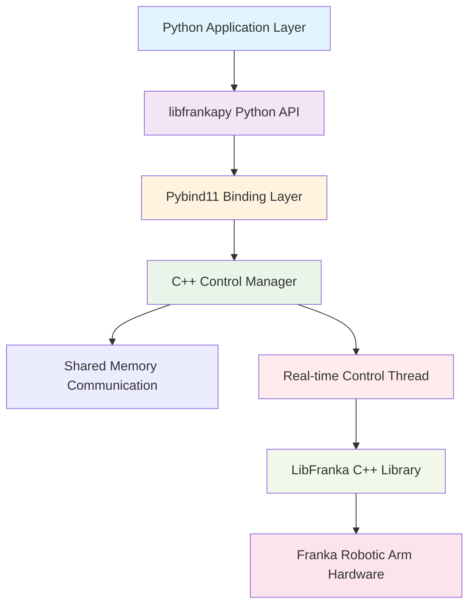

# libfrankapy

[](https://github.com/han-xudong/libfrankapy/actions) [](https://badge.fury.io/py/libfrankapy) [](https://www.python.org/downloads/) [](https://opensource.org/licenses/Apache-2.0)

libfrankapy is a Python binding project for the [libfranka](https://github.com/frankarobotics/libfranka) C++ library, designed to provide high-level Python interfaces for Franka robotic arms while maintaining the performance advantages of low-level C++ real-time control.

## ✨ Features

- 🚀 **Real-time Performance Guarantee**: C++ control loop maintains 1kHz real-time performance, Python does not participate in real-time loops
- 🐍 **Python Friendly**: Provides intuitive Python API with complete type hints
- ⚡ **Efficient Communication**: Uses shared memory and atomic operations for Python-C++ data exchange
- 🛡️ **Safety Control**: Complete safety limits, error handling, and emergency stop functionality
- 🎯 **Multiple Control Modes**: Supports joint space, Cartesian space, and trajectory control
- 📊 **Real-time Monitoring**: Complete robot state feedback and monitoring functionality
- 🏗️ **Modular Design**: Clear code structure and interface separation

## 📚 Documentation

- **📖 Online Documentation**: [https://han-xudong.github.io/libfrankapy/](https://han-xudong.github.io/libfrankapy/)
- **🔧 API Reference**: Complete API documentation with examples
- **🚀 Quick Start Guide**: Step-by-step tutorials for getting started
- **🏗️ Architecture Guide**: Detailed system architecture and design principles
- **🛠️ Development Guide**: Contributing guidelines and development setup

## 🏗️ Architecture Design

libfrankapy adopts a hybrid architecture of C++ real-time environment + Python high-level interface:



## 📋 System Requirements

### Hardware Requirements

- Franka Robotics robotic arm (with FCI functionality)
- Computer with PREEMPT_RT real-time kernel

### Software Requirements

- **Operating System**: Ubuntu 22.04+ with PREEMPT_RT real-time kernel
- **Python**: 3.8+
- **C++ Compiler**: GCC 7+ or Clang 6+
- **CMake**: 3.16+
- **Dependencies**:
  - libfranka 0.15+
  - Eigen3
  - Poco
  - fmt
  - pinocchio
  - pybind11 2.10+

## 🚀 Installation

### 1. Install System Dependencies

```bash
# Update package manager
sudo apt-get update

# Install basic build tools
sudo apt-get install -y build-essential cmake git

# Install libfranka dependencies
sudo apt-get install -y libpoco-dev libeigen3-dev libfmt-dev

# Install pinocchio (required for libfranka 0.14.0+)
sudo apt-get install -y lsb-release curl
sudo mkdir -p /etc/apt/keyrings
curl -fsSL http://robotpkg.openrobots.org/packages/debian/robotpkg.asc | sudo tee /etc/apt/keyrings/robotpkg.asc
echo "deb [arch=amd64 signed-by=/etc/apt/keyrings/robotpkg.asc] http://robotpkg.openrobots.org/packages/debian/pub $(lsb_release -cs) robotpkg" | sudo tee /etc/apt/sources.list.d/robotpkg.list
sudo apt-get update
sudo apt-get install -y robotpkg-pinocchio
```

### 2. Install libfranka

```bash
# Clone libfranka repository
git clone --recurse-submodules https://github.com/frankarobotics/libfranka.git
cd libfranka

# Checkout specific version (recommended 0.15.0)
git checkout 0.15.0
git submodule update

# Build and install
mkdir build && cd build
cmake -DCMAKE_BUILD_TYPE=Release -DCMAKE_PREFIX_PATH=/opt/openrobots/lib/cmake -DBUILD_TESTS=OFF ..
make -j$(nproc)

# Create and install Debian package (recommended)
cpack -G DEB
sudo dpkg -i libfranka*.deb
```

### 3. Install libfrankapy

#### Install from Source (Recommended)

```bash
# Clone repository
git clone https://github.com/han-xudong/libfrankapy.git
cd libfrankapy

# Create virtual environment (recommended)
python -m venv venv
source venv/bin/activate

# Install Python dependencies
pip install -r requirements.txt

# Build and install
pip install -e .
```

#### Install from PyPI

```bash
pip install libfrankapy
```

## 🎯 Quick Start

### Basic Control Example

```python
import libfrankapy as fp
import numpy as np

# Connect to robot
robot = fp.FrankaRobot("192.168.1.100")  # Replace with your robot IP
robot.connect()
robot.start_control()

try:
    # Get current state
    state = robot.get_robot_state()
    print(f"Current joint positions: {state.joint_state.positions}")
    print(f"Current end-effector pose: {state.cartesian_pose.position}")

    # Joint space motion
    target_joints = [0.0, -0.785, 0.0, -2.356, 0.0, 1.571, 0.785]
    robot.move_to_joint(target_joints, speed_factor=0.1)

    # Cartesian space motion
    target_pose = [0.5, 0.0, 0.5, 0.0, 0.0, 0.0, 1.0]  # [x, y, z, qx, qy, qz, qw]
    robot.move_to_pose(target_pose, speed_factor=0.1)

finally:
    # Disconnect
    robot.disconnect()
```

### Trajectory Control Example

```python
import libfrankapy as fp

# Create trajectory
trajectory = fp.Trajectory()
trajectory.add_waypoint([0.0, -0.785, 0.0, -2.356, 0.0, 1.571, 0.785], duration=2.0)
trajectory.add_waypoint([0.2, -0.785, 0.0, -2.356, 0.0, 1.571, 0.785], duration=2.0)
trajectory.add_waypoint([0.0, -0.785, 0.0, -2.356, 0.0, 1.571, 0.785], duration=2.0)

# Execute trajectory
robot = fp.FrankaRobot("192.168.1.100")
robot.connect()
robot.start_control()

def progress_callback(progress):
    print(f"Trajectory execution progress: {progress:.1%}")

robot.execute_trajectory(trajectory, callback=progress_callback)
robot.disconnect()
```

### Real-time State Monitoring

```python
import libfrankapy as fp
import time

robot = fp.FrankaRobot("192.168.1.100")
robot.connect()
robot.start_control()

try:
    for i in range(100):  # Monitor for 10 seconds
        state = robot.get_robot_state()

        print(f"Timestamp: {state.timestamp:.3f}")
        print(f"Joint positions: {[f'{q:.3f}' for q in state.joint_state.positions]}")
        print(f"End-effector position: {[f'{p:.3f}' for p in state.cartesian_pose.position]}")
        print(f"External forces: {[f'{f:.3f}' for f in state.external_wrench[:3]]}")
        print("-" * 50)

        time.sleep(0.1)

finally:
    robot.disconnect()
```

## 📚 API Documentation

### Main Classes

#### `FrankaRobot`

Main robot control class.

```python
class FrankaRobot:
    def __init__(self, robot_ip: str, realtime_config: Optional[RealtimeConfig] = None)
    def connect() -> bool
    def disconnect() -> None
    def is_connected() -> bool
    def start_control() -> None
    def stop_control() -> None
    def move_to_joint(self, joint_positions: List[float],
                      speed_factor: float = 0.1,
                      acceleration_factor: float = 0.1) -> bool
    def move_to_pose(self, target_pose: List[float],
                     speed_factor: float = 0.1) -> bool
    def execute_trajectory(self, trajectory: Trajectory,
                          callback: Optional[Callable] = None) -> bool
    def get_joint_state() -> JointState
    def get_cartesian_pose() -> CartesianPose
    def get_robot_state() -> RobotState
    def emergency_stop() -> None
```

#### Data Structures

```python
@dataclass
class JointState:
    positions: List[float]  # 7 joint angles (rad)
    velocities: List[float] # 7 joint velocities (rad/s)
    efforts: List[float]    # 7 joint torques (Nm)
    timestamp: float

@dataclass
class CartesianPose:
    position: List[float]   # [x, y, z] (m)
    orientation: List[float] # [qx, qy, qz, qw] quaternion
    timestamp: float

@dataclass
class RobotState:
    joint_state: JointState
    cartesian_pose: CartesianPose
    external_wrench: List[float]  # [fx, fy, fz, tx, ty, tz]
    control_mode: int
    timestamp: float
```

## 🔧 Configuration

### Real-time Configuration

```python
config = fp.RealtimeConfig(
    control_frequency=1000,  # Hz
    filter_cutoff=100.0,     # Hz
    safety_limits=fp.SafetyLimits(
        max_joint_velocity=2.0,     # rad/s
        max_joint_acceleration=5.0, # rad/s²
        max_cartesian_velocity=1.0, # m/s
        max_cartesian_acceleration=3.0, # m/s²
        max_force=20.0,             # N
        max_torque=10.0             # Nm
    )
)

robot = fp.FrankaRobot("192.168.1.100", realtime_config=config)
```

## 🧪 Testing

```bash
# Run all tests
pytest

# Run specific tests
pytest tests/test_robot.py

# Run tests with coverage
pytest --cov=libfrankapy
```

## 📖 Examples

See the `examples/` directory for more usage examples:

- `basic_control.py` - Basic control example
- `trajectory_control.py` - Trajectory control example
- `state_monitoring.py` - Real-time state monitoring example

## 🤝 Contributing

We welcome community contributions! Please see [CONTRIBUTING.md](CONTRIBUTING.md) for details on how to participate in project development.

### Development Environment Setup

```bash
# Clone repository
git clone https://github.com/han-xudong/libfrankapy.git
cd libfrankapy

# Create development environment
python3 -m venv venv
source venv/bin/activate

# Install development dependencies
pip install -e ".[dev]"

# Install pre-commit hooks
pre-commit install
```

## 📄 License

This project is licensed under the [Apache License 2.0](LICENSE).

## 🙏 Acknowledgments

- [Franka Robotics](https://www.franka.de/) for providing excellent robotic arm hardware and the libfranka library
- [pybind11](https://github.com/pybind/pybind11) for providing excellent Python-C++ binding tools
- All developers who have contributed to this project

## 📞 Support

- 📖 [Documentation](https://libfrankapy.readthedocs.io/)
- 🐛 [Issue Tracker](https://github.com/han-xudong/libfrankapy/issues)
- 💬 [Discussions](https://github.com/han-xudong/libfrankapy/discussions)
- 📧 [Email Support](mailto:support@libfrankapy.org)

## 🔗 Related Links

- [libfranka Official Documentation](https://frankarobotics.github.io/docs/)
- [Franka Control Interface (FCI) Documentation](https://frankarobotics.github.io/docs/control_interface.html)
- [Real-time Kernel Installation Guide](https://frankarobotics.github.io/docs/installation_linux.html#setting-up-the-real-time-kernel)

---

**Note**: When using this library to control robotic arms, please ensure you follow all safety protocols and test in a controlled environment.
