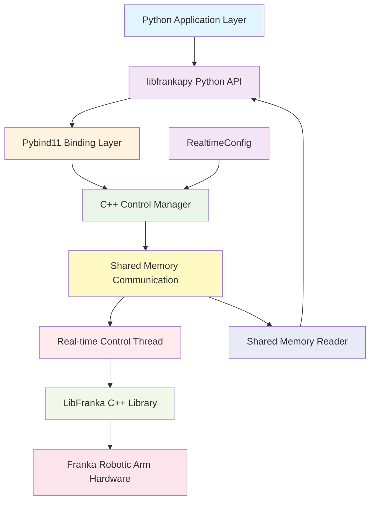

# libfrankapy

 [](https://pypi.org/project/libfrankapy/) [](https://www.python.org/downloads/) [](https://github.com/han-xudong/libfrankapy/actions) [](https://opensource.org/licenses/Apache-2.0) [](https://han-xudong.github.io/libfrankapy/)

libfrankapy is a Python binding project for the [libfranka](https://github.com/frankarobotics/libfranka) library, designed to provide high-level Python interfaces for Franka robotic arms while maintaining the performance advantages of low-level C++ real-time control.

## ✨ Features

- 🚀 **Real-time Performance Guarantee**: C++ control loop maintains 1kHz real-time performance, Python does not participate in real-time loops
- 🐍 **Python Friendly**: Provides intuitive Python API with complete type hints
- ⚡ **Efficient Communication**: Uses shared memory and atomic operations for Python-C++ data exchange
- 🛡️ **Safety Control**: Complete safety limits, error handling, and emergency stop functionality

## 📋 System Requirements

Hardware Requirements:

- Franka Robotics robotic arm (with FCI functionality)
- Computer with PREEMPT_RT real-time kernel

Software Requirements:

- **Operating System**: Ubuntu 22.04+ with PREEMPT_RT real-time kernel
- **Python**: 3.9+
- **C++ Compiler**: GCC 7+ or Clang 6+
- **CMake**: 3.16+

## 🚀 Installation

Before installing libfrankapy, make sure you have installed libfranka following the [libfranka repository](https://github.com/frankarobotics/libfranka).

### Install from source

First, clone the repository:

```bash
git clone https://github.com/han-xudong/libfrankapy.git
cd libfrankapy
```

It's recommended to create a virtual environment (`venv` or `conda`):

```bash
python -m venv venv
source venv/bin/activate
```

Next, build and install the package:

```bash
pip install -e .
```

### Install from PyPI

```bash
pip install libfrankapy
```

## 🎯 Quick Start

Here is a brief example to get you started:

```python
import libfrankapy as fp
import numpy as np

# Connect to robot
robot = fp.FrankaRobot("192.168.1.100")  # Replace with your robot IP
robot.connect()
robot.start_control()

try:
    # Get current state
    state = robot.get_robot_state()
    print(f"Current joint positions: {state.joint_state.positions}")
    print(f"Current end-effector pose: {state.cartesian_pose.position}")

    # Joint space motion
    target_joints = [0.0, -0.785, 0.0, -2.356, 0.0, 1.571, 0.785]
    robot.move_to_joint(target_joints, speed_factor=0.1)

    # Cartesian space motion
    target_pose = [0.5, 0.0, 0.5, 0.0, 0.0, 0.0, 1.0]  # [x, y, z, qx, qy, qz, qw]
    robot.move_to_pose(target_pose, speed_factor=0.1)

finally:
    # Disconnect
    robot.disconnect()
```

See the `examples/` directory for more usage examples:

- `basic_control.py` - Basic control example
- `trajectory_control.py` - Trajectory control example
- `state_monitoring.py` - Real-time state monitoring example

**Note**: When using this library to control robotic arms, please ensure you follow all safety protocols and test in a controlled environment.

## 🏗️ Architecture Design

libfrankapy adopts a hybrid architecture of C++ real-time environment + Python high-level interface:



## 🤝 Contributing

We welcome community contributions! Please see [CONTRIBUTING.md](CONTRIBUTING.md) for details on how to participate in project development.

### Development Environment Setup

```bash
# Clone repository
git clone https://github.com/han-xudong/libfrankapy.git
cd libfrankapy

# Create development environment
python3 -m venv venv
source venv/bin/activate

# Install development dependencies
pip install -e ".[dev]"

# Install pre-commit hooks
pre-commit install
```

## 📄 License

This project is licensed under the [Apache License 2.0](LICENSE).

## 🙏 Acknowledgments

- [Franka Robotics](https://www.franka.de/) for providing excellent robotic arm hardware and the libfranka library
- [pybind11](https://github.com/pybind/pybind11) for providing excellent Python-C++ binding tools
- All developers who have contributed to this project

## 📞 Support

- 📖 [Documentation](https://libfrankapy.readthedocs.io/)
- 🐛 [Issue Tracker](https://github.com/han-xudong/libfrankapy/issues)
- 💬 [Discussions](https://github.com/han-xudong/libfrankapy/discussions)

## 🔗 Related Links

- [libfranka Official Documentation](https://frankarobotics.github.io/docs/)
- [Franka Control Interface (FCI) Documentation](https://frankarobotics.github.io/docs/control_interface.html)
- [Real-time Kernel Installation Guide](https://frankarobotics.github.io/docs/installation_linux.html#setting-up-the-real-time-kernel)
