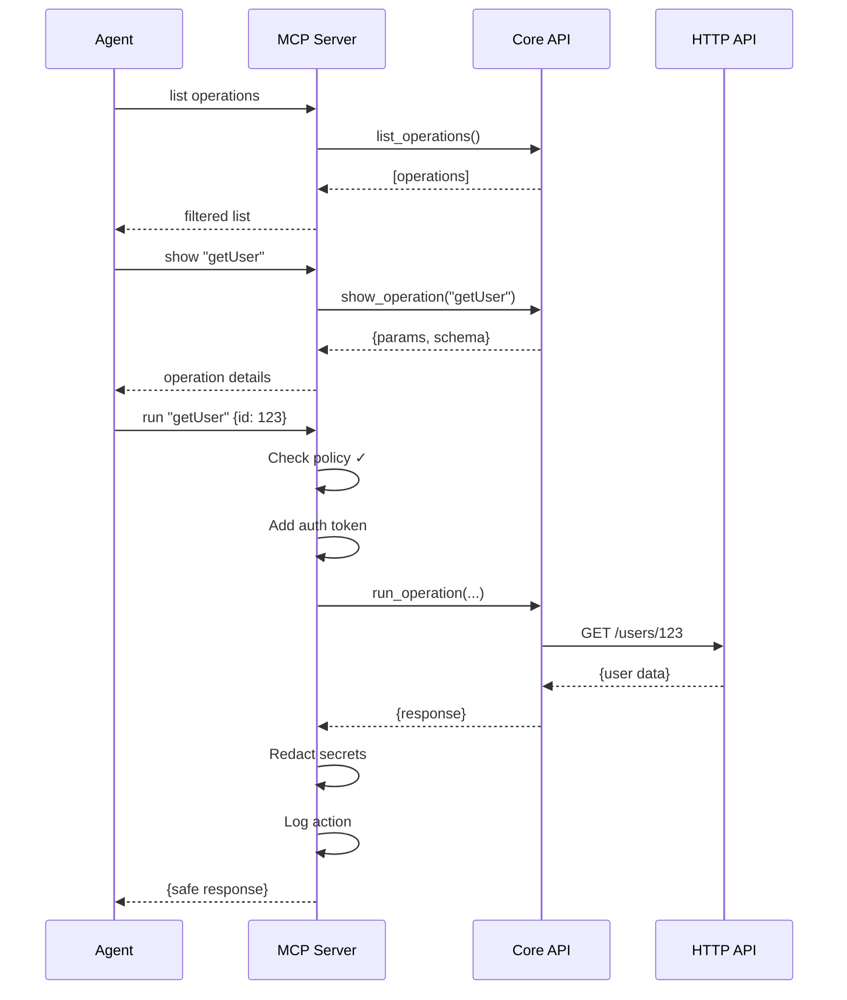
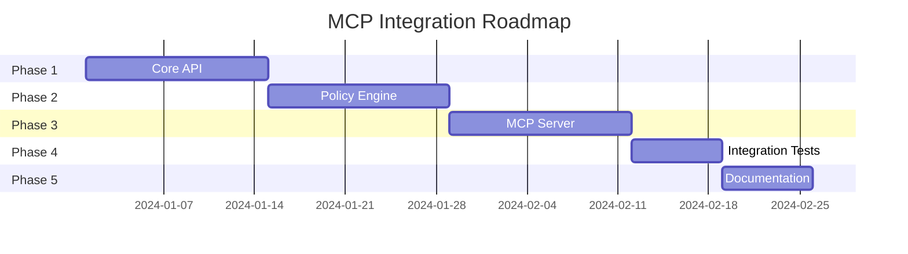

# MCP Architecture Overview

## Quick Start Guide

This document provides a high-level overview of the MCP (Model Context Protocol) integration with MicroRapid, designed for developers who want to quickly understand the architecture.

---

## What is MCP Integration?

MCP integration allows AI agents to safely execute API operations through MicroRapid without:
- Accessing secrets directly
- Bypassing security policies
- Using shell commands
- Breaking existing CLI functionality

Think of it as adding a "robot-safe mode" to MicroRapid.

---

## Architecture at a Glance

```
┌─────────────┐     ┌─────────────┐
│   Human     │     │  AI Agent   │
└──────┬──────┘     └──────┬──────┘
       │                   │
       ▼                   ▼
┌─────────────┐     ┌─────────────┐
│  CLI (mrapids)│     │ MCP Server  │
└──────┬──────┘     └──────┬──────┘
       │                   │
       └─────────┬─────────┘
                 ▼
          ┌─────────────┐
          │  Core API   │
          └──────┬──────┘
                 ▼
          ┌─────────────┐
          │ HTTP Client │
          └─────────────┘
```

**Key Insight**: Humans and agents use the same core engine through different interfaces.

---

## Core Principles

### 1. Two Doors, One Engine
- **Human Door**: Interactive CLI with prompts and colors
- **Agent Door**: MCP server with JSON and policies
- **Shared Engine**: Core API that both doors use

### 2. Security Layers
```
Agent Request
     ↓
[Schema Validation]  ← Ensure valid structure
     ↓
[Policy Check]       ← Can agent do this?
     ↓
[Auth Injection]     ← Add credentials (agent never sees)
     ↓
[Execute Operation]  ← Make the API call
     ↓
[Redact Response]    ← Remove sensitive data
     ↓
[Audit Log]          ← Record what happened
     ↓
Agent Response
```

### 3. Never Trust, Always Verify
- Agents can't override security policies
- Every action is logged
- Secrets stay in the MCP server
- Default deny for dangerous operations

---

## Key Components

### 1. Core API (`src/core/api/`)
Pure business logic, no I/O:
```rust
pub async fn run_operation(
    request: RunRequest,
    auth: Option<AuthProfile>,
) -> Result<RunResponse, ApiError>
```

### 2. Policy Engine (`src/core/policy/`)
Decides what agents can do:
```yaml
rules:
  - name: "readonly-access"
    allow:
      methods: ["GET"]
    deny:
      operations: ["delete*", "update*"]
```

### 3. MCP Server (`agent/`)
Bridges agents to core API:
- Validates requests
- Enforces policies
- Injects auth
- Redacts responses
- Logs everything

### 4. MCP Tools
Three simple tools agents can use:
- `list` - What operations are available?
- `show` - What does this operation need?
- `run` - Execute the operation

---

## Typical Agent Workflow



---

## Configuration Files

### 1. MCP Server Config (`mcp-server.toml`)
```toml
[defaults]
policy_file = "./policy.yaml"
auth_profile = "agent-readonly"
audit_path = "./logs/audit.jsonl"
```

### 2. Policy File (`policy.yaml`)
```yaml
version: "1.0"
defaults:
  allow_methods: ["GET"]
  deny_external_refs: true
  
rules:
  - name: "safe-operations"
    allow:
      operations: ["list*", "get*", "search*"]
```

### 3. Auth Profiles (`.mrapids/auth/`)
```toml
[profile.agent-readonly]
type = "bearer"
token_env = "AGENT_API_TOKEN"
scopes = ["read:all"]
```

---

## Security Model

### What Agents CAN Do:
- ✅ Execute allowed operations
- ✅ Use pre-configured auth profiles
- ✅ Get structured responses
- ✅ Handle errors gracefully

### What Agents CANNOT Do:
- ❌ See raw API tokens
- ❌ Override security policies
- ❌ Execute shell commands
- ❌ Access forbidden operations

---

## Error Handling

Agents receive structured errors:

```json
{
  "status": "error",
  "error": {
    "code": 1001,
    "message": "Operation denied by policy",
    "details": {
      "operation": "deleteUser",
      "rule": "readonly-access",
      "explanation": "DELETE operations are not allowed"
    }
  }
}
```

Error codes follow a pattern:
- `1xxx` - Policy errors
- `2xxx` - Auth errors
- `3xxx` - Validation errors
- `4xxx` - Runtime errors
- `5xxx` - Internal errors

---

## Implementation Timeline



---

## Benefits

### For Developers
- Keep using CLI as normal
- Same core functionality
- Better testability
- Clear security model

### For Operations
- Full audit trail
- Policy-based access
- No secret leakage
- Easy monitoring

### For AI Agents
- Safe API access
- Clear error messages
- Structured responses
- No credential handling

---

## Quick Examples

### Agent Making API Call
```python
# Agent code
result = mcp_client.call("run", {
    "operation_id": "getUser",
    "parameters": {"userId": "123"}
})
```

### Policy Allowing Read-Only
```yaml
rules:
  - name: "github-readonly"
    pattern: "github.com/*"
    allow:
      methods: ["GET"]
      operations: ["list*", "get*"]
```

### Audit Log Entry
```json
{
  "timestamp": "2024-01-20T10:30:00Z",
  "agent": "assistant-v1",
  "operation": "getUser",
  "parameters": {"userId": "123"},
  "policy_match": "readonly-access",
  "result": "success",
  "duration_ms": 145
}
```

---

## Next Steps

1. **For CLI Users**: Nothing changes, keep using mrapids as usual
2. **For DevOps**: Review policy examples and plan rollout
3. **For Developers**: Check out the API reference
4. **For Security**: Review the security model

---

## Resources

- [Full Design Document](./MCP_INTEGRATION_DESIGN.md)
- [Policy Examples](../examples/.mrapids/policy.yaml)
- [MCP Specification](https://modelcontextprotocol.org)
- [API Reference](./API_REFERENCE.md)

---

**Remember**: MCP integration is about making MicroRapid safe for robots while keeping it awesome for humans!