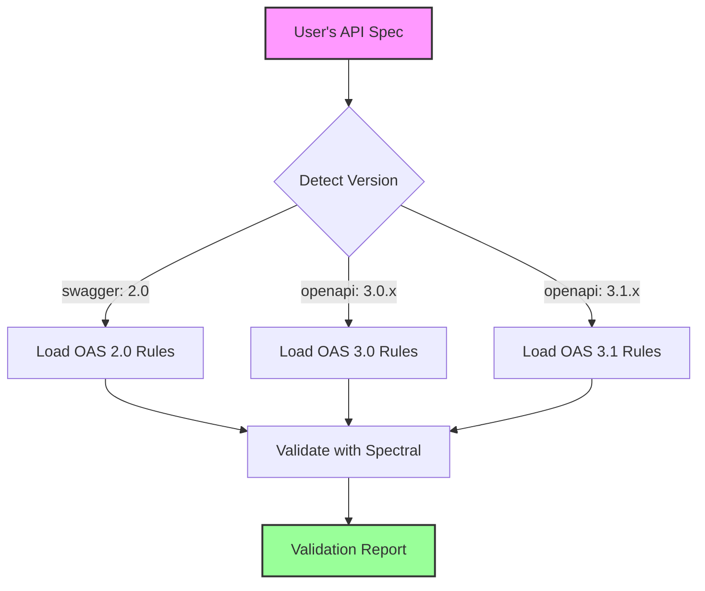

# OpenAPI Spec Validation Architecture

## Where Do OAS Specs Come From?

### 1. User-Provided Specs (Not Part of Binary)

The OAS files to validate are **NOT part of the MicroRapid binary**. They come from:

```bash
# From URL
mrapids init my-api --from-url https://api.example.com/openapi.yaml

# From local file
mrapids init my-api --from-file ./specs/api.yaml

# Already in project
mrapids validate spec ./specs/api.yaml
```

### 2. Validation Rules (Part of Binary/Package)

What IS included:

```
mrapids binary/
├── mrapids              # Main binary
├── .spectral.yaml       # Default ruleset (bundled)
└── rules/               # Security rules (bundled)
    ├── oas2-rules.yaml  # OAS 2.0 specific
    ├── oas3-rules.yaml  # OAS 3.0.x specific
    └── oas31-rules.yaml # OAS 3.1 specific
```

## Version-Specific Validation

### Detection and Routing

```rust
pub fn validate_spec(content: &str) -> Result<ValidationReport> {
    // Step 1: Detect version from the spec itself
    let version = detect_version(content)?;
    
    // Step 2: Route to appropriate validator
    match version {
        SpecVersion::Swagger2_0 => validate_oas2(content),
        SpecVersion::OpenAPI3_0(_) => validate_oas3(content),
        SpecVersion::OpenAPI3_1(_) => validate_oas31(content),
    }
}

fn detect_version(content: &str) -> Result<SpecVersion> {
    let value: Value = serde_json::from_str(content)
        .or_else(|_| serde_yaml::from_str(content))?;
    
    // Check for Swagger 2.0
    if let Some(v) = value.get("swagger") {
        if v == "2.0" {
            return Ok(SpecVersion::Swagger2_0);
        }
    }
    
    // Check for OpenAPI 3.x
    if let Some(v) = value.get("openapi").and_then(|v| v.as_str()) {
        if v.starts_with("3.0.") {
            return Ok(SpecVersion::OpenAPI3_0(v.to_string()));
        }
        if v.starts_with("3.1.") {
            return Ok(SpecVersion::OpenAPI3_1(v.to_string()));
        }
    }
    
    Err(anyhow!("Unknown spec version"))
}
```

## Bundling Strategy

### Option 1: Embedded Rules (Recommended)
```rust
// Embed validation rules in binary at compile time
const OAS2_RULES: &str = include_str!("../rules/oas2-rules.yaml");
const OAS3_RULES: &str = include_str!("../rules/oas3-rules.yaml");
const OAS31_RULES: &str = include_str!("../rules/oas31-rules.yaml");

pub fn get_rules_for_version(version: &SpecVersion) -> &'static str {
    match version {
        SpecVersion::Swagger2_0 => OAS2_RULES,
        SpecVersion::OpenAPI3_0(_) => OAS3_RULES,
        SpecVersion::OpenAPI3_1(_) => OAS31_RULES,
    }
}
```

### Option 2: External Validator (Alternative)
```toml
# Cargo.toml
[dependencies]
# Use pre-built validators
openapi-validator = "0.5"  # Rust crate
spectral-core = "6.0"      # If available as lib

# Or shell out to installed tools
```

## Version-Specific Rules

### OAS 2.0 (Swagger) Rules
```yaml
# rules/oas2-rules.yaml
extends: [[spectral:swagger2, all]]

rules:
  swagger-version:
    description: Must be Swagger 2.0
    given: $.swagger
    then:
      const: "2.0"
      
  basePath-required:
    description: Swagger 2.0 requires basePath
    given: $
    then:
      field: basePath
      function: truthy
      
  definitions-valid:
    description: Definitions must be objects
    given: $.definitions[*]
    then:
      type: object
```

### OAS 3.0.x Rules
```yaml
# rules/oas3-rules.yaml
extends: [[spectral:oas3_0, all]]

rules:
  openapi-version:
    description: Must be OpenAPI 3.0.x
    given: $.openapi
    then:
      function: pattern
      functionOptions:
        match: "^3\\.0\\.[0-3]$"
        
  servers-required:
    description: OpenAPI 3.0 requires servers
    given: $
    then:
      field: servers
      function: truthy
```

### OAS 3.1 Rules
```yaml
# rules/oas31-rules.yaml
extends: [[spectral:oas3_1, all]]

rules:
  json-schema-compatibility:
    description: Use valid JSON Schema 2020-12
    given: $..schema
    then:
      function: jsonSchema202012Valid
      
  webhooks-valid:
    description: Webhooks must follow operation format
    given: $.webhooks[*][*]
    then:
      function: operation-valid
```

## Binary Distribution Options

### 1. Single Binary with Embedded Rules
```rust
// Everything in one binary (~10MB extra)
cargo build --release --features embedded-rules
```

**Pros**: 
- Simple distribution
- Works offline
- No external dependencies

**Cons**:
- Larger binary size
- Rules updates require new release

### 2. Binary + Runtime Download
```rust
// Minimal binary, download rules on first use
pub async fn ensure_rules_available() -> Result<PathBuf> {
    let rules_dir = dirs::config_dir()
        .unwrap()
        .join("mrapids")
        .join("rules");
    
    if !rules_dir.exists() {
        download_rules(&rules_dir).await?;
    }
    
    Ok(rules_dir)
}
```

**Pros**:
- Smaller binary
- Rules can be updated independently

**Cons**:
- Requires internet on first run
- More complex deployment

### 3. Binary + Bundled Spectral
```dockerfile
# Multi-platform distribution
FROM node:slim as spectral
RUN npm install -g @stoplight/spectral-cli

FROM rust:latest as builder
COPY . .
RUN cargo build --release

FROM debian:slim
COPY --from=builder /target/release/mrapids /usr/local/bin/
COPY --from=spectral /usr/local/bin/spectral /usr/local/bin/
```

## Validation Flow Example



## Usage Examples

### Validating Different Versions
```bash
# OAS 2.0 (Swagger)
$ mrapids validate spec swagger2-api.yaml
🔍 Detected: Swagger 2.0
✅ Validation passed with Swagger 2.0 rules

# OAS 3.0.2
$ mrapids validate spec openapi3-api.yaml  
🔍 Detected: OpenAPI 3.0.2
✅ Validation passed with OpenAPI 3.0.x rules

# OAS 3.1.0
$ mrapids validate spec openapi31-api.yaml
🔍 Detected: OpenAPI 3.1.0
✅ Validation passed with OpenAPI 3.1 rules
```

## Implementation Priority

1. **Phase 1**: Embed basic rules in binary
2. **Phase 2**: Add Spectral as optional dependency
3. **Phase 3**: Support custom rule loading
4. **Phase 4**: Cloud-based rule updates

## Summary

- **OAS specs**: Come from users, not bundled
- **Validation rules**: Bundled with binary or downloaded
- **Version detection**: Automatic from spec content
- **Distribution**: Single binary with embedded rules (recommended)