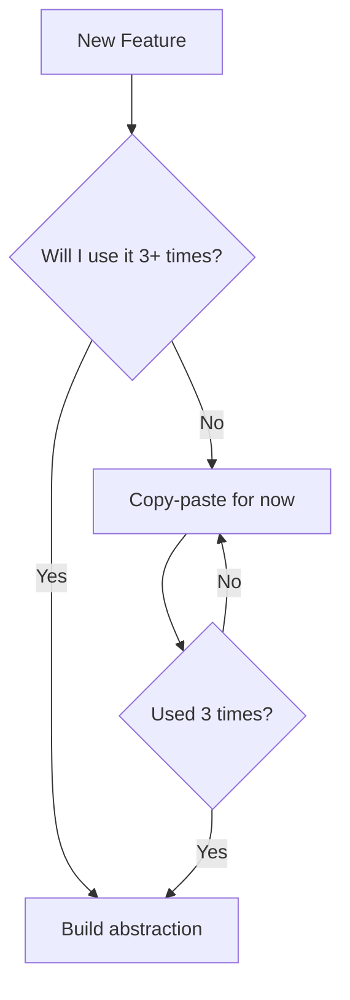

# Architecture Decisions for API-Runtime

## Core Principles (Just 5)

1. **Boring is Good** - Use obvious solutions, not clever ones
2. **One Thing Well** - Each function/module does ONE thing
3. **Fail Loudly** - Errors should scream what went wrong
4. **Test the Behavior** - Not the implementation
5. **Delete, Don't Comment** - Dead code dies

## The 3-3-3 Rule

### 3 Layers Maximum
```
CLI → Service → Core
(Input → Logic → Output)
```

### 3 Parameters Maximum
```rust
// ✅ Good
fn execute(spec: &Spec, operation: &str, config: &Config)

// ❌ Bad - use a struct
fn execute(spec: &Spec, op: &str, timeout: u64, retry: u32, parallel: bool)
```

### 3 Levels Deep Maximum
```rust
// ✅ Good - flat
if !valid { return Err(...) }
process();
return Ok(result);

// ❌ Bad - nested
if valid {
    if authorized {
        if has_data {
            process();
        }
    }
}
```

## Naming: The Only Convention

### Be Boring and Obvious
```rust
// ✅ Obvious what it does
load_spec_from_file()
execute_http_request()
parse_json_response()

// ❌ Clever or vague
process_data()
handle_stuff()
do_the_thing()
```

### Tell Me What, Not How
```rust
// ✅ What it does
validate_response()
find_operation()

// ❌ How it does it
loop_through_array()
use_hashmap_lookup()
```

## Just Build It Like This

### Every Module Pattern
```rust
// errors.rs - What can go wrong
pub enum ModuleError {
    NotFound(String),
    Invalid(String),
}

// types.rs - What we work with
pub struct Thing {
    pub id: String,
}

// mod.rs - What we do
pub fn do_something(thing: &Thing) -> Result<Output> {
    // 1. Validate
    // 2. Process  
    // 3. Return
}

// tests.rs - Prove it works
#[test]
fn it_works() {
    assert!(do_something(&thing).is_ok());
}
```

### Every Error Message
```rust
// ✅ Tells me how to fix it
"Cannot find spec 'api.yaml'. Did you mean 'api.yml'?"
"Port 3000 is in use. Try: --port 3001"
"Invalid JSON at line 5. Expected ',' or '}'."

// ❌ Useless
"Error occurred"
"Invalid input"
"Failed to process"
```

## Test Only What Matters

### Test Behavior, Not Code
```rust
// ✅ Tests what users care about
#[test]
fn returns_404_for_unknown_operation() {
    let result = runtime.execute("unknown_op");
    assert_eq!(result.status(), 404);
}

// ❌ Tests implementation details
#[test]
fn uses_hashmap_internally() {
    // Who cares?
}
```

## What NOT to Do (Just 5 Things)

1. **Don't Abstract Too Early** - Wait until you have 3 examples
2. **Don't Nest Beyond 3** - Use early returns
3. **Don't Comment Obvious Code** - Make code obvious instead
4. **Don't Catch and Hide** - Let errors bubble with context
5. **Don't Optimize Prematurely** - Wait for real metrics

## The One-Screen Rule

If you can't see the whole function on one screen, it's too big.
Split it up.

## When Stuck, Ask:

1. Can I delete this?
2. Can I make this simpler?
3. Will I understand this in 6 months?

If any answer is "no", refactor now.

## The Minimal `.rustfmt.toml`

```toml
# Just 3 rules that matter
max_width = 100              # Fits on screen
imports_granularity = "Crate" # Consistent imports  
group_imports = "StdExternalCrate" # Logical grouping
```

## The Essential Clippy

```rust
// In main.rs - just these matter
#![warn(clippy::unwrap_used)]   // No panics
#![warn(clippy::print_stdout)]  // Use logging
#![warn(clippy::todo)]          // No TODOs in prod
```

## The Real Secret: Start Ugly, Refactor Later

```rust
// Version 1: Just make it work
fn process(data: String) -> String {
    // Ugly but works
    data.to_uppercase()
}

// Version 2: Make it right (after it works)
fn process(data: impl AsRef<str>) -> Result<String> {
    Ok(data.as_ref().to_uppercase())
}

// Version 3: Make it fast (after profiling)
// Only if needed!
```

## The Architecture That Always Works

```
src/
├── main.rs        # Just wiring
├── cli.rs         # Just parsing  
├── app.rs         # Just orchestration
├── core/          # The actual logic
│   ├── spec.rs    # Spec handling
│   ├── runtime.rs # Execution
│   └── tests.rs   # Behavior tests
└── utils/         # Boring helpers
```

## How API-Runtime Actually Works (v0.1.0)

### Data Flow (Keep It Simple)
```
1. User runs: mrapids run api.yaml --operation getUser
2. CLI parses arguments
3. Load OpenAPI spec from file
4. Find the operation
5. Build HTTP request
6. Execute request
7. Display response
```

### Core Components (Just What We Need)
```rust
// spec.rs - Just load and parse
pub fn load_spec(path: &str) -> Result<Spec, Error> {
    // Read file, parse YAML/JSON, return spec
}

// runtime.rs - Just execute
pub fn execute(spec: &Spec, operation: &str) -> Result<Response, Error> {
    // Find operation, build request, send it
}

// cli.rs - Just parse args
pub fn parse_args() -> Args {
    // Use clap, return args
}
```

### What We're NOT Building (Yet)
- Plugin systems (wait for v0.5)
- Caching layers (wait for performance issues)
- Abstract interfaces (wait for second implementation)
- Retry mechanisms (wait for user complaints)

### When to Add Complexity
Only add architecture when:
1. Users complain about missing features (not before)
2. Performance metrics show real problems (not imagined)
3. You have 3+ examples of the same pattern (not 1)

## Decision Framework



## The Golden Rule

**Code is for humans. Make it boring.**

Boring code is:
- Easy to read at 3 AM
- Easy to debug
- Easy to delete
- Easy to replace

## That's It. Nothing More.

Don't add more rules. These cover 95% of what matters.

The other 5%? You'll know it when you see it.

---

Put this in your project as ARCHITECTURE.md and follow it. Delete everything else.

Remember: **Perfect is the enemy of shipped.**