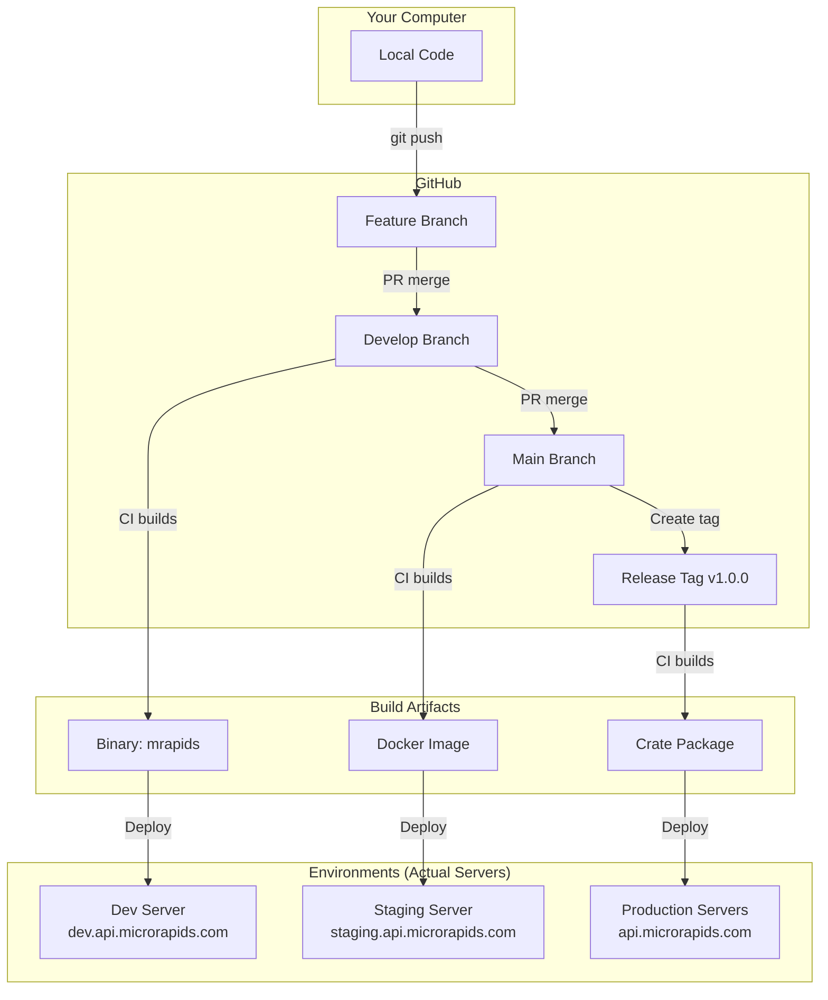

# Artifact Management & Environment Guide

## Table of Contents
1. [What Are Artifacts?](#what-are-artifacts)
2. [Where Artifacts Are Stored](#where-artifacts-are-stored)
3. [Understanding Environments](#understanding-environments)
4. [Publishing Artifacts](#publishing-artifacts)
5. [Complete Workflow Example](#complete-workflow-example)

---

## What Are Artifacts?

**Artifacts** are the compiled, ready-to-run versions of your code. They are NOT stored in Git.

### Git vs Artifacts

| Git Repository | Artifacts |
|---------------|-----------|
| Source code (.rs files) | Compiled binaries (mrapids.exe) |
| Cargo.toml | Docker images |
| Documentation | Published packages |
| Tests | Release bundles |

**Why not store artifacts in Git?**
- Binary files are large (10-100MB+)
- They change with every build
- They can be regenerated from source code
- Git is designed for text/source, not binaries

---

## Where Artifacts Are Stored

When you push code to a feature branch, here's the complete flow:

```
Your Computer                    GitHub                         Artifact Storage
     │                             │                                  │
     ├─[1. Write Code]             │                                  │
     ├─[2. git push]──────────────>├─[3. Triggers CI/CD]             │
     │                             ├─[4. Builds Code]                │
     │                             ├─[5. Runs Tests]                 │
     │                             ├─[6. Creates Artifacts]──────────>│
     │                             │                                  ├─> GitHub Artifacts (90 days)
     │                             │                                  ├─> Docker Registry (permanent)
     │                             │                                  ├─> crates.io (permanent)
     │                             │                                  └─> GitHub Releases (permanent)
```

### Storage Locations Explained

#### 1. **GitHub Actions Artifacts** (Temporary)
- **What**: Build outputs from CI/CD
- **Where**: GitHub Actions tab → Your workflow run → Artifacts section
- **Lifetime**: 90 days (configurable)
- **Use**: Testing, temporary distribution
- **Access**: 
  ```bash
  # Download from GitHub UI or using GitHub CLI
  gh run download <run-id> -n artifact-name
  ```

#### 2. **GitHub Container Registry (ghcr.io)** (Permanent)
- **What**: Docker images
- **Where**: `ghcr.io/microrapids/api-runtime:tag`
- **Lifetime**: Permanent
- **Use**: Container deployments
- **Access**:
  ```bash
  # Pull Docker image
  docker pull ghcr.io/microrapids/api-runtime:latest
  ```

#### 3. **crates.io** (Permanent)
- **What**: Rust packages
- **Where**: https://crates.io/crates/mrapids
- **Lifetime**: Permanent (can't delete!)
- **Use**: Library distribution for Rust developers
- **Access**:
  ```bash
  # Install from crates.io
  cargo install mrapids
  ```

#### 4. **GitHub Releases** (Permanent)
- **What**: Binary releases for end users
- **Where**: GitHub repo → Releases tab
- **Lifetime**: Permanent
- **Use**: Distributing compiled binaries
- **Access**:
  ```bash
  # Download release
  curl -L https://github.com/microrapids/api-runtime/releases/download/v1.0.0/mrapids-linux-amd64.tar.gz
  ```

---

## Understanding Environments

Environments are **separate deployments** of your application, NOT branches!

### Environment vs Branch vs Artifact

| Concept | What It Is | Example |
|---------|-----------|---------|
| **Branch** | Version of source code | `feature/add-auth` |
| **Artifact** | Compiled binary/image | `mrapids-v1.0.0-linux.tar.gz` |
| **Environment** | Where artifact runs | `https://staging.api.microrapids.com` |

### The Three Environments Explained

#### 1. **Development Environment**
- **Purpose**: For developers to test new features
- **URL**: `https://dev.api.microrapids.com`
- **Database**: Test data, gets reset often
- **Who Uses**: Developers only
- **Deployed From**: `develop` branch
- **Example Real Server**: AWS EC2 t2.micro instance

#### 2. **Staging Environment**
- **Purpose**: Final testing before production
- **URL**: `https://staging.api.microrapids.com`
- **Database**: Copy of production data (sanitized)
- **Who Uses**: QA team, product managers
- **Deployed From**: `main` branch
- **Example Real Server**: AWS EC2 t3.medium instance

#### 3. **Production Environment**
- **Purpose**: Live application for real users
- **URL**: `https://api.microrapids.com`
- **Database**: Real user data
- **Who Uses**: Actual customers
- **Deployed From**: Tagged releases (v1.0.0)
- **Example Real Server**: AWS EC2 cluster with load balancer

### Visual Flow



---

## Publishing Artifacts

### How to Publish Your Package

#### 1. **To crates.io (Rust Package Manager)**

First, set up your account:
```bash
# 1. Create account at https://crates.io
# 2. Get your API token from account settings
# 3. Save token locally
cargo login <your-token>
```

Publish your package:
```bash
# Test that it will work
cargo publish --dry-run

# Actually publish
cargo publish
```

Or use CI/CD (Recommended):
```bash
# Set secret in GitHub
# Settings → Secrets → New secret
# Name: CARGO_REGISTRY_TOKEN
# Value: <your-crates.io-token>

# Create a release on GitHub
# The publish.yml workflow will automatically publish to crates.io
```

#### 2. **To Docker Hub**

Manual publish:
```bash
# Build image
docker build -t microrapids/api-runtime:v1.0.0 .

# Login to Docker Hub
docker login

# Push image
docker push microrapids/api-runtime:v1.0.0
```

Or use CI/CD (Recommended):
```bash
# Set secrets in GitHub
# DOCKER_USERNAME and DOCKER_PASSWORD

# The workflow handles everything when you create a release
```

#### 3. **To GitHub Packages**

This happens automatically when you create a release on GitHub!

```bash
# Create and push a tag
git tag -a v1.0.0 -m "Release version 1.0.0"
git push origin v1.0.0

# Go to GitHub → Releases → Create release from tag
# CI/CD will build and attach binaries automatically
```

---

## Complete Workflow Example

Let's follow a feature from development to production:

### Step 1: Develop Feature
```bash
# Create feature branch
git checkout -b feature/add-auth

# Write code
# ... make changes ...

# Commit and push
git add .
git commit -m "feat: add authentication"
git push origin feature/add-auth
```

**Result**: CI builds and stores artifacts temporarily in GitHub Actions

### Step 2: Merge to Develop
```bash
# Create PR to develop branch
# After review and approval, merge

# CI/CD automatically:
# 1. Builds artifact
# 2. Stores in GitHub Actions (temp)
# 3. Creates Docker image
# 4. Deploys to dev.api.microrapids.com
```

**Result**: Your code is running on development server

### Step 3: Promote to Staging
```bash
# Create PR from develop to main
# After testing and approval, merge

# CI/CD automatically:
# 1. Builds production-ready artifact
# 2. Pushes to ghcr.io
# 3. Deploys to staging.api.microrapids.com
```

**Result**: Your code is running on staging server

### Step 4: Release to Production
```bash
# Create release tag
git checkout main
git tag -a v1.0.0 -m "Release v1.0.0"
git push origin v1.0.0

# CI/CD automatically:
# 1. Builds final artifacts for all platforms
# 2. Publishes to crates.io
# 3. Pushes to Docker Hub
# 4. Creates GitHub Release with binaries
# 5. Deploys to api.microrapids.com
```

**Result**: Your code is live in production!

---

## Quick Reference

### Where to Find Your Artifacts

| Stage | Artifact Location | How to Access |
|-------|------------------|---------------|
| After PR | GitHub Actions | Actions tab → Workflow run → Artifacts |
| After merge to main | GitHub Container Registry | `docker pull ghcr.io/microrapids/api-runtime:main` |
| After release | crates.io | `cargo install mrapids` |
| After release | Docker Hub | `docker pull microrapids/api-runtime:v1.0.0` |
| After release | GitHub Releases | Releases tab → Download binaries |

### Commands Cheat Sheet

```bash
# Download CI artifact
gh run download <run-id>

# Pull Docker image
docker pull ghcr.io/microrapids/api-runtime:latest

# Install from crates.io
cargo install mrapids

# Download release binary
curl -LO https://github.com/microrapids/api-runtime/releases/latest/download/mrapids-linux-amd64.tar.gz
```

---

## FAQ

**Q: Why can't I just commit the binary to Git?**
A: Binaries are large (10-100MB), change frequently, and can be rebuilt from source. Git becomes slow and bloated with binaries.

**Q: What if I want to test my artifact locally?**
A: Build it locally with `cargo build --release`. The binary will be in `target/release/mrapids`.

**Q: How do I know which artifact is deployed where?**
A: Check the environment URL's `/version` or `/health` endpoint, or look at deployment logs in GitHub Actions.

**Q: Can I download artifacts without GitHub account?**
A: Release artifacts yes, CI artifacts no. Release artifacts are public, CI artifacts require authentication.

**Q: What's the difference between staging and production?**
A: Staging is a production-like environment for final testing. Production is the real environment with actual users and data.

---

Last Updated: August 2025
Version: 1.0