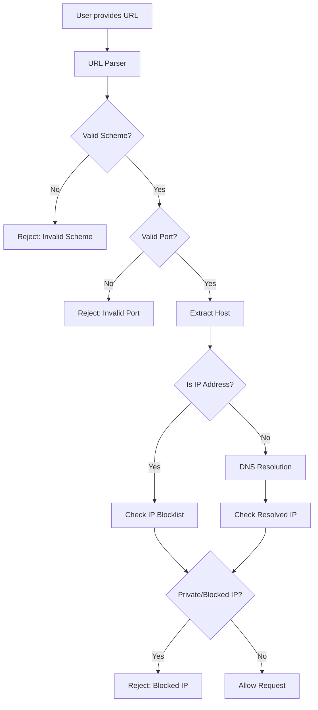
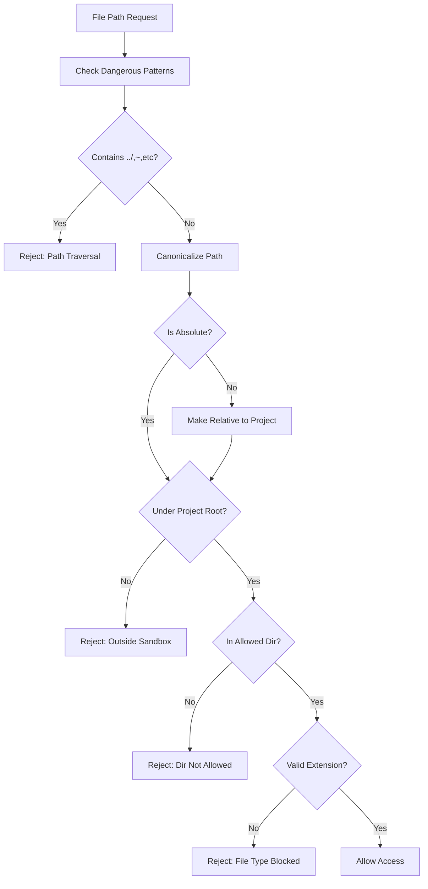

# How MicroRapid Security Works

## Overview

The security implementation uses a **defense-in-depth** approach with multiple layers of validation to prevent attacks. Here's how each component works:

## 1. SSRF Prevention Flow



### How URL Validation Works:

```rust
// User tries to access internal service
let url = "http://192.168.1.100/admin";

// Step 1: Parse URL
let parsed = Url::parse(url)?;
// Extracts: scheme="http", host="192.168.1.100", port=80

// Step 2: Check Scheme
if !["http", "https"].contains(&parsed.scheme()) {
    return Err(SecurityError::InvalidScheme);
}

// Step 3: Check Port
let port = parsed.port_or_known_default(); // 80 for http
if ![80, 443, 8080, 8443, 3000, 8000].contains(&port) {
    return Err(SecurityError::InvalidPort);
}

// Step 4: Check IP/Host
match parsed.host() {
    Host::Ipv4(ip) => {
        // Direct IP - check against blocklist
        if is_private_ip(ip) {
            return Err(SecurityError::BlockedIP);
        }
    }
    Host::Domain(domain) => {
        // Domain - resolve then check
        let ip = dns_resolve(domain).await?;
        if is_private_ip(ip) {
            return Err(SecurityError::BlockedIP);
        }
    }
}
```

### Blocked IP Ranges (CIDR):

| Range | Description | Example Blocked URLs |
|-------|-------------|---------------------|
| 127.0.0.0/8 | Localhost | http://127.0.0.1, http://localhost |
| 10.0.0.0/8 | Private Class A | http://10.0.0.1/api |
| 172.16.0.0/12 | Private Class B | http://172.16.0.1/admin |
| 192.168.0.0/16 | Private Class C | http://192.168.1.1/config |
| 169.254.0.0/16 | Link-local | http://169.254.169.254/ (AWS metadata) |
| ::1/128 | IPv6 localhost | http://[::1]:8080 |
| fc00::/7 | IPv6 private | http://[fc00::1]/api |

### DNS Rebinding Protection:

```rust
// Even if attacker controls DNS:
// evil.com → 8.8.8.8 (initial request)
// evil.com → 192.168.1.1 (redirect/rebind)

async fn safe_dns_resolve(hostname: &str) -> Result<IpAddr> {
    let ips = lookup_host(hostname).await?;
    
    // Check EVERY resolved IP
    for ip in ips {
        if is_private_ip(&ip) || is_metadata_endpoint(&ip) {
            return Err(SecurityError::DangerousIP(ip));
        }
    }
    
    Ok(ips[0]) // Return first safe IP
}
```

## 2. File Sandboxing Flow



### Path Traversal Prevention:

```rust
// Attack attempts and how they're blocked:

// 1. Classic traversal
"../../../etc/passwd"
// Blocked by: pattern detection (..)

// 2. Encoded traversal  
"%2e%2e%2f%65%74%63%2fpasswd"
// Blocked by: pattern detection (%2e%2e)

// 3. Double encoding
"%252e%252e%252fetc%252fpasswd"
// Blocked by: pattern detection (%252e%252e)

// 4. Null byte injection
"config.yaml\0.exe"
// Blocked by: pattern detection (\0)

// 5. Absolute path
"/etc/shadow"
// Blocked by: not under project root

// 6. Home directory
"~/.ssh/id_rsa"
// Blocked by: pattern detection (~)

// 7. Windows UNC path
"\\\\server\\share\\file"
// Blocked by: pattern detection (\\)

// 8. Symbolic link
"symlink_to_etc" -> "/etc"
// Blocked by: canonicalization resolves real path
```

### Directory Restrictions:

```rust
// Project structure:
project/
├── config/         ✅ Read allowed
├── specs/          ✅ Read allowed  
├── examples/       ✅ Read allowed
├── src/            ❌ Read blocked
├── output/         ✅ Write allowed
├── generated/      ✅ Write allowed
├── .mrapids/       ✅ Write allowed
└── /etc/           ❌ Outside project
```

### Safe Path Resolution:

```rust
fn resolve_safe_path(untrusted: &str) -> Result<PathBuf> {
    // Step 1: Check patterns
    if untrusted.contains("..") || untrusted.contains("~") {
        return Err(SecurityError::PathTraversal);
    }
    
    // Step 2: Join with project root
    let joined = project_root.join(untrusted);
    
    // Step 3: Canonicalize (resolves symlinks, .., etc)
    let canonical = joined.canonicalize()?;
    
    // Step 4: Verify still under project root
    if !canonical.starts_with(&project_root) {
        return Err(SecurityError::PathTraversal);
    }
    
    Ok(canonical)
}
```

## 3. Configuration Security

### Secure Defaults:

```toml
# These defaults are enforced even without config file:

[network]
allowed_schemes = ["https", "http"]  # No file://, ftp://, etc.
allowed_ports = [80, 443, 8080, 8443]  # No 22 (SSH), 3306 (MySQL)
max_redirects = 5  # Prevent infinite redirects

[limits]
max_response_size = 10485760  # 10MB - prevent memory exhaustion
request_timeout = 30000  # 30s - prevent hanging
max_request_size = 1048576  # 1MB - prevent large uploads

[tls]
verify = true  # Always verify certificates
min_version = "1.2"  # No SSLv3, TLS 1.0/1.1
```

### Configuration Validation:

```rust
impl SecurityConfig {
    pub fn validate(&self) -> Result<(), SecurityError> {
        // Prevent insecure overrides
        if self.network.max_redirects > 10 {
            return Err("Too many redirects allowed");
        }
        
        if self.limits.max_response_size > 100*1024*1024 {
            return Err("Response size limit too high");
        }
        
        if !self.tls.verify {
            eprintln!("⚠️ WARNING: TLS verification disabled!");
        }
        
        Ok(())
    }
}
```

## 4. Secure HTTP Client Integration

```rust
// Before (vulnerable):
let client = reqwest::Client::new();
let response = client.get(user_url).send().await?;
let body = response.bytes().await?; // Could be huge!

// After (secure):
let secure_client = SecureHttpClient::new(config)?;
let response = secure_client.get(user_url).await?;
// - URL validated against private IPs
// - DNS resolved and checked
// - Size limits enforced
// - Timeouts applied
// - TLS verified
```

## 5. Attack Scenarios Prevented

### SSRF Attack:
```bash
# Attacker tries to access internal services
curl http://your-cli.com/api?url=http://192.168.1.100/admin
# ❌ Blocked: Private IP detected

# Attacker tries AWS metadata
curl http://your-cli.com/api?url=http://169.254.169.254/latest/meta-data
# ❌ Blocked: Metadata endpoint detected

# Attacker uses DNS rebinding
curl http://your-cli.com/api?url=http://evil.com/api
# evil.com first resolves to 8.8.8.8, then to 192.168.1.1
# ❌ Blocked: DNS resolution checks ALL IPs
```

### File Theft:
```bash
# Attacker tries to read sensitive files
mrapids run --config ../../../etc/passwd
# ❌ Blocked: Path traversal detected

# Attacker tries encoded path
mrapids run --config %2e%2e%2f%2e%2e%2fetc%2fpasswd
# ❌ Blocked: Encoded traversal detected

# Attacker tries to write malicious file
mrapids generate --output /usr/local/bin/evil
# ❌ Blocked: Write outside allowed directories
```

### Resource Exhaustion:
```bash
# Attacker tries to download huge file
mrapids run --url http://evil.com/10gb.zip
# ❌ Blocked: Response size exceeds 10MB limit

# Attacker tries infinite redirects
mrapids run --url http://evil.com/infinite-redirect
# ❌ Blocked: Max 5 redirects allowed

# Attacker tries slow response
mrapids run --url http://evil.com/slow-drip
# ❌ Blocked: 30 second timeout enforced
```

## 6. Security Layers

1. **Input Validation**: Patterns, schemes, ports
2. **Resolution**: DNS checks, canonicalization  
3. **Blocklists**: CIDR ranges, dangerous hosts
4. **Sandboxing**: Directory/extension restrictions
5. **Limits**: Size, timeout, redirect limits
6. **Monitoring**: Security logs and warnings

## 7. Testing the Security

```bash
# Run security test suite
cargo test --test security_tests

# Test results:
✅ test_url_validator_blocks_dangerous_urls
✅ test_url_validator_allows_safe_urls  
✅ test_file_sandbox_blocks_traversal
✅ test_file_sandbox_allows_safe_paths
✅ test_file_sandbox_write_restrictions
✅ test_file_sandbox_extension_filtering
✅ test_security_config_defaults
✅ test_security_config_validation
✅ test_safe_join
✅ test_dns_resolution_safety
```

## 8. Performance Impact

- URL validation: ~1ms per request
- DNS resolution: Network dependent (cached)
- File sandboxing: <1ms (path operations)
- No significant performance degradation

## Summary

The security implementation provides comprehensive protection through:
- **Multiple validation layers** that work together
- **Fail-safe defaults** that are secure out-of-the-box
- **Clear error messages** that don't leak sensitive info
- **Comprehensive tests** that verify all attack vectors

This ensures that the MicroRapid CLI cannot be used as a vector for SSRF attacks, file theft, or resource exhaustion.