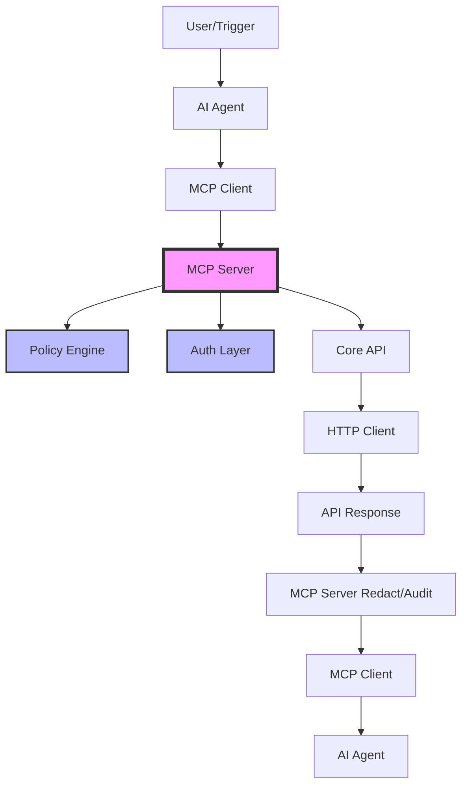

# MCP Integration Design for MicroRapid

## Executive Summary

This document outlines the design and implementation plan for integrating MicroRapid (`mrapids`) with the Model Context Protocol (MCP), enabling AI agents to safely execute API operations while maintaining security and auditability.

**Key Principle**: "Two Doors, One Engine" - Human CLI and Agent MCP interfaces share the same core business logic but have different security and interaction models.

---

## Table of Contents

1. [Overview](#overview)
2. [Architecture](#architecture)
3. [Folder Structure](#folder-structure)
4. [Core Components](#core-components)
5. [Security Model](#security-model)
6. [Implementation Plan](#implementation-plan)
7. [API Reference](#api-reference)
8. [Configuration](#configuration)
9. [Examples](#examples)
10. [Migration Guide](#migration-guide)

---

## Overview

### Goals

- Enable AI agents to execute API operations safely
- Prevent agents from accessing secrets directly
- Provide policy-based access control
- Maintain full audit trail of agent actions
- Support any MCP-compatible agent

### Non-Goals

- Replace human CLI interface
- Break existing functionality
- Require immediate migration
- Support arbitrary code execution

---

## Architecture

### High-Level Flow



### Component Responsibilities

#### AI Agent
- Plans and orchestrates API operations
- Builds structured requests matching tool schemas
- Consumes structured responses
- Never handles secrets or credentials

#### MCP Server (mrapids-agent)
- Loads server configuration and policies
- Enforces security policies before execution
- Injects authentication credentials
- Redacts sensitive data from responses
- Maintains audit log of all operations

#### Core API
- Provides programmatic interface (no I/O)
- Validates inputs against OpenAPI schemas
- Executes HTTP requests with retries
- Returns structured responses

#### Policy Engine
- Evaluates requests against security rules
- Provides allow/deny decisions with explanations
- Supports pattern-based rules and conditions
- Defaults to least-privilege access

---

## Folder Structure

```
mrapids/
├── src/
│   ├── cli/                    # Human-facing CLI (unchanged)
│   │   └── mod.rs             # Interactive commands, prompts, pretty output
│   │
│   ├── core/
│   │   ├── api/               # NEW: Programmatic API layer
│   │   │   ├── mod.rs         # Public API exports
│   │   │   ├── types.rs       # Request/Response types with serde + schemars
│   │   │   ├── run.rs         # Operation execution logic
│   │   │   ├── list.rs        # Operation listing logic
│   │   │   ├── show.rs        # Operation introspection
│   │   │   └── errors.rs      # Structured error types
│   │   │
│   │   ├── policy/            # NEW: Policy engine
│   │   │   ├── mod.rs         # Policy API exports
│   │   │   ├── model.rs       # PolicyRule, PolicySet, Decision types
│   │   │   ├── engine.rs      # Rule evaluation engine
│   │   │   ├── parser.rs      # YAML/TOML parser for policies
│   │   │   └── explain.rs     # Decision explanation generator
│   │   │
│   │   ├── auth/              # Enhanced auth layer
│   │   │   ├── mod.rs
│   │   │   ├── profiles.rs    # Profile management (no direct secrets)
│   │   │   └── keyring.rs     # Secure credential storage
│   │   │
│   │   └── commands/          # Existing CLI commands (will use api/)
│
├── agent/                     # NEW: MCP server binary
│   ├── Cargo.toml            # mrapids-agent dependencies
│   ├── src/
│   │   ├── main.rs           # Server entry point
│   │   ├── config.rs         # Configuration management
│   │   ├── server.rs         # MCP protocol implementation
│   │   ├── auth.rs           # Auth profile resolution
│   │   ├── audit.rs          # Audit logging system
│   │   ├── redact.rs         # Response sanitization
│   │   └── tools/            # MCP tool implementations
│   │       ├── mod.rs        # Tool registry
│   │       ├── list.rs       # List operations tool
│   │       ├── show.rs       # Show operation details tool
│   │       └── run.rs        # Execute operation tool
│
├── schemas/                   # Generated JSON schemas
│   ├── tools/                # MCP tool schemas
│   │   ├── list-tool.json
│   │   ├── show-tool.json
│   │   └── run-tool.json
│   └── types/                # Type schemas
│       ├── RunRequest.json
│       ├── RunResponse.json
│       └── ErrorDetail.json
│
└── examples/
    ├── .mrapids/             # Example configurations
    │   ├── config.toml       # CLI configuration
    │   ├── policy.yaml       # Security policy
    │   └── mcp-server.toml   # MCP server config
    ├── agent-demo/           # Agent integration examples
    └── ci-integration/       # CI/CD examples
```

---

## Core Components

### 1. Core API Types

```rust
// core/api/types.rs

#[derive(Serialize, Deserialize, JsonSchema, Debug)]
pub struct RunRequest {
    /// Operation ID from OpenAPI spec
    pub operation_id: String,
    
    /// Parameters for path, query, header
    pub parameters: Option<HashMap<String, Value>>,
    
    /// Request body (if applicable)
    pub body: Option<Value>,
    
    /// Path to OpenAPI spec (optional if default)
    pub spec_path: Option<PathBuf>,
    
    /// Environment name (optional)
    pub env: Option<String>,
}

#[derive(Serialize, Deserialize, JsonSchema, Debug)]
pub struct RunResponse {
    /// Success or error status
    pub status: ResponseStatus,
    
    /// Response data (on success)
    pub data: Option<Value>,
    
    /// Error details (on failure)
    pub error: Option<ErrorDetail>,
    
    /// Metadata about the operation
    pub meta: ResponseMeta,
}

#[derive(Serialize, Deserialize, JsonSchema, Debug)]
pub enum ResponseStatus {
    Success,
    Error,
    PartialSuccess,
}

#[derive(Serialize, Deserialize, JsonSchema, Debug)]
pub struct ErrorDetail {
    /// Machine-readable error code
    pub code: ErrorCode,
    
    /// Human-readable message
    pub message: String,
    
    /// Additional context
    pub details: Option<HashMap<String, Value>>,
}
```

### 2. Error Taxonomy

```rust
// core/api/errors.rs

#[derive(Serialize_repr, Deserialize_repr, JsonSchema, Debug)]
#[repr(u16)]
pub enum ErrorCode {
    // Policy errors (1xxx)
    PolicyDeny = 1001,
    PolicyMisconfigured = 1002,
    PolicyNotFound = 1003,
    
    // Auth errors (2xxx)
    AuthMissing = 2001,
    AuthExpired = 2002,
    AuthInvalid = 2003,
    AuthProfileNotFound = 2004,
    
    // Validation errors (3xxx)
    InputValidation = 3001,
    SchemaValidation = 3002,
    SpecNotFound = 3003,
    OperationNotFound = 3004,
    
    // Runtime errors (4xxx)
    NetworkError = 4001,
    Timeout = 4002,
    HttpError = 4100, // + HTTP status code
    
    // Internal errors (5xxx)
    InternalError = 5001,
    ConfigError = 5002,
}
```

### 3. Policy Model

```yaml
# Example policy.yaml
version: "1.0"
metadata:
  name: "default-agent-policy"
  description: "Safe defaults for AI agents"

defaults:
  # Methods allowed by default
  allow_methods: ["GET", "HEAD", "OPTIONS"]
  
  # Deny external references by default
  deny_external_refs: true
  
  # Require auth for all operations
  require_auth: true

rules:
  - name: "github-readonly"
    description: "Read-only access to GitHub API"
    pattern: "github.com/*"
    conditions:
      - auth_profile: "github-readonly"
    allow:
      operations: ["list*", "get*", "search*"]
      methods: ["GET"]
    deny:
      operations: ["create*", "update*", "delete*", "merge*"]
      
  - name: "internal-apis"
    description: "Full access to internal APIs"
    pattern: "*.internal.company.com/*"
    conditions:
      - auth_profile: "internal-service"
      - time_window: "business_hours"
    allow:
      methods: ["GET", "POST", "PUT", "DELETE"]
    audit:
      level: "detailed"
      
  - name: "payment-apis"
    description: "Restricted payment operations"
    pattern: "*/payment/*"
    deny:
      all: true
    explain: "Payment operations require human approval"
```

### 4. MCP Tool Schemas

```json
// schemas/tools/run-tool.json
{
  "name": "run",
  "description": "Execute an API operation from an OpenAPI specification",
  "inputSchema": {
    "type": "object",
    "properties": {
      "operation_id": {
        "type": "string",
        "description": "The operation ID from the OpenAPI spec"
      },
      "parameters": {
        "type": "object",
        "description": "Path, query, and header parameters",
        "additionalProperties": true
      },
      "body": {
        "type": "object",
        "description": "Request body (if applicable)",
        "additionalProperties": true
      },
      "spec_path": {
        "type": "string",
        "description": "Path to OpenAPI spec file"
      },
      "env": {
        "type": "string",
        "description": "Environment name (dev, staging, prod)"
      }
    },
    "required": ["operation_id"]
  }
}
```

---

## Security Model

### Principles

1. **Least Privilege**: Agents get minimal required permissions
2. **Defense in Depth**: Multiple security layers
3. **Fail Secure**: Deny by default
4. **Audit Everything**: Complete operation history
5. **No Secret Exposure**: Agents never see credentials

### Security Layers

```
┌─────────────────────────────────────────┐
│          Agent Request                  │
└────────────────┬───────────────────────┘
                 ▼
┌─────────────────────────────────────────┐
│      1. Schema Validation               │ ← Reject malformed requests
└────────────────┬───────────────────────┘
                 ▼
┌─────────────────────────────────────────┐
│      2. Policy Evaluation               │ ← Check allow/deny rules
└────────────────┬───────────────────────┘
                 ▼
┌─────────────────────────────────────────┐
│      3. Auth Injection                  │ ← Add credentials (agent never sees)
└────────────────┬───────────────────────┘
                 ▼
┌─────────────────────────────────────────┐
│      4. Operation Execution             │ ← Validated API call
└────────────────┬───────────────────────┘
                 ▼
┌─────────────────────────────────────────┐
│      5. Response Redaction              │ ← Remove sensitive data
└────────────────┬───────────────────────┘
                 ▼
┌─────────────────────────────────────────┐
│      6. Audit Logging                   │ ← Record all actions
└────────────────┬───────────────────────┘
                 ▼
┌─────────────────────────────────────────┐
│         Agent Response                  │
└─────────────────────────────────────────┘
```

---

## Implementation Plan

### Phase 1: Core API Layer (Week 1-2)

**Objective**: Create programmatic API without CLI dependencies

- [ ] Design request/response types with schemars
- [ ] Extract business logic from CLI commands
- [ ] Implement structured error types
- [ ] Add comprehensive unit tests
- [ ] Generate JSON schemas

**Deliverables**:
- `core/api/` module with types and logic
- JSON schemas for all types
- 90%+ test coverage

### Phase 2: Policy Engine (Week 2-3)

**Objective**: Build flexible policy evaluation system

- [ ] Design policy model and types
- [ ] Implement YAML/TOML parser
- [ ] Build pattern matching engine
- [ ] Add decision explanation
- [ ] Create policy testing framework

**Deliverables**:
- `core/policy/` module
- Policy examples and documentation
- Policy validation CLI tool

### Phase 3: MCP Server (Week 3-4)

**Objective**: Implement MCP protocol server

- [ ] Set up agent crate structure
- [ ] Implement MCP protocol handler
- [ ] Create tool implementations
- [ ] Add configuration management
- [ ] Build audit logging system
- [ ] Implement response redaction

**Deliverables**:
- `mrapids-agent` binary
- MCP tool implementations
- Audit log format specification

### Phase 4: Integration (Week 4-5)

**Objective**: End-to-end testing and examples

- [ ] Integration tests with mock agents
- [ ] Performance benchmarks
- [ ] Security audit
- [ ] Example agent implementations
- [ ] CI/CD integration examples

**Deliverables**:
- Test suite with 80%+ coverage
- Performance baseline metrics
- Example implementations

### Phase 5: Documentation & Release (Week 5-6)

**Objective**: Production-ready release

- [ ] User documentation
- [ ] Migration guides
- [ ] Security documentation
- [ ] API reference
- [ ] Release notes

**Deliverables**:
- Complete documentation
- Release binaries
- Docker images

---

## API Reference

### Core API

```rust
// List available operations
pub async fn list_operations(
    spec_path: Option<&Path>,
    filter: Option<&ListFilter>,
) -> Result<ListResponse, ApiError>

// Get operation details
pub async fn show_operation(
    spec_path: Option<&Path>,
    operation_id: &str,
) -> Result<ShowResponse, ApiError>

// Execute an operation
pub async fn run_operation(
    request: RunRequest,
    auth: Option<AuthProfile>,
) -> Result<RunResponse, ApiError>
```

### MCP Tools

#### List Tool
```typescript
{
  name: "list",
  description: "List available API operations",
  parameters: {
    spec_path?: string,
    filter?: {
      method?: string,
      tag?: string,
      pattern?: string
    }
  }
}
```

#### Show Tool
```typescript
{
  name: "show",
  description: "Get operation details including parameters and schema",
  parameters: {
    operation_id: string,
    spec_path?: string
  }
}
```

#### Run Tool
```typescript
{
  name: "run",
  description: "Execute an API operation",
  parameters: {
    operation_id: string,
    parameters?: object,
    body?: object,
    spec_path?: string,
    env?: string
  }
}
```

---

## Configuration

### MCP Server Configuration

```toml
# mcp-server.toml
[server]
host = "127.0.0.1"
port = 3333
max_connections = 10

[defaults]
spec_path = "./specs/api.yaml"
env = "production"
auth_profile = "default-agent"
policy_file = "./policy.yaml"

[audit]
enabled = true
path = "./logs/audit.jsonl"
level = "detailed"
rotation = "daily"

[security]
redact_patterns = [
  "password",
  "secret",
  "token",
  "key"
]
allow_override_env = false
allow_override_auth = false

[performance]
request_timeout = 30
max_retries = 3
rate_limit = 100
```

### Policy Configuration

```yaml
# policy.yaml
version: "1.0"

# Global defaults
defaults:
  allow_methods: ["GET", "HEAD"]
  require_auth: true
  audit_level: "basic"

# Rule templates
templates:
  readonly:
    allow:
      methods: ["GET", "HEAD", "OPTIONS"]
    deny:
      methods: ["POST", "PUT", "DELETE", "PATCH"]

# Specific rules
rules:
  - name: "public-apis"
    pattern: "api.public.com/*"
    use_template: "readonly"
    
  - name: "admin-apis"
    pattern: "*/admin/*"
    deny:
      all: true
    explain: "Admin operations not allowed for agents"
```

---

## Examples

### Basic Agent Integration

```python
# agent_example.py
import mcp

# Connect to MCP server
client = mcp.Client("http://localhost:3333")

# List available operations
operations = client.call("list", {
    "filter": {"tag": "users"}
})

# Get operation details
details = client.call("show", {
    "operation_id": "getUser"
})

# Execute operation
result = client.call("run", {
    "operation_id": "getUser",
    "parameters": {
        "userId": "12345"
    }
})
```

### CI/CD Integration

```yaml
# .github/workflows/api-test.yml
name: API Integration Tests

on: [push, pull_request]

jobs:
  test:
    runs-on: ubuntu-latest
    steps:
      - uses: actions/checkout@v3
      
      - name: Start MCP Server
        run: |
          docker run -d \
            -v $PWD:/workspace \
            -p 3333:3333 \
            mrapids/agent:latest \
            --config /workspace/.mrapids/ci-mcp-server.toml
            
      - name: Run API Tests
        run: |
          npm test -- --mcp-url http://localhost:3333
```

### Policy Testing

```bash
# Test policy decisions
mrapids-agent policy test \
  --policy policy.yaml \
  --scenario scenarios/test-cases.yaml

# Explain a specific decision
mrapids-agent policy explain \
  --policy policy.yaml \
  --operation "deleteUser" \
  --profile "readonly-agent"
```

---

## Migration Guide

### For CLI Users

**No changes required!** The CLI continues to work exactly as before. The MCP integration is completely optional.

### For API Consumers

If you're currently using `mrapids` in scripts:

```bash
# Old way (still works)
mrapids run createUser --data '{"name": "John"}'

# New way (for agents)
curl -X POST http://localhost:3333/rpc \
  -H "Content-Type: application/json" \
  -d '{
    "method": "run",
    "params": {
      "operation_id": "createUser",
      "body": {"name": "John"}
    }
  }'
```

### For DevOps Teams

1. **Install MCP server**:
   ```bash
   cargo install mrapids-agent
   ```

2. **Create policy**:
   ```yaml
   # Start with restrictive policy
   defaults:
     allow_methods: ["GET"]
   ```

3. **Configure server**:
   ```toml
   [defaults]
   policy_file = "./policy.yaml"
   ```

4. **Start server**:
   ```bash
   mrapids-agent --config mcp-server.toml
   ```

---

## Appendix

### A. Glossary

- **MCP**: Model Context Protocol - Standard for AI agent tool integration
- **Policy**: Rules defining what operations agents can perform
- **Auth Profile**: Named set of credentials for API access
- **Redaction**: Removing sensitive data from responses
- **Audit Log**: Immutable record of all agent operations

### B. Security Considerations

1. Never expose raw credentials in logs
2. Use separate auth profiles for agents
3. Regularly rotate agent credentials
4. Monitor audit logs for anomalies
5. Test policies before production

### C. Performance Considerations

1. Policy evaluation: < 1ms per request
2. Schema validation: < 5ms for typical payloads
3. Audit logging: Async, non-blocking
4. Memory overhead: ~10MB per connection

### D. References

- [Model Context Protocol Specification](https://github.com/modelcontextprotocol/specification)
- [MicroRapid Documentation](https://github.com/deepwissen/api-runtime)
- [OpenAPI Specification](https://spec.openapis.org/oas/latest.html)

---

**Document Version**: 1.0.0  
**Last Updated**: 2024-12-20  
**Status**: Design Phase