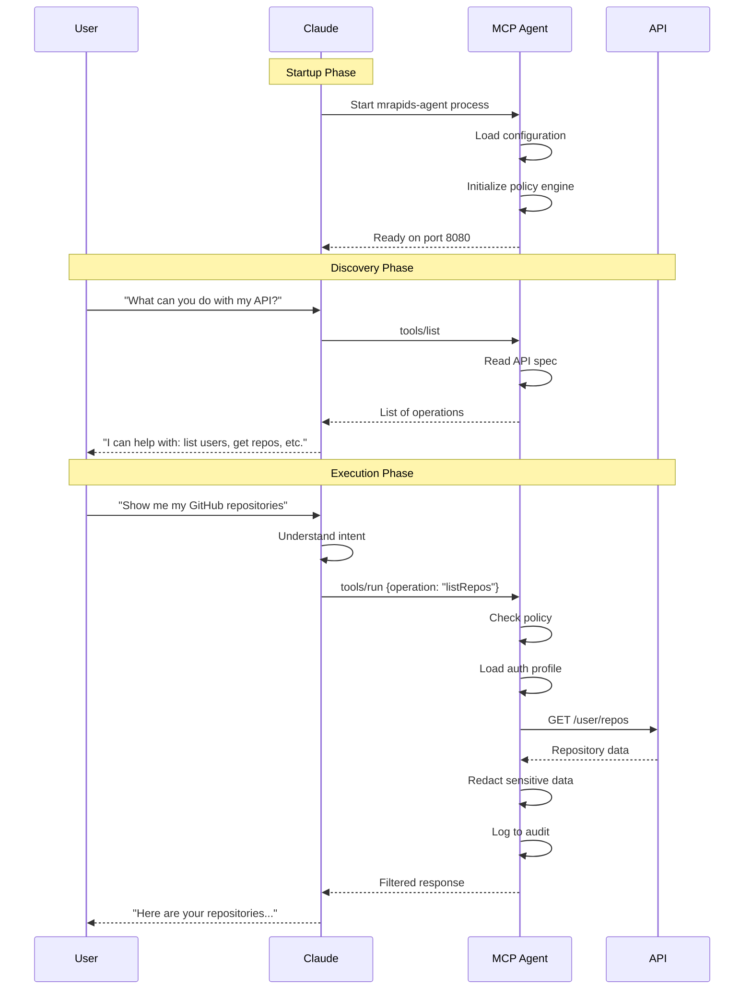

# MCP Integration Flow

## How Claude Integrates with MCP Agent



## Architecture Overview

```
┌─────────────────────────────────────────────────────────────┐
│                        Claude Desktop                        │
│  ┌─────────────────────────────────────────────────────┐   │
│  │                   MCP Client Handler                 │   │
│  │  • Manages MCP server processes                      │   │
│  │  • Routes requests to appropriate server             │   │
│  │  • Handles JSON-RPC communication                    │   │
│  └──────────────────────┬──────────────────────────────┘   │
│                         │                                    │
│  ┌──────────────────────┼──────────────────────────────┐   │
│  │   Claude's Language  │  Model + Tool Selection      │   │
│  │  • Understands user  │  intent                      │   │
│  │  • Selects appropriate tools                        │   │
│  │  • Formats requests  │                              │   │
│  └──────────────────────┴──────────────────────────────┘   │
└─────────────────────────┬───────────────────────────────────┘
                          │ JSON-RPC over HTTP
                          │
┌─────────────────────────▼───────────────────────────────────┐
│                      mrapids-agent                           │
│  ┌─────────────────────────────────────────────────────┐   │
│  │                  JSON-RPC Server                     │   │
│  │  • Receives tool requests                            │   │
│  │  • Routes to appropriate handler                     │   │
│  │  • Returns structured responses                      │   │
│  └──────────────────────┬──────────────────────────────┘   │
│                         │                                    │
│  ┌──────────────────────▼──────────────────────────────┐   │
│  │                 Policy Engine                        │   │
│  │  • Evaluates access rules                           │   │
│  │  • Allows/denies operations                         │   │
│  │  • Logs decisions                                   │   │
│  └──────────────────────┬──────────────────────────────┘   │
│                         │                                    │
│  ┌──────────────────────▼──────────────────────────────┐   │
│  │              Response Handler                        │   │
│  │  • Redacts sensitive data                          │   │
│  │  • Formats responses                               │   │
│  │  • Applies transformations                         │   │
│  └──────────────────────┬──────────────────────────────┘   │
│                         │                                    │
│  ┌──────────────────────▼──────────────────────────────┐   │
│  │                Audit Logger                          │   │
│  │  • Records all operations                           │   │
│  │  • Tracks policy decisions                          │   │
│  │  • Manages log rotation                             │   │
│  └─────────────────────────────────────────────────────┘   │
└─────────────────────────┬───────────────────────────────────┘
                          │ HTTPS with Auth
                          │
┌─────────────────────────▼───────────────────────────────────┐
│                      Target APIs                             │
│  • GitHub API                                                │
│  • Stripe API                                                │
│  • Internal APIs                                             │
│  • Any OpenAPI/Swagger API                                   │
└─────────────────────────────────────────────────────────────┘
```

## Configuration Flow

```
1. User Configuration
   ├── claude_desktop_config.json
   │   └── mcpServers
   │       └── mrapids
   │           ├── command: "mrapids-agent"
   │           ├── args: ["start", "--port", "8080"]
   │           └── env: { "API_KEY": "xxx" }
   │
   └── .mrapids/
       ├── mcp-server.toml (Server config)
       ├── policy.yaml (Access rules)
       ├── api.yaml (OpenAPI spec)
       └── auth/
           └── github.toml (Auth profiles)

2. Runtime Flow
   Claude Desktop starts
   → Reads claude_desktop_config.json
   → Spawns mrapids-agent process
   → mrapids-agent loads .mrapids/ config
   → Establishes JSON-RPC connection
   → Ready for requests
```

## Request/Response Examples

### 1. Tool Discovery
```json
// Claude → MCP Agent
{
  "jsonrpc": "2.0",
  "method": "tools/list",
  "params": {},
  "id": 1
}

// MCP Agent → Claude
{
  "jsonrpc": "2.0",
  "result": {
    "operations": [
      {
        "operation_id": "listRepos",
        "method": "GET",
        "path": "/user/repos",
        "summary": "List repositories for authenticated user"
      }
    ]
  },
  "id": 1
}
```

### 2. Tool Execution
```json
// Claude → MCP Agent
{
  "jsonrpc": "2.0",
  "method": "tools/run",
  "params": {
    "operation_id": "getRepo",
    "parameters": {
      "owner": "anthropics",
      "repo": "anthropic-sdk-python"
    }
  },
  "id": 2
}

// MCP Agent → Policy Check → API Call → Response Processing

// MCP Agent → Claude (after redaction)
{
  "jsonrpc": "2.0",
  "result": {
    "status": 200,
    "data": {
      "name": "anthropic-sdk-python",
      "description": "SDK for Anthropic's API",
      "stars": 1234,
      "private_key": "[REDACTED:KEY]"  // Sensitive data removed
    }
  },
  "id": 2
}
```

## Security Layers

```
User Request
    ↓
Claude (Intent validation)
    ↓
MCP Agent
    ├── Policy Engine (Can this operation be performed?)
    ├── Auth Manager (Load credentials without exposing)
    ├── Request Validation (Are parameters valid?)
    ├── Rate Limiting (Is this within limits?)
    └── Audit Logger (Record attempt)
    ↓
API Call (if allowed)
    ↓
Response Processing
    ├── Redaction (Remove sensitive data)
    ├── Transformation (Format for Claude)
    └── Audit Logger (Record result)
    ↓
Claude (Present to user)
```

This architecture ensures:
- **Security**: Multiple validation layers
- **Privacy**: Credentials never exposed to Claude
- **Control**: Policy-based access management
- **Visibility**: Complete audit trail
- **Flexibility**: Works with any OpenAPI-compliant API