# OAuth 2.0 Implementation Design for MicroRapid

## Overview

This document outlines the design and implementation plan for adding OAuth 2.0 support to MicroRapid, enabling users to authenticate with modern APIs like Google, GitHub, Microsoft, etc.

## User Experience Goals

```bash
# Simple flow for users
mrapids auth login github
# Opens browser, user authorizes, tokens stored securely

# Use authenticated requests
mrapids run get-repos --auth github
# Automatically uses stored GitHub tokens

# Manage auth profiles
mrapids auth list
mrapids auth refresh github
mrapids auth logout github
```

## Architecture

### 1. OAuth Flow Support

We'll implement the Authorization Code flow (most common and secure):

```mermaid
sequenceDiagram
    participant User
    participant MicroRapid
    participant Browser
    participant AuthServer
    participant API
    
    User->>MicroRapid: mrapids auth login github
    MicroRapid->>MicroRapid: Start local HTTP server
    MicroRapid->>Browser: Open authorization URL
    Browser->>AuthServer: Request authorization
    User->>AuthServer: Approve access
    AuthServer->>Browser: Redirect to localhost:8899
    Browser->>MicroRapid: Authorization code
    MicroRapid->>AuthServer: Exchange code for tokens
    AuthServer->>MicroRapid: Access token + Refresh token
    MicroRapid->>MicroRapid: Store tokens securely
    MicroRapid->>User: ✅ Authentication successful
```



### 2. Token Storage

Tokens will be stored securely in the user's home directory:

```
~/.mrapids/
├── auth/
│   ├── profiles.json     # Profile metadata
│   └── tokens/          # Encrypted token files
│       ├── github.enc
│       ├── google.enc
│       └── custom.enc
```

### 3. Component Structure

```rust
src/
├── core/
│   ├── auth/
│   │   ├── mod.rs           # Auth module
│   │   ├── oauth2.rs        # OAuth 2.0 implementation
│   │   ├── providers.rs     # Provider configurations
│   │   ├── token_store.rs   # Secure token storage
│   │   └── server.rs        # Local callback server
│   └── ...
└── cli/
    └── auth_commands.rs     # CLI commands for auth
```

## Implementation Plan

### Phase 1: Core OAuth Infrastructure

#### 1.1 OAuth Configuration Structures

```rust
// src/core/auth/oauth2.rs
#[derive(Debug, Clone, Serialize, Deserialize)]
pub struct OAuth2Config {
    pub provider: String,
    pub client_id: String,
    pub client_secret: Option<String>,
    pub auth_url: String,
    pub token_url: String,
    pub redirect_uri: String,
    pub scopes: Vec<String>,
}

#[derive(Debug, Clone, Serialize, Deserialize)]
pub struct OAuth2Token {
    pub access_token: String,
    pub token_type: String,
    pub expires_at: Option<DateTime<Utc>>,
    pub refresh_token: Option<String>,
    pub scopes: Vec<String>,
}

#[derive(Debug, Clone, Serialize, Deserialize)]
pub struct AuthProfile {
    pub name: String,
    pub provider: String,
    pub created_at: DateTime<Utc>,
    pub last_used: Option<DateTime<Utc>>,
    pub metadata: HashMap<String, Value>,
}
```

#### 1.2 Provider Templates

```rust
// src/core/auth/providers.rs
pub fn get_provider_config(provider: &str) -> Result<OAuth2Config> {
    match provider.to_lowercase().as_str() {
        "github" => Ok(OAuth2Config {
            provider: "github".to_string(),
            client_id: "${GITHUB_CLIENT_ID}".to_string(),
            client_secret: Some("${GITHUB_CLIENT_SECRET}".to_string()),
            auth_url: "https://github.com/login/oauth/authorize".to_string(),
            token_url: "https://github.com/login/oauth/access_token".to_string(),
            redirect_uri: "http://localhost:8899/callback".to_string(),
            scopes: vec!["repo", "user"].into_iter().map(String::from).collect(),
        }),
        "google" => Ok(OAuth2Config {
            provider: "google".to_string(),
            client_id: "${GOOGLE_CLIENT_ID}".to_string(),
            client_secret: Some("${GOOGLE_CLIENT_SECRET}".to_string()),
            auth_url: "https://accounts.google.com/o/oauth2/v2/auth".to_string(),
            token_url: "https://oauth2.googleapis.com/token".to_string(),
            redirect_uri: "http://localhost:8899/callback".to_string(),
            scopes: vec!["openid", "email", "profile"].into_iter().map(String::from).collect(),
        }),
        _ => Err(anyhow!("Unknown provider: {}", provider))
    }
}
```

### Phase 2: CLI Commands

#### 2.1 New Auth Subcommand

```rust
// src/cli/mod.rs additions
#[derive(Subcommand)]
pub enum AuthCommands {
    /// Login to an OAuth provider
    Login {
        /// Provider name (github, google, etc.) or custom
        provider: String,
        
        /// Client ID (for custom providers)
        #[arg(long)]
        client_id: Option<String>,
        
        /// Auth URL (for custom providers)
        #[arg(long)]
        auth_url: Option<String>,
        
        /// Token URL (for custom providers)
        #[arg(long)]
        token_url: Option<String>,
        
        /// Scopes to request
        #[arg(long)]
        scopes: Vec<String>,
        
        /// Profile name (defaults to provider name)
        #[arg(long)]
        profile: Option<String>,
    },
    
    /// List stored auth profiles
    List,
    
    /// Show auth profile details
    Show {
        profile: String,
    },
    
    /// Refresh tokens for a profile
    Refresh {
        profile: String,
    },
    
    /// Remove auth profile
    Logout {
        profile: String,
    },
    
    /// Test authentication
    Test {
        profile: String,
    },
}
```

#### 2.2 Integration with Run Command

```rust
// Modify RunCommand to support OAuth profiles
pub struct RunCommand {
    // ... existing fields ...
    
    /// Use OAuth profile for authentication
    #[arg(long, conflicts_with = "auth")]
    pub auth_profile: Option<String>,
}
```

### Phase 3: OAuth Flow Implementation

#### 3.1 Authorization Flow

```rust
// src/core/auth/oauth2.rs
pub async fn oauth_login(config: OAuth2Config, profile_name: String) -> Result<()> {
    // 1. Generate state and PKCE challenge
    let state = generate_state();
    let (pkce_challenge, pkce_verifier) = generate_pkce_pair();
    
    // 2. Start local server for callback
    let (tx, rx) = channel();
    let server_handle = start_callback_server(tx).await?;
    
    // 3. Build authorization URL
    let auth_url = build_auth_url(&config, &state, &pkce_challenge)?;
    
    // 4. Open browser
    println!("🌐 Opening browser for authentication...");
    open::that(&auth_url)?;
    
    // 5. Wait for callback
    println!("⏳ Waiting for authorization...");
    let auth_code = rx.recv_timeout(Duration::from_secs(300))?;
    
    // 6. Exchange code for tokens
    let tokens = exchange_code_for_tokens(&config, &auth_code, &pkce_verifier).await?;
    
    // 7. Store tokens securely
    store_tokens(&profile_name, &tokens)?;
    
    println!("✅ Authentication successful! Profile '{}' created.", profile_name);
    Ok(())
}
```

#### 3.2 Token Refresh

```rust
pub async fn refresh_tokens(profile: &str) -> Result<OAuth2Token> {
    let tokens = load_tokens(profile)?;
    let config = load_provider_config(profile)?;
    
    if let Some(refresh_token) = tokens.refresh_token {
        let new_tokens = perform_token_refresh(&config, &refresh_token).await?;
        store_tokens(profile, &new_tokens)?;
        Ok(new_tokens)
    } else {
        Err(anyhow!("No refresh token available"))
    }
}
```

### Phase 4: Secure Token Storage

#### 4.1 Encryption

```rust
// src/core/auth/token_store.rs
use aes_gcm::{Aes256Gcm, Key, Nonce};
use argon2::{Argon2, PasswordHasher};

pub fn store_tokens(profile: &str, tokens: &OAuth2Token) -> Result<()> {
    let token_data = serde_json::to_vec(tokens)?;
    
    // Derive encryption key from machine ID + profile name
    let key = derive_encryption_key(profile)?;
    
    // Encrypt tokens
    let encrypted = encrypt_data(&token_data, &key)?;
    
    // Store encrypted data
    let token_path = get_token_path(profile);
    fs::write(token_path, encrypted)?;
    
    Ok(())
}
```

### Phase 5: Integration Points

#### 5.1 Request Authentication

```rust
// In src/core/run_v2.rs
fn apply_oauth_auth(request: &mut Request, profile: &str) -> Result<()> {
    // Load tokens
    let mut tokens = load_tokens(profile)?;
    
    // Check if expired and refresh if needed
    if tokens.is_expired() {
        tokens = refresh_tokens(profile).await?;
    }
    
    // Apply to request
    request.headers.insert(
        "Authorization".to_string(),
        format!("{} {}", tokens.token_type, tokens.access_token)
    );
    
    Ok(())
}
```

## Security Considerations

1. **Token Storage**: Encrypted using AES-256-GCM with machine-specific keys
2. **PKCE**: Implement Proof Key for Code Exchange for added security
3. **State Parameter**: Prevent CSRF attacks
4. **Secure Defaults**: Use system keyring where available
5. **Token Expiry**: Automatic refresh before requests

## User Workflows

### First-time Setup
```bash
# Set up GitHub OAuth app credentials
export GITHUB_CLIENT_ID=your_client_id
export GITHUB_CLIENT_SECRET=your_client_secret

# Login
mrapids auth login github
# Browser opens → User authorizes → Success!
```

### Daily Usage
```bash
# List my repos (uses stored GitHub auth)
mrapids run list-repos --profile github

# Token refresh happens automatically
mrapids run create-issue --profile github --data @issue.json
```

### Custom Provider
```bash
# Login to custom OAuth provider
mrapids auth login custom \
  --client-id $CLIENT_ID \
  --auth-url https://auth.company.com/oauth/authorize \
  --token-url https://auth.company.com/oauth/token \
  --scopes "read write" \
  --profile company-api
```

## Testing Strategy

1. **Unit Tests**: Token storage, encryption, PKCE generation
2. **Integration Tests**: Full OAuth flow with mock server
3. **Provider Tests**: Test against real providers (with test apps)
4. **Security Tests**: Token expiry, refresh, invalid states

## Documentation Updates

1. Add OAuth setup guide
2. Provider-specific tutorials
3. Security best practices
4. Troubleshooting guide

## Success Metrics

- Support top 10 OAuth providers
- < 30 seconds from start to authenticated request
- Automatic token refresh with zero user intervention
- Secure storage passing security audits

This implementation will make MicroRapid compatible with 70%+ of modern APIs that require OAuth 2.0 authentication.