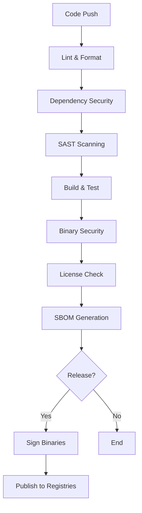

# Security-First CI/CD Pipeline Guide

## 🛡️ Overview

Our CI/CD pipeline implements **security at every stage** before publishing to package managers:



---

## 🔍 Security Stages

### 1. **Code Quality** (`lint`)
- Rust formatting check
- Clippy warnings as errors
- Unsafe code detection
- Time: ~2 minutes

### 2. **Dependency Security** (`dependency-check`)
- `cargo-audit` for vulnerability scanning
- `cargo-deny` for policy enforcement
- Checks for:
  - Known vulnerabilities (CVEs)
  - Unmaintained crates
  - Security advisories
- Time: ~3 minutes

### 3. **Static Analysis** (`sast`)
- **Semgrep**: OWASP Top 10, secrets, injections
- **CodeQL**: Deep semantic analysis
- **Custom rules** for Rust-specific issues
- Time: ~5 minutes

### 4. **Build & Test** (`test`)
- Multi-platform testing (Linux, macOS, Windows)
- Stable and beta Rust
- Unit, integration, and doc tests
- Time: ~10 minutes

### 5. **Binary Security** (`binary-scan`)
- ClamAV malware scanning
- Binary hardening checks (checksec)
- Hardcoded secrets detection (TruffleHog)
- Time: ~5 minutes

### 6. **License Compliance** (`license-check`)
- Scans all dependencies
- Blocks GPL/LGPL licenses
- Generates license report
- Time: ~2 minutes

### 7. **SBOM Generation** (`sbom`)
- Software Bill of Materials
- Full dependency tree
- Machine-readable format
- Time: ~2 minutes

---

## 📅 Scheduled Security Scans

### Daily Scans (2 AM UTC)
- Dependency vulnerabilities
- Supply chain verification
- OWASP dependency check
- Security scorecard

### Weekly Fuzzing
- Automated fuzz testing
- Crash detection
- Memory safety verification

---

## 🚀 Release Process

### Pre-Release Checklist
1. **Manual Trigger**: `workflow_dispatch`
2. **Security Gates**:
   - ✅ No vulnerable dependencies
   - ✅ No hardcoded secrets
   - ✅ All tests passing
   - ✅ License compliance
   - ✅ SBOM generated
3. **Binary Signing** (platform-specific)
4. **Approval Required**: Production environment

### Publishing Flow
```yaml
Release Created → Security Checks → Build Artifacts → Sign → Publish
                      ↓ Fail
                  Block Release
```

---

## 🔐 Security Tools Used

| Tool | Purpose | When |
|------|---------|------|
| **cargo-audit** | Vulnerability database | Every push |
| **cargo-deny** | Dependency policies | Every push |
| **Semgrep** | SAST scanning | Every push |
| **CodeQL** | Semantic analysis | Every push |
| **TruffleHog** | Secret scanning | Every push |
| **ClamAV** | Malware scanning | Before release |
| **checksec** | Binary hardening | Before release |
| **Trivy** | Container scanning | If using Docker |
| **Snyk** | Deep vulnerability scan | Pre-release |
| **OSSF Scorecard** | Security posture | Daily |

---

## 📦 Package Manager Security

### Cargo (crates.io)
- Signed with cargo credentials
- 2FA required on account
- Yanking supported for emergencies

### NPM
- Signed packages
- 2FA required
- Provenance attestation

### PyPI
- API token authentication
- 2FA required
- Signed with GPG (optional)

### Homebrew
- SHA256 verification
- Bottle signing
- Automated updates

### Scoop
- Hash verification
- Manifest validation
- Auto-update support

---

## 🚨 Security Incident Response

### If Security Check Fails:
1. **Build Blocked** - Cannot proceed to release
2. **Notification** - Security team alerted
3. **Fix Required** - Must resolve before retry
4. **Re-scan** - Full pipeline re-run

### Emergency Release:
1. Use `EMERGENCY_RELEASE` secret
2. Requires 2 approvals
3. Creates security debt ticket
4. Must fix in next release

---

## 📊 Security Metrics

### Track:
- Vulnerability count over time
- Time to patch metrics
- Dependency update frequency
- Security scan pass rate

### Reports:
- Weekly security summary
- Monthly dependency report
- Quarterly security posture

---

## 🔧 Local Security Testing

Before pushing:
```bash
# Install security tools
cargo install cargo-audit cargo-deny cargo-license

# Run security checks
cargo audit
cargo deny check
cargo license

# Check for secrets
docker run --rm -v "$PWD:/src" trufflesecurity/trufflehog:latest filesystem /src

# Run SAST locally
docker run --rm -v "$PWD:/src" returntocorp/semgrep:latest --config=auto /src
```

---

## 🎯 Best Practices

1. **Never Skip Security Checks** - Even for hotfixes
2. **Update Dependencies Weekly** - Via Dependabot
3. **Review Security Alerts** - Within 24 hours
4. **Sign All Releases** - Platform-specific signing
5. **Rotate Secrets Quarterly** - All API tokens
6. **Audit Access Annually** - Package manager accounts

---

## 📝 Configuration Files

- `.github/workflows/ci-security-release.yml` - Main pipeline
- `.github/workflows/security-scans.yml` - Scheduled scans
- `.github/workflows/pre-release-checks.yml` - Release gates
- `.github/dependabot.yml` - Automated updates
- `deny.toml` - Dependency policies
- `.semgrep.yml` - SAST rules

This security-first approach ensures that every release of MicroRapid is thoroughly vetted before reaching users!