# 🎯 GitHub Packages - Visual Guide

## What Can You Package in GitHub?

```mermaid
graph TB
    subgraph "Your GitHub Repository"
        REPO[microrapids/api-runtime]
    end
    
    subgraph "GitHub Packages (FREE!)"
        DOCKER[🐳 Docker Images<br/>ghcr.io/microrapids/api-runtime]
        NPM[📦 NPM Packages<br/>@microrapids/api-runtime]
        MAVEN[☕ Maven/Gradle<br/>com.microrapids.api-runtime]
        NUGET[🔷 NuGet Packages<br/>MicroRapids.ApiRuntime]
        RUBY[💎 Ruby Gems<br/>microrapids-api-runtime]
        GENERIC[📁 Any Files<br/>Binaries, Archives, etc.]
    end
    
    REPO --> DOCKER
    REPO --> NPM
    REPO --> MAVEN
    REPO --> NUGET
    REPO --> RUBY
    REPO --> GENERIC
    
    subgraph "Consumers"
        DEV1[Developer 1]
        DEV2[Developer 2]
        PROD[Production]
        CI[CI/CD Systems]
    end
    
    DOCKER --> DEV1
    DOCKER --> PROD
    NPM --> DEV2
    GENERIC --> CI
```



## GitHub Packages vs Other Services

| Service | What It Is | Cost | Private Packages | Storage Limit |
|---------|-----------|------|------------------|---------------|
| **GitHub Packages** | Built into GitHub | FREE | ✅ Yes | 500MB free / ∞ paid |
| Docker Hub | Separate service | $5/mo for private | 💰 Paid | 1 free private |
| NPM Registry | Separate service | $7/user/mo | 💰 Paid | Unlimited |
| crates.io | Rust only | FREE | ❌ No | Unlimited public |
| **GitHub Packages** | **Everything!** | **FREE** | **✅ Yes** | **Generous** |

## How GitHub Packages Work

### 1️⃣ **Push Code to GitHub**
```bash
git push origin main
```
↓

### 2️⃣ **CI/CD Builds Package**
```yaml
# Automatic in GitHub Actions
- uses: docker/build-push-action@v5
  with:
    push: true
    tags: ghcr.io/${{ github.repository }}:latest
```
↓

### 3️⃣ **Package Stored in GitHub**
```
https://github.com/microrapids/api-runtime/packages
```
↓

### 4️⃣ **Anyone Can Use It**
```bash
# Public package - no auth needed
docker pull ghcr.io/microrapids/api-runtime:latest

# Private package - needs token
echo $TOKEN | docker login ghcr.io -u USERNAME --password-stdin
docker pull ghcr.io/microrapids/api-runtime:latest
```

## Real Examples You Can Try NOW

### Example 1: Publish a Docker Image (2 minutes)

```bash
# 1. Build your image
docker build -t ghcr.io/microrapids/api-runtime:my-test .

# 2. Login (one-time)
echo YOUR_PAT | docker login ghcr.io -u YOUR_USERNAME --password-stdin

# 3. Push
docker push ghcr.io/microrapids/api-runtime:my-test

# ✅ DONE! View at: https://github.com/microrapids/api-runtime/packages
```

### Example 2: Upload ANY File as Package (1 minute)

```bash
# Upload your compiled binary, PDF, ZIP, anything!
curl -X PUT \
  -H "Authorization: token YOUR_PAT" \
  -H "Content-Type: application/octet-stream" \
  --data-binary @my-app.exe \
  "https://uploads.github.com/repos/microrapids/api-runtime/packages/generic/my-app/1.0.0/my-app.exe"

# ✅ Your file is now a GitHub Package!
```

### Example 3: Auto-Publish on Every Release

Already configured! Just:
```bash
# Create a release
git tag v1.0.0
git push --tags

# Go to GitHub → Releases → Create Release
# ✅ Packages automatically created!
```

## Package Visibility Control

### Making Packages Public/Private

1. Go to: https://github.com/microrapids/api-runtime/packages
2. Click on your package
3. Click "Package settings"
4. Change visibility:
   - 🌍 **Public** - Anyone can pull
   - 🔒 **Private** - Need authentication

### Who Can Access?

| Package Type | Public Repo | Private Repo |
|-------------|------------|--------------|
| Public Package | ✅ Everyone | ✅ Everyone |
| Private Package | 🔑 Auth needed | 🔑 Auth needed |
| Internal Package | 🏢 Org members | 🏢 Org members |

## Cool Features

### 📊 Package Insights
- Download statistics
- Version history  
- Dependent repositories
- Storage usage

### 🔗 Deep Integration
- Linked to commits
- Shown in repo sidebar
- CI/CD native support
- Security scanning

### 💰 Cost Savings
- No Docker Hub subscription
- No NPM private registry
- No separate accounts
- All FREE with GitHub!

## Your Package Dashboard

After publishing, you'll see:

```
GitHub Repo Page
├── Code
├── Issues  
├── Pull requests
├── Actions
├── Projects
├── Security
├── Insights
└── 📦 Packages (NEW!)  ← Your packages appear here!
    ├── 🐳 api-runtime (Container)
    ├── 📁 api-runtime-binaries (Generic)
    └── 📚 api-runtime-docs (Generic)
```

## Quick Setup Command

Run this ONE command to set up everything:

```bash
./scripts/setup-github-packages.sh
```

This will:
1. ✅ Create your GitHub token
2. ✅ Configure Docker
3. ✅ Test publishing
4. ✅ Show your packages

## Start Publishing in 30 Seconds!

```bash
# The fastest way to see GitHub Packages in action:
docker build -t ghcr.io/microrapids/api-runtime:test .
echo $PAT | docker login ghcr.io -u USERNAME --password-stdin  
docker push ghcr.io/microrapids/api-runtime:test

# Check: https://github.com/microrapids/api-runtime/packages
# 🎉 You now have a GitHub Package!
```

---

**Bottom Line**: GitHub Packages = FREE package hosting for EVERYTHING, right in your repo! 🚀