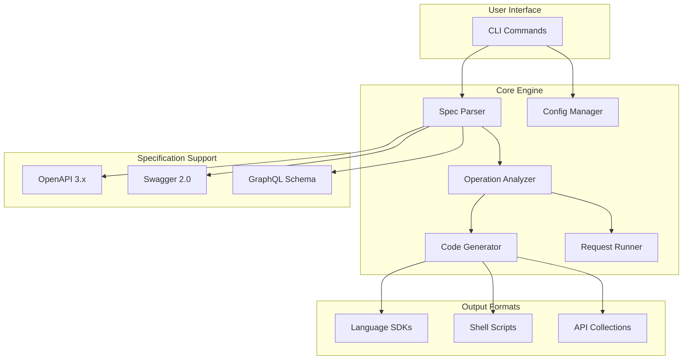
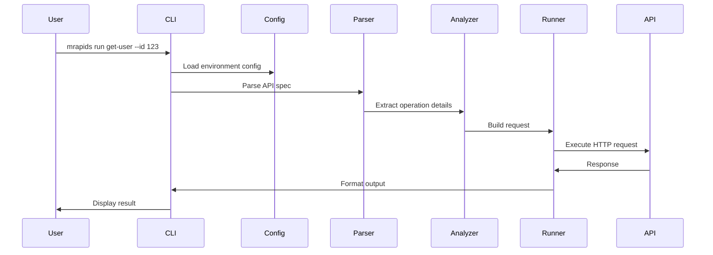
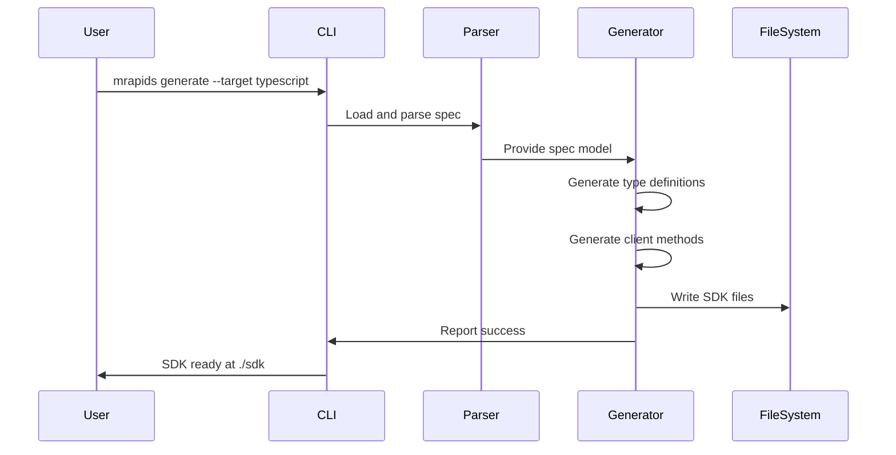

# MicroRapid Technical Architecture

## System Architecture Overview



## Core Components

### 1. CLI Layer (`src/cli/`)
- **Purpose**: User interface and command routing
- **Key Components**:
  - Command parsers (Clap-based)
  - Argument validation
  - Output formatting
  - Error handling

### 2. Parser Module (`src/core/parser.rs`)
- **Purpose**: Parse and validate API specifications
- **Responsibilities**:
  - Detect specification format
  - Parse OpenAPI/Swagger/GraphQL
  - Validate schema compliance
  - Extract operation metadata

### 3. Analyzer Module (`src/core/analyze_v2.rs`)
- **Purpose**: Deep analysis of API operations
- **Features**:
  - Parameter extraction
  - Request body schema analysis
  - Response format detection
  - Example generation

### 4. Runner Module (`src/core/request_runner.rs`)
- **Purpose**: Execute API operations
- **Capabilities**:
  - HTTP request construction
  - Authentication handling
  - Response validation
  - Error recovery

### 5. Generator Module (`src/core/generate.rs`)
- **Purpose**: Code generation engine
- **Supports**:
  - Multi-language SDKs
  - Type-safe clients
  - Documentation
  - Test setup-testss

### 6. Configuration System (`src/core/config.rs`)
- **Purpose**: Environment and settings management
- **Features**:
  - Environment-specific configs
  - Credential management
  - Base URL overrides
  - Custom headers

## Data Flow Architecture

### Command Execution Flow



### SDK Generation Flow



## Key Design Patterns

### 1. Command Pattern
Each CLI command is a self-contained unit with:
- Argument parsing
- Validation
- Execution logic
- Output formatting

```rust
pub trait Command {
    fn execute(&self) -> Result<()>;
}
```

### 2. Builder Pattern
Request construction uses builders for flexibility:
```rust
RequestBuilder::new()
    .method(Method::POST)
    .url(&base_url)
    .headers(headers)
    .body(data)
    .build()
```

### 3. Strategy Pattern
Different generators for different targets:
```rust
match target {
    GenerateTarget::Typescript => TypescriptGenerator::generate(),
    GenerateTarget::Python => PythonGenerator::generate(),
    // ...
}
```

### 4. Template Pattern
Code generation uses templates with placeholders:
```rust
let template = r#"
class {{class_name}} {
    constructor(config) {
        this.baseURL = config.baseURL || '{{base_url}}';
    }
    {{methods}}
}
"#;
```

## Directory Structure Philosophy

```
project/
├── specs/              # API specifications
│   └── api.yaml       # Primary spec file
├── config/            # Environment configs
│   ├── development.yaml
│   ├── staging.yaml
│   └── production.yaml
├── requests/          # Saved request examples
│   ├── create-user.yaml
│   └── update-user.json
├── data/              # Test data files
│   └── users.json
├── generated/         # Generated code
│   ├── sdk/
│   └── tests/
└── responses/         # Saved responses
    └── api-logs/
```

## Module Architecture

### Core Modules

```rust
// High-level module structure
mod cli;        // CLI interface
mod core {      // Core functionality
    mod parser;     // Spec parsing
    mod analyzer;   // Operation analysis
    mod runner;     // Request execution
    mod generator;  // Code generation
    mod config;     // Configuration
    mod errors;     // Error types
}
mod utils;      // Utilities
```

### Error Handling Strategy

```rust
// Unified error type
#[derive(Error, Debug)]
pub enum MicroRapidError {
    #[error("Specification parse error: {0}")]
    ParseError(String),
    
    #[error("Network error: {0}")]
    NetworkError(#[from] reqwest::Error),
    
    #[error("Configuration error: {0}")]
    ConfigError(String),
    
    #[error("Generation error: {0}")]
    GenerationError(String),
}
```

## Performance Considerations

### 1. Lazy Loading
- Specs loaded only when needed
- Partial parsing for large specs
- Cached parsed representations

### 2. Parallel Processing
- Concurrent request execution
- Parallel file generation
- Async I/O operations

### 3. Memory Efficiency
- Streaming for large responses
- Incremental file writing
- Minimal spec duplication

## Security Architecture

### 1. Credential Management
- Never store credentials in specs
- Environment variable support
- Secure config file handling

### 2. Request Safety
- URL validation
- Header sanitization
- Body content validation

### 3. Output Security
- Mask sensitive data in logs
- Secure file permissions
- No credential leaking

## Extension Points

### 1. Custom Generators
```rust
trait Generator {
    fn generate(&self, spec: &Spec) -> Result<GeneratedCode>;
}
```

### 2. Authentication Plugins
```rust
trait AuthProvider {
    fn authenticate(&self, request: &mut Request) -> Result<()>;
}
```

### 3. Output Formatters
```rust
trait OutputFormatter {
    fn format(&self, response: &Response) -> String;
}
```

## Testing Strategy

### 1. Unit Tests
- Parser validation
- Generator output
- Config loading

### 2. Integration Tests
- Full command execution
- File generation
- Network requests (mocked)

### 3. End-to-End Tests
- Real API interactions
- Complete workflows
- Performance benchmarks

## Future Architecture Considerations

### 1. Plugin System
- Dynamic loading of generators
- Custom command extensions
- Third-party integrations

### 2. Distributed Execution
- Remote spec fetching
- Cloud-based generation
- Distributed testing

### 3. Advanced Features
- WebSocket support
- GraphQL subscriptions
- gRPC integration
- AsyncAPI handling

## Performance Metrics

- **Startup Time**: < 50ms
- **Spec Parsing**: < 100ms for 100 operations
- **SDK Generation**: < 1s for full SDK
- **Memory Usage**: < 50MB for typical usage
- **Concurrent Requests**: Up to 100 parallel

This architecture enables MicroRapid to deliver on its promise of making APIs instantly executable while maintaining flexibility, performance, and reliability.