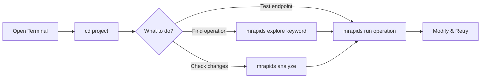
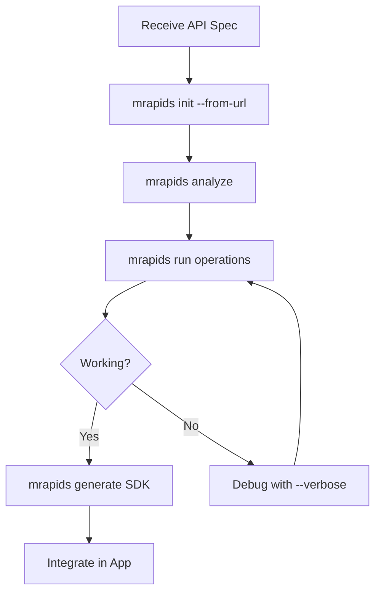
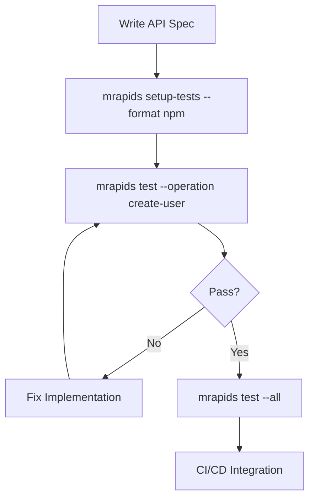

# MicroRapid User Workflows

## Overview

MicroRapid transforms how developers interact with APIs by making specifications directly executable. This document outlines the typical workflows and usage patterns.

## 🎯 Core User Journeys

### 1. Quick API Testing (Most Common)

```bash
# Developer has an OpenAPI spec and wants to test an endpoint
mrapids run get-user --id 123

# Behind the scenes:
# 1. Detects operation from spec file (specs/api.yaml)
# 2. Maps --id to path parameter
# 3. Executes request
# 4. Pretty-prints response
```

### 2. New Project Setup

```bash
# Starting a new API integration project
mrapids init my-project --from-url https://api.example.com/openapi.json

# What happens:
# 1. Downloads OpenAPI spec
# 2. Creates project structure
# 3. Generates request examples
# 4. Sets up environment configs
# 5. Creates initial test data

cd my-project
mrapids list operations  # See what's available
mrapids run list-users   # Try first operation
```

### 3. SDK Generation for Frontend Team

```bash
# Backend team has updated API, frontend needs new SDK
cd api-project
mrapids generate specs/api.yaml --target typescript --output ./sdk

# Frontend developer:
npm install ./sdk
```

```typescript
import { ApiClient } from './sdk';
const api = new ApiClient({ baseURL: 'https://api.example.com' });
const users = await api.getUsers({ limit: 10 });
```

## 📊 Detailed Workflow Patterns

### Pattern 1: Exploration → Execution → Integration

```bash
# Step 1: Explore available operations
mrapids explore user        # Find user-related operations
mrapids list operations     # See all operations
mrapids show create-user    # Get details about specific operation

# Step 2: Test the operation
mrapids run create-user --data @user.json --dry-run    # Preview
mrapids run create-user --data @user.json              # Execute
mrapids run create-user --edit                         # Interactive

# Step 3: Generate integration code
mrapids generate specs/api.yaml --target python
```

### Pattern 2: Development → Testing → Production

```bash
# Development
mrapids init-config --env development
mrapids run get-products --env development

# Testing
mrapids setup-tests --format npm               # Generate test scripts
npm run test:api                           # Run generated tests
mrapids test --all                         # Test all operations

# Production
mrapids init-config --env production
mrapids run get-products --env production --save response.json
```

### Pattern 3: API-First Development

```bash
# 1. Start with OpenAPI spec
mrapids init api-service --template rest

# 2. Generate server stubs
mrapids generate specs/api.yaml --target python --server

# 3. Test as you develop
mrapids run create-order --data @test-order.json

# 4. Generate client SDKs
mrapids generate specs/api.yaml --target typescript --client
```

## 🔄 Common Usage Flows

### Daily Development Flow



### Integration Flow



### Testing Flow



## 💡 Real-World Scenarios

### Scenario 1: Mobile Developer

```bash
# Mobile dev needs to integrate payment API
mrapids init payment-integration --from-url https://api.stripe.com/v1/openapi.json
cd payment-integration

# Test the charge endpoint
mrapids show create-charge
mrapids run create-charge --data @test-charge.json --env test

# Generate native SDKs
mrapids generate specs/api.yaml --target swift --output ios-sdk
mrapids generate specs/api.yaml --target kotlin --output android-sdk
```

### Scenario 2: QA Engineer

```bash
# Set up test environment
mrapids init-config --env staging
export MRAPIDS_ENV=staging

# Run smoke tests
mrapids test --operation health-check
mrapids test --operation list-users --data @qa/test-users.json

# Generate regression test suite
mrapids setup-tests --format shell --with-examples
./run-tests.sh
```

### Scenario 3: DevOps Engineer

```bash
# Validate API deployment
mrapids run health-check --env production

# Monitor endpoints
for op in $(mrapids list operations --format simple); do
    mrapids run $op --required-only --timeout 5
done

# Generate monitoring scripts
mrapids setup-tests --format compose --with-env
docker-compose up monitoring
```

## 🛠️ Advanced Workflows

### Batch Operations

```bash
# Process multiple records
cat user-ids.txt | while read id; do
    mrapids run get-user --id $id --save "responses/user-$id.json"
done

# Bulk testing
mrapids list operations --format simple | \
    xargs -I {} mrapids run {} --required-only --dry-run
```

### Template-Based Workflows

```bash
# Create reusable templates
cat > templates/create-user.yaml << EOF
name: "{{name}}"
email: "{{email}}"
role: "{{role:-user}}"
EOF

# Use templates
mrapids run create-user --template create-user.yaml \
    --set name="John Doe" --set email="john@example.com"
```

### CI/CD Integration

```yaml
# .github/workflows/api-test.yml
name: API Tests
on: [push]
jobs:
  test:
    runs-on: ubuntu-latest
    steps:
      - uses: actions/checkout@v2
      - name: Install mrapids
        run: cargo install mrapids
      - name: Run API tests
        run: |
          mrapids test --all --env test
          mrapids generate specs/api.yaml --target typescript
```

## 📈 Usage Patterns by Role

### Frontend Developer
1. `mrapids generate` - Get SDK
2. `mrapids run` - Test endpoints
3. `mrapids show` - Check parameters

### Backend Developer
1. `mrapids analyze` - Validate spec
2. `mrapids run` - Test implementation
3. `mrapids setup-tests` - Create tests

### DevOps Engineer
1. `mrapids test --all` - Validate deployment
2. `mrapids setup-tests --format compose` - Container setup
3. `mrapids run health-check` - Monitor

### QA Engineer
1. `mrapids explore` - Find test scenarios
2. `mrapids test` - Execute tests
3. `mrapids run --save` - Capture responses

## 🚀 Quick Start Workflows

### 5-Minute Integration
```bash
# From zero to working integration
curl -O https://petstore.swagger.io/v2/swagger.json
mrapids run listPets
mrapids generate swagger.json --target typescript
# Done! SDK ready to use
```

### Test Any API
```bash
# Public API testing
mrapids init github-api --from-url https://api.github.com/openapi.json
mrapids run get-user --id octocat
```

### Generate Everything
```bash
# Full project setup-tests
mrapids init my-api
mrapids analyze --all
mrapids setup-tests --format all
mrapids generate specs/api.yaml --target typescript --both
```

## 📚 Learning Path

1. **Beginner**: Start with `mrapids run` commands
2. **Intermediate**: Use `mrapids generate` for SDKs
3. **Advanced**: Create workflows with templates and setup-testsing
4. **Expert**: Integrate into CI/CD and monitoring systems

## 🎯 Best Practices

1. **Always start with `mrapids analyze`** to understand the API
2. **Use environment configs** for different stages
3. **Save successful requests** as templates
4. **Generate SDKs** instead of writing manual code
5. **Setup Tests tests** for comprehensive coverage
6. **Use `--dry-run`** before production calls

## 🔗 Workflow Integration

MicroRapid fits into existing workflows:

- **Git**: Commit generated SDKs and tests
- **CI/CD**: Run tests in pipelines
- **Docker**: Include in containers
- **IDE**: Use generated SDKs with full IntelliSense
- **Monitoring**: Export metrics from run commands

## 📊 Typical Session

```bash
# Morning standup: "We need to integrate the payment API"
$ mrapids init payment-api --from-url https://api.payment.com/openapi.yaml
✅ Project initialized

$ mrapids explore payment
🔍 Found: create-payment, list-payments, refund-payment

$ mrapids show create-payment
📄 POST /payments - Create a payment...

$ mrapids run create-payment --data @test-payment.json --dry-run
🔍 Would send: POST https://api.payment.com/payments...

$ mrapids run create-payment --data @test-payment.json
✅ Payment created: {"id": "pay_123", "status": "success"}

$ mrapids generate specs/api.yaml --target typescript
✅ SDK generated in ./sdk

# Afternoon: "It's integrated and tested!"
```

This workflow demonstrates MicroRapid's philosophy: from API spec to working integration in minutes, not days.