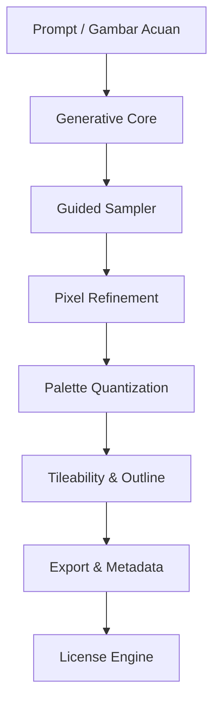

# 🧩 **PixAI — Pixel Art License & Generator**

`pip install pixai`
`pixai`

> **PixAI** adalah paket Python + CLI/GUI untuk **membuat, mengelola lisensi, dan menyiapkan aset pixel art** yang dihasilkan oleh AI serta **lisensi karya AI** bernama **PixAI License**.

---

## 📋 **Daftar Isi**

1. [Deskripsi Proyek](#-deskripsi-proyek)
2. [Kegunaan & Ruang Lingkup](#-kegunaan--ruang-lingkup)
3. [Fitur Utama](#-fitur-utama)
4. [Arsitektur & Algoritma](#-arsitektur--algoritma)
5. [Persyaratan Sistem](#-persyaratan-sistem)
6. [Instalasi Lengkap](#-instalasi-lengkap)
7. [Cara Penggunaan](#-cara-penggunaan)
8. [Pengelolaan Palet & Gaya](#-pengelolaan-palet--gaya)
9. [Ekspor & Integrasi](#-ekspor--integrasi)
10. [Lisensi PixAI (Lengkap)](#-lisensi-pixai-lengkap)
11. [Template LICENSE.txt](#-template-licensetxt)
12. [Watermark & Metadata AI](#-watermark--metadata-ai)
13. [Troubleshooting](#-troubleshooting)
14. [FAQ](#-faq)
15. [Kontribusi](#-kontribusi)
16. [Catatan Rilis & Perubahan](#-catatan-rilis--perubahan)

---

## Demo Video 


## 📌 **Deskripsi Proyek**

**PixAI** menghadirkan pipeline lengkap untuk:

* **Generate** sprite, tileset, ikon, UI pixel art
* **Refine** (pixelate, quantize, outline) agar mengikuti estetika pixel art klasik.
* **License-aware**: menyertakan **Penentu Lisensi** otomatis (Personal/Commercial/Exclusive) + **template kontrak**.
* **Audit**: menambahkan watermark halus & metadata **AI-generated**.

> Nama lisensi dan tool: **PixAI**.

---

## 🎯 **Kegunaan & Ruang Lingkup**

* Game 2D (JRPG, Roguelike, Platformer, Metroidvania).
* UI/UX retro, icon pack pixelated.
* Tileset kota, dungeon, overworld.
* NPC, monster, equipment, item drop, efek skill.
* Proyek komersial dan non-komersial dengan **aturan lisensi jelas**.

---

## ✨ **Fitur Utama**

* ✅ **AI Pixel Generator**: teks → sprite/tileset (ukuran 16×16, 24×24, 32×32, 48×48, 64×64, kustom).
* ✅ **Style Controls**: NES/GB/SNES/GENESIS-like palettes, dithering, outline otomatis, tileability.
* ✅ **Batch & Seed**: batch generation + seed untuk reproduksibilitas.
* ✅ **License Engine**: pilih skema Personal/Commercial/Exclusive, auto-isi LICENSE.txt & metadata.
* ✅ **GUI & CLI**: antarmuka sederhana + perintah terminal untuk CI/CD aset.
* ✅ **Export Kit**: PNG (indexed), spritesheet, Aseprite JSON, Godot/Unity importer hints.
* ✅ **Audit AI**: EXIF/XMP tag *AI-generated by PixAI*, watermark frekuensi-rendah opsional.

---

## 🧠 **Arsitektur & Algoritma**

### 📂 Alur Utama



### 🔧 Tahapan Algoritmik (Ringkas)

1. **Generative Core**: model difusi/transformer menghasilkan *base image* resolusi tinggi.
2. **Guided Sampler**: classifier-free guidance + kontrol ukuran target (mis. 64×64) via downscale.
3. **Pixel Refinement**:

   * Downscale → **nearest-neighbor** ke target grid.
   * **Pixel-cleanup** (morphology ringan) untuk menghindari noise.
4. **Palette Quantization**:

   * KMeans/MedianCut → palet terbatas (8/16/32 warna) sesuai preset (NES/GB/SNES/Custom).
   * Opsional **Floyd–Steinberg dithering**.
5. **Tileability & Outline**:

   * Seam-fix (wrap padding + Poisson-like blending pada grid) untuk tileset.
   * **Edge-detect** (Sobel/Scharr) → outline 1px adaptif.
6. **Export & Metadata**: simpan PNG indexed + sematkan XMP tag `generator=PixAI`.
7. **License Engine**: buat **LICENSE.txt** sesuai pilihan pemilik proyek.

### 🧪 Pseudocode Inti

```pseudo
function pixai_generate(prompt, size=64, palette="NES", colors=16, tileable=false, seed=None):
    base = generative_model.sample(prompt=prompt, seed=seed, hi_res=True)
    low = resample_nearest(base, target=(size,size))
    clean = pixel_cleanup(low)
    pal = choose_palette(preset=palette, n=colors)
    quant = quantize_image(clean, palette=pal, dithering="floyd_steinberg")
    if tileable:
        quant = make_tileable(quant)
    outlined = adaptive_outline(quant)
    write_png_indexed(outlined, metadata={"generator":"PixAI","ai":true})
    return outlined
```

---

## 🖥 **Persyaratan Sistem**

| Komponen   | Minimal                          | Catatan                              |
| ---------- | -------------------------------- | ------------------------------------ |
| **OS**     | Windows Xp / macOS / Linux (x64) | ARM64 didukung via Rosetta/Miniforge |
| **Python** | 3.9+                             | Disarankan 3.10/3.11                 |
| **GPU**    | Opsional                         | CUDA/Metal/ROCm mempercepat generasi |
| **RAM**    | 2 GB+                            | 16 GB disarankan untuk batch         |
| **Disk**   | 2–10 GB                          | Model & cache                        |

> **Tanpa Node/Cordova/Android SDK.** Semua dependensi adalah Python-native.

---

## 📥 **Instalasi Lengkap**

### 1) Cek Python & PIP

```bash
python --version
pip --version
```

### 2) Instal PixAI

```bash
pip install pixai
```

### 3) Running Apps

```bash
pixai
```

> Perintah ini untuk menjalankan aplikasi kalian bisa mencobanya

---

## 🕹 **Cara Penggunaan**

### CLI (Command Line Interface)

```bash
# generate satu sprite
pixai generate \
  --prompt "knight with red cape, side view, chibi" \
  --size 64 \
  --palette snes --colors 24 \
  --outline 1 \
  --out knight_64.png

# batch 32x32 tileset, tileable
pixai generate --prompt "mossy stone floor, topdown" \
  --size 32 --tileable true \
  --palette gb --colors 8 \
  --grid 8x8 --out tileset_stone.png

# reproduksi hasil dengan seed
pixai generate --prompt "desert cactus small" --size 48 --seed 1234 --out cactus.png
```

#### Argumen Umum

* `--size {16|24|32|48|64|...}`
* `--palette {nes|gb|snes|genesis|pico8|custom}`
* `--colors <n>` (jumlah warna maksimum)
* `--tileable true|false`
* `--outline 0|1` (ketebalan outline 1px)
* `--seed <int>`
* `--grid AxB` (susun ke spritesheet)
* `--out <file.png>`

### GUI (Antarmuka Grafis)

1. Jalankan `pixai gui`.
2. Isi **Prompt**, pilih **Size**, **Palette**, **Colors**, dan opsi **Tileable/Outline**.
3. Klik **Generate** → pratinjau akan muncul.
4. Klik **Export** untuk menyimpan PNG + `LICENSE.txt`.

### Engine Lisensi (CLI)

```bash
pixai license init --type commercial --owner "Studio Contoh" --project "RPG-Alpha" --author "PixAI"
# menghasilkan LICENSE.txt + metadata XMP pada setiap ekspor
```

---

## 🎨 **Pengelolaan Palet & Gaya**

* **Preset**: NES (54), GB (4), SNES (variasi), PICO-8 (16), Genesis (64-128).*Angka dalam tanda kurung adalah contoh ukuran palet bawaan.*
* **Custom Palette**: impor `.gpl`/`.txt` daftar RGB.
* **Dithering**: `none`, `floyd_steinberg`.
* **Constraint**: hard-limit warna saat quantize untuk konsistensi cross-asset.

---

## 📦 **Ekspor & Integrasi**

* **PNG Indexed** (palet tetap), **spritesheet** + **JSON (Aseprite-like)**.
* **Godot**: aktifkan `flags/mipmaps=false`, `filter=nearest`.
* **Unity**: `Filter Mode=Point (no filter)`, `Compression=None`, `Max Size` sesuai kebutuhan.

---

## 📜 **Lisensi PixAI (Lengkap)**

> **PixAI License** mengikat **aset pixel art** yang dihasilkan melalui tool ini. Pilih salah satu mode saat ekspor: **Personal**, **Commercial**, atau **Exclusive**.

### 1) Personal

* Penggunaan non-komersial (proyek pribadi, prototipe, edukasi).
* Attribution **wajib**: `"Pixel art generated with PixAI"` di credit.
* Redistribusi aset **dilarang** kecuali sebagai bagian dari proyek.

### 2) Commercial

* Boleh digunakan dalam produk berbayar/beriklan.
* Attribution **disarankan** (opsional), namun **metadata AI** tidak boleh dihapus.
* Dilarang menjual aset sebagai *asset pack* berdiri sendiri.

### 3) Exclusive (add-on berbayar)

* Lisensi **eksklusif** untuk pemegang lisensi pada aset tertentu (hash aset tercantum).
* Tidak ada pihak ketiga lain yang boleh menggunakan aset yang sama.
* Attribution opsional; watermark dapat dihapus secara legal via kunci lisensi.

### Ketentuan Umum

* **Dilarang**: konten ilegal, kebencian, pelanggaran IP pihak lain.
* **AI Disclosure**: setiap file menyertakan metadata `ai-generated=true`.
* **Pembuktian Asal**: checksum/hashing file disimpan di manifest proyek.
* **Upstream Models**: patuhi lisensi model dasar (jika ada) saat distribusi.

---

## 📄 **Template LICENSE.txt**

Salin, lalu sesuaikan variabel di `pixai`.


PixAI License v1.0

Project: PixAi
Owner: Dwi Bakti N Dev
Author/Tooling: PixAI (AI-generated)
Date: 27-08-2025

1. Grant of Rights
   - Rights are granted to use the listed pixel art assets according to the License Type above.

2. Restrictions
   - No reselling assets as standalone packs.
   - No unlawful, hateful, or infringing usage.

3. Attribution
   - Personal: Required ("Pixel art generated with PixAI").
   - Commercial/Exclusive: Recommended; may be omitted per project policy.

4. AI Disclosure & Metadata
   - Do not remove embedded XMP/EXIF tags identifying AI generation.

5. Exclusivity (Exclusive Only)
   - Exclusive license applies to assets listed by hash and is unique to the Owner.

6. Liability & Warranty
   - Provided "as is" without warranties; Owner responsible for compliance.

7. Governing Law
   - Determined by Owner's jurisdiction unless stated otherwise.


---

## 🏷 **Watermark & Metadata AI**

* **Watermark**: pola frekuensi-rendah pada channel luminance, tak kasat mata saat zoom 100%.
* **Metadata**: XMP fields `creator=PixAI`, `generator=PixAI`, `ai-generated=true`, `license=<type>`.
* **Manifest**: `pixai_manifest.json` berisi daftar file + SHA256 untuk audit.

---

## 🛠 **Troubleshooting**

| Masalah               | Penyebab Umum                | Solusi                                                       |
| --------------------- | ---------------------------- | ------------------------------------------------------------ |
| Lambat saat generate  | Backend CPU                  | Aktifkan GPU (CUDA/Metal), kurangi resolusi/steps            |
| Warna meleber         | Interpolasi salah            | Pastikan ekspor **nearest-neighbor**, nonaktifkan resampling |
| Palet tidak konsisten | Quantize berbeda antar batch | Kunci preset + `--colors` sama                               |
| Tileset ada garis     | Seam tidak tileable          | Gunakan `--tileable true` + periksa wrap padding             |
| Metadata hilang       | Editor menghapus XMP         | Ekspor ulang via `pixai export`                              |

---

## ❓ **FAQ**

* **Apakah PixAI perlu internet?** Tidak, model dapat di-cache lokal setelah unduhan awal.
* **Bisa impor gambar sketsa?** Ya, gunakan `--init <file>` untuk *image-to-pixel*.
* **Legal untuk komersial?** Ya, pilih **Commercial**/**Exclusive** dan ikuti syarat lisensi.

---

## 🤝 **Kontribusi**

* Laporkan isu/fitur lewat *issue tracker*.
* PR: sertakan *before/after* dan *seed* agar dapat direproduksi.
* Tambahkan preset palet baru di `palettes/` + dokumentasi.

---

## 🗒 **Catatan Rilis & Perubahan**

* **v1.0**: Rilis awal PixAI yang sangat menakjubkan yang membungkam programing

> **Ringkasan Perubahan Besar**: Semua instruksi Cordova/Android/Gradle dihapus. Diganti dengan panduan instalasi PixAI, algoritma generatif, pipeline pixel-art, lisensi baru, dan template `LICENSE.txt`.

---

### 🚀 **Selamat Berkarya dengan PixAI!**