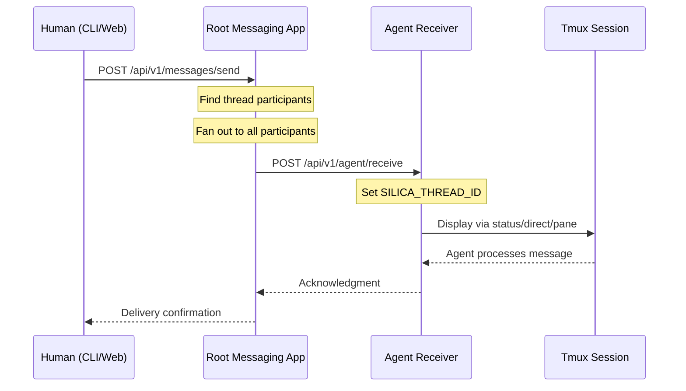
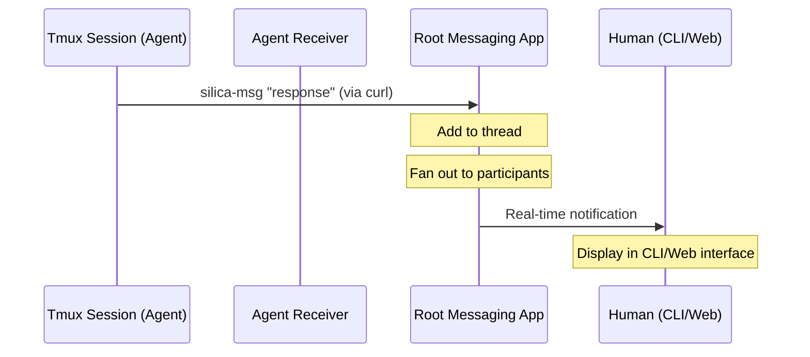
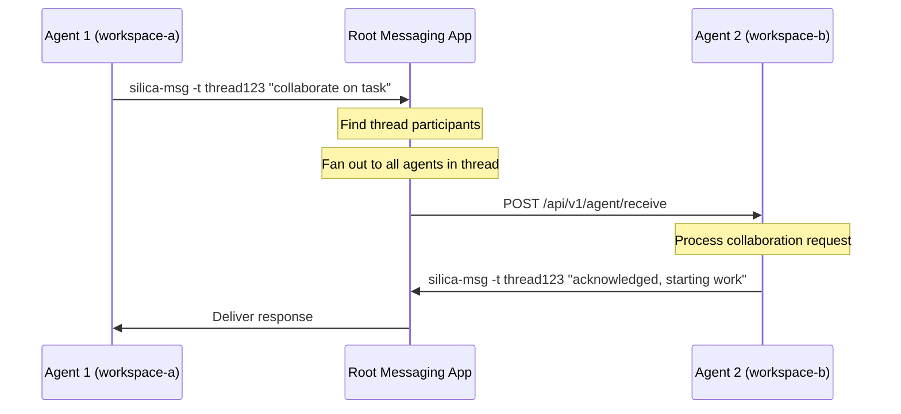
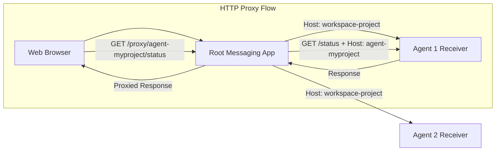

# Silica Messaging System Flow

## Overview

The Silica messaging system enables threaded, bidirectional communication between humans and agents across multiple workspaces. The system uses a hub-and-spoke architecture with global threads and participant-based message distribution.

## Architecture Components

### 1. Root Messaging App (`silica-messaging`)
- Central hub deployed as piku app
- Manages global threads and participant lists
- Routes messages between participants
- Serves web interface with HTTP proxy
- File-based persistence in DATA_DIR

### 2. Agent Receivers
- HTTP endpoints in each agent workspace
- Launched via `silica messaging receiver --port <port>`
- Receive messages from root app
- Forward to tmux sessions with context

### 3. Messaging Function (`silica-msg`)
- Bash function available in agent environments
- Sends messages from agents to root app
- Supports stdin piping and positional arguments
- Enables agent-to-agent communication

## Message Flow Diagrams

### Human-to-Agent Communication

### Agent-to-Human Communication

### Agent-to-Agent Communication

## Thread Model

### Global Threads
- Threads are globally unique, not workspace-namespaced
- Thread IDs can be arbitrary strings or UUIDs
- Any participant can reference any thread by ID

### Implicit Thread Creation
- Threads are created automatically when first referenced
- No explicit thread creation required
- Default thread title based on first message or thread ID

### Participant Management
- Each thread maintains a list of participants
- Participants can be humans or agents (`{workspace}-{project}`)
- Messages fan out to all participants in a thread
- Participants can be added/removed dynamically

## HTTP Routing & Proxy

### Agent Endpoint Access
The root messaging app provides HTTP proxy functionality to access agent endpoints through the web interface:

This allows the web interface to:
- Browse agent status pages
- Access agent-specific dashboards
- Interact with agent HTTP APIs
- Maintain real-time connections

## API Endpoints

### Root Messaging App

#### Thread Management
- `GET /api/v1/threads` - List all threads
- `GET /api/v1/threads/{thread_id}` - Get thread details
- `GET /api/v1/threads/{thread_id}/participants` - Get participants
- `POST /api/v1/threads/{thread_id}/participants` - Add participant

#### Message Operations
- `GET /api/v1/threads/{thread_id}/messages` - Get messages
- `POST /api/v1/messages/send` - Send message (auto-creates thread)
- `POST /api/v1/messages/agent-response` - Receive from agent

#### HTTP Proxy
- `GET /proxy/{workspace-project}/*` - Proxy to agent endpoints
- Supports all HTTP methods (GET, POST, etc.)
- Preserves headers and streaming responses

### Agent Receiver

#### Message Handling
- `POST /api/v1/agent/receive` - Receive message from root app
- `GET /api/v1/agent/status` - Agent status and environment
- `GET /health` - Health check

## Environment Variables

### Root Messaging App
- `PORT` - HTTP server port (default: 5000)
- `DATA_DIR` - Persistent storage directory

### Agent Receivers
- `SILICA_WORKSPACE` - Workspace name
- `SILICA_PROJECT` - Project name  
- `SILICA_RECEIVER_PORT` - HTTP receiver port
- `SILICA_MESSAGE_DELIVERY` - Delivery mode (status/direct/pane)

### Agent Environment
- `SILICA_THREAD_ID` - Current thread context
- `SILICA_PARTICIPANT` - Agent's participant ID
- `SILICA_LAST_SENDER` - Sender of last received message

## Message Delivery Modes

### Status Bar (Default)
- Non-intrusive tmux status display
- Brief message preview with timeout
- Preserves agent workflow

### Direct Input
- Sends message directly to current tmux pane
- Appears as if typed by user
- For immediate agent interaction

### Dedicated Pane
- Creates/uses separate tmux pane for messages
- Maintains message history
- Allows focused message review

## Error Handling

### Network Failures
- Root app retries message delivery
- Agent receivers handle connection drops
- Graceful degradation for offline agents

### Thread Consistency
- File-based locking for concurrent access
- Atomic message writes
- Participant list synchronization

### Recovery Procedures
- Auto-restart of agent receivers
- Health check monitoring
- Persistent message queuing

## Security Considerations

### Localhost-Only Operation
- All communication over localhost
- No external network exposure
- Piku-based routing and isolation

### Authentication
- Single-user mode by default
- Future: Multi-user with participant validation
- Thread access control via participant lists

This flow enables seamless communication between humans and agents while maintaining proper isolation and context preservation.