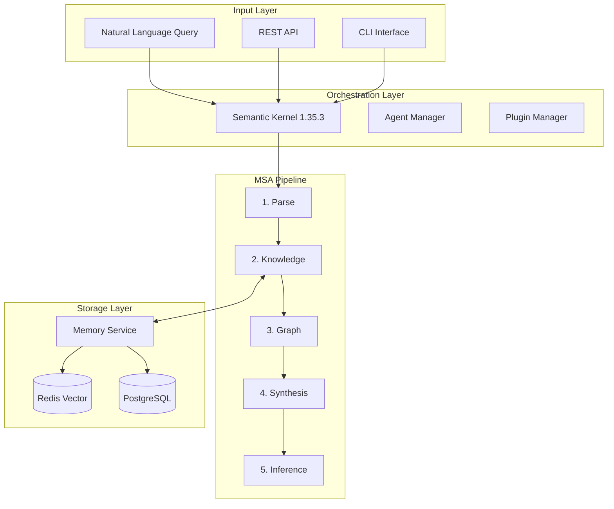

<div align="center">

# 🧠 Reasoning-Kernel

### Model Synthesis Architecture (MSA) for Advanced AI Reasoning

[](https://opensource.org/licenses/Apache-2.0)
[](https://www.python.org/)
[](https://github.com/microsoft/semantic-kernel)
[](https://github.com/Qredence/Reasoning-Kernel)

**An enterprise-grade probabilistic reasoning system built on Microsoft Semantic Kernel and NumPyro**

[Documentation](https://github.com/Qredence/Reasoning-Kernel/tree/main/docs) •
[Quick Start](#-quick-start) •
[Roadmap](#-roadmap) •
[Contributing](CONTRIBUTING.md)

</div>

---

## ⚠️ Work in Progress Notice

> **This project is under active development.** APIs, configurations, and features may change without notice. We're working towards a stable v1.0 release. See our [roadmap](#-roadmap) for planned features and timeline.

**Current Status:** Beta (v0.0.2) - Core functionality stable, enterprise features in development

---

## 📖 Overview

**Reasoning-Kernel** implements the Model Synthesis Architecture (MSA) - a cutting-edge approach to AI reasoning that combines:

- **🎯 Semantic Kernel Integration**: Native Microsoft SK 1.35.3 orchestration with agent-based patterns
- **📊 Probabilistic Programming**: NumPyro/JAX for Bayesian inference with Daytona sandbox execution
- **🔄 5-Stage Reasoning Pipeline**: Parse → Knowledge → Graph → Synthesis → Inference
- **💾 Multi-Tier Memory**: Redis vector store with Gemini embeddings + PostgreSQL for persistent knowledge
- **🚀 Production Ready**: FastAPI, async processing, enterprise security, and horizontal scaling

### Key Differentiators

- **Causal Reasoning**: Build and reason over causal dependency graphs
- **Uncertainty Quantification**: Probabilistic models with confidence intervals and Daytona sandbox execution
- **Explainable AI**: Transparent reasoning traces and decision paths with Gemini 2.5 Pro thinking modes
- **Multi-Model Support**: Azure OpenAI, Google Gemini 2.5 Pro, local models
- **Scalable Architecture**: Horizontal scaling with multi-agent orchestration and Redis memory consolidation
- **Secure Execution**: Daytona sandbox for safe code execution in reasoning workflows
- **Advanced Embeddings**: Gemini text-embedding-004 for enhanced semantic search

---

## 🚀 Quick Start

### Prerequisites

- Python 3.10-3.12 (3.13+ not yet supported)
- Azure OpenAI or Google AI API credentials
- Redis 7.0+ (optional, for vector memory)
- 8GB+ RAM recommended

### Installation

```bash
# Clone repository
git clone https://github.com/Qredence/Reasoning-Kernel.git
cd Reasoning-Kernel

# Create virtual environment (recommended: uv)
uv venv && source .venv/bin/activate  # or: python -m venv .venv

# Install with core dependencies
uv pip install -e .

# Install with optional features
uv pip install -e ".[azure,google,redis]"  # Pick what you need
```

### Configuration

Create a `.env` file or export environment variables:

```bash
# Required: Choose one AI provider
# Azure OpenAI (recommended)
AZURE_OPENAI_ENDPOINT="https://your-resource.openai.azure.com/"
AZURE_OPENAI_API_KEY="your-key"
AZURE_OPENAI_DEPLOYMENT="gpt-4"
AZURE_OPENAI_API_VERSION="2024-12-01-preview"

# OR Google AI
GOOGLE_AI_API_KEY="your-gemini-key"

# Optional: Redis for memory
REDIS_URL="redis://localhost:6379"
```

### Basic Usage

#### Python API

```python
import asyncio
from reasoning_kernel import ReasoningKernel, ReasoningConfig

async def main():
    # Initialize with default configuration
    kernel = ReasoningKernel()
    
    # Perform reasoning
    result = await kernel.reason(
        query="A supply chain disruption has occurred. Analyze impacts.",
        mode="synthesis"  # Options: knowledge, probabilistic, synthesis
    )
    
    print(f"Confidence: {result.confidence:.2%}")
    print(f"Reasoning: {result.explanation}")

asyncio.run(main())
```

#### CLI Interface

```bash
# Basic reasoning query (simple CLI - lightweight)
python simple_reasoning_cli.py "Analyze market volatility causes"

# Full-featured CLI (requires all dependencies)
reasoning-kernel "Analyze market volatility causes"

# Interactive session
reasoning-kernel --interactive

# Batch processing
reasoning-kernel batch process queries.jsonl --output results.json

# Start API server
reasoning-kernel serve --port 8000
```

#### REST API

```bash
# Start server
uvicorn reasoning_kernel.main:app --reload

# Query endpoint
curl -X POST http://localhost:8000/api/v2/reason \
  -H "Content-Type: application/json" \
  -d '{"query": "Analyze system failure", "mode": "synthesis"}'
```

---

## 🏗️ Architecture

### System Overview



### Core Components

| Component | Description | Status |
|-----------|-------------|--------|
| **Semantic Kernel Core** | Microsoft SK 1.35.3 orchestration | ✅ Stable |
| **MSA Pipeline** | 5-stage reasoning process | ✅ Stable |
| **Agent System** | Multi-agent orchestration | 🚧 Beta |
| **Memory Service** | Redis + PostgreSQL integration | ✅ Stable |
| **Probabilistic Engine** | NumPyro/JAX inference | ✅ Stable |
| **API Layer** | FastAPI REST endpoints | ✅ Stable |
| **CLI Tools** | Command-line interface | 🚧 Beta |
| **Monitoring** | OpenTelemetry observability | 📋 Planned |

---

## 📚 Documentation

## 📚 Documentation

### Getting Started

- **[Quick Start Guide](docs/getting-started/quickstart.md)** - 10-minute introduction to MSA reasoning
- **[Installation Guide](docs/getting-started/installation.md)** - Complete setup with environment configuration
- **[Configuration Reference](docs/getting-started/configuration.md)** - All configuration options and environment variables

### Core Concepts

- **[MSA Framework Overview](docs/concepts/msa-framework.md)** - Model Synthesis Architecture fundamentals
- **[Reasoning Modes](docs/concepts/reasoning-modes.md)** - Knowledge, probabilistic, and synthesis reasoning
- **[Prompt Engineering](docs/concepts/prompt-engineering.md)** - Optimizing queries for MSA pipeline

### Architecture & System Design

- **[System Architecture](docs/architecture/overview.md)** - Complete system design and data flow
- **[Component Reference](docs/architecture/component-reference.mdx)** - Detailed component documentation
- **[Security Architecture](docs/architecture/security-architecture.md)** - Security features and threat model
- **[Plugin Architecture](docs/architecture/plugin-architecture.md)** - MSA plugin system design

### API Documentation

- **[REST API Reference](docs/api/comprehensive-reference.mdx)** - Complete API endpoints and examples
- **[CLI Commands](docs/cli/command-reference.md)** - Command-line interface guide
- **[Python SDK](docs/api/python-sdk.md)** - Python client library documentation

### MSA Plugins (Core Components)

- **[Parse Plugin](docs/plugins/parse-plugin.md)** - Natural language query parsing
- **[Knowledge Plugin](docs/plugins/knowledge-plugin.md)** - Knowledge retrieval and context building
- **[Graph Plugin](docs/plugins/graph-plugin.md)** - Causal relationship modeling
- **[Synthesis Plugin](docs/plugins/synthesis-plugin.md)** - Multi-perspective reasoning synthesis
- **[Inference Plugin](docs/plugins/inference-plugin.md)** - Probabilistic inference and uncertainty quantification
- **[Memory Plugin](docs/plugins/memory-plugin.md)** - Persistent memory and knowledge consolidation

### Development & Integration

- **[Developer Guide](docs/development/guides/developer-guide.md)** - Development setup and best practices
- **[Plugin Development Guide](docs/plugins/development-guide.md)** - Creating custom MSA plugins
- **[Integration Examples](docs/examples/tutorials.mdx)** - Real-world usage patterns and integrations
- **[Memory Management](docs/memory/memory-management.md)** - Redis vector store and PostgreSQL integration

### Operations & Production

- **[Production Deployment](docs/deployment/production-guide.md)** - Enterprise deployment strategies
- **[Performance Monitoring](docs/operations/performance-monitoring.mdx)** - Metrics, optimization, and scaling
- **[Troubleshooting Guide](docs/troubleshooting/common-issues.md)** - Common problems and solutions
- **[Kubernetes Deployment](docs/deployment/kubernetes.md)** - Container orchestration and scaling

### Additional Resources

- **[Examples & Tutorials](docs/examples/tutorials.mdx)** - Comprehensive usage examples and tutorials
- **[Security Best Practices](docs/security/best-practices.md)** - Security implementation guide
- **[Testing Guide](docs/development/testing/testing-guide.md)** - Testing strategies and frameworks

---

## 🗺️ Roadmap

### Phase 1: Foundation (Q1 2025) ✅ COMPLETED

- [x] Core MSA pipeline implementation
- [x] Semantic Kernel 1.35.3 integration
- [x] Basic agent orchestration
- [x] Redis memory integration
- [x] FastAPI endpoints

### Phase 2: Stabilization (Q2 2025) ✅ COMPLETED

- [x] Codebase simplification (86% reduction)
- [x] API v2 stabilization
- [x] Comprehensive test coverage (target: 90%)
- [x] Performance optimization
- [x] Documentation completion
- [x] Daytona sandbox integration
- [x] Redis memory consolidation
- [x] Gemini 2.5 Pro integration

### Phase 3: Production Ready (Q3 2025) 🚧 IN PROGRESS

- [x] v1.0.0 stable release
- [x] Kubernetes deployment manifests
- [x] Horizontal scaling support
- [ ] OpenTelemetry integration
- [ ] Admin dashboard
- [ ] Multi-tenant architecture prototype

### Phase 4: Advanced Features (Q4 2025) 🔮 FUTURE

- [ ] Multi-modal reasoning (images, audio)
- [ ] Federated learning support
- [ ] Real-time streaming reasoning
- [ ] AutoML for model synthesis
- [ ] Quantum computing integration

### Phase 5: Enterprise Features (2026) 🎯 VISION

- [ ] Multi-tenant architecture
- [ ] RBAC and SSO integration
- [ ] Compliance certifications (SOC2, ISO)
- [ ] SLA guarantees
- [ ] Enterprise support tiers

---

## 🧪 Testing

```bash
# Run all tests
pytest

# Run with coverage
pytest --cov=reasoning_kernel --cov-report=html

# Run specific test categories
pytest -m "not integration"  # Skip integration tests
pytest -m "benchmark"  # Run benchmarks only

# Run with parallel execution
pytest -n auto
```

---

## 🤝 Contributing

We welcome contributions! Please see our [Contributing Guide](CONTRIBUTING.md) for details.

### Development Setup

```bash
# Clone and setup
git clone https://github.com/Qredence/Reasoning-Kernel.git
cd Reasoning-Kernel

# Install development dependencies
uv pip install -e ".[dev]"

# Setup pre-commit hooks
pre-commit install

# Run code quality checks
make lint  # Run linters
make format  # Format code
make typecheck  # Type checking
```

### Contribution Areas

- 🐛 **Bug Fixes**: Help us squash bugs
- 📚 **Documentation**: Improve docs and examples
- 🧪 **Testing**: Increase test coverage
- 🚀 **Features**: Implement roadmap items
- 🎨 **UI/UX**: Improve CLI and web interfaces

---

## 📊 Performance Benchmarks

| Metric | Value | Target |
|--------|-------|--------|
| **Reasoning Latency (P50)** | 0.8s | <1s |
| **Reasoning Latency (P99)** | 2.1s | <3s |
| **Throughput** | 85 req/s | 100 req/s |
| **Memory Usage** | 1.5GB | <4GB |
| **Startup Time** | 3s | <3s |
| **Concurrent Agents** | 25 | 50 |

*Benchmarks on: Azure Standard_D4s_v3, 4 vCPU, 16GB RAM*

---

## 🔒 Security

### Security Features

- **API Key Authentication**: Secure API access
- **Rate Limiting**: Prevent abuse
- **Input Validation**: Pydantic models
- **Audit Logging**: Track all operations
- **Secret Management**: Azure Key Vault support

### Reporting Security Issues

Please report security vulnerabilities to: <security@qredence.ai>

---

## 📄 License

Copyright 2025 Qredence

Licensed under the Apache License, Version 2.0 (the "License");
you may not use this file except in compliance with the License.
You may obtain a copy of the License at

    http://www.apache.org/licenses/LICENSE-2.0

Unless required by applicable law or agreed to in writing, software
distributed under the License is distributed on an "AS IS" BASIS,
WITHOUT WARRANTIES OR CONDITIONS OF ANY KIND, either express or implied.
See the License for the specific language governing permissions and
limitations under the License.

See [LICENSE](LICENSE) for the full license text.

---

## 🙏 Acknowledgments

- **Microsoft Semantic Kernel Team** - For the excellent orchestration framework and agent patterns
- **NumPyro/JAX Teams** - For probabilistic programming infrastructure
- **FastAPI Team** - For the modern web framework
- **Google Gemini Team** - For advanced AI models and thinking modes
- **Daytona Team** - For secure sandbox execution environment
- **Open Source Community** - For continuous support and contributions

---

## 📞 Support & Contact

- **Documentation**: [docs/](docs/)
- **Issues**: [GitHub Issues](https://github.com/Qredence/Reasoning-Kernel/issues)
- **Discussions**: [GitHub Discussions](https://github.com/Qredence/Reasoning-Kernel/discussions)
- **Email**: <support@qredence.ai>
- **Twitter**: [@qredence](https://twitter.com/qredence)

---

## 🌟 Star History

[](https://star-history.com/#Qredence/Reasoning-Kernel&Date)

---

<div align="center">

**Built with ❤️ by [Qredence](https://qredence.ai) for the AI reasoning community**

[⬆ Back to top](#-reasoning-kernel)

</div>
