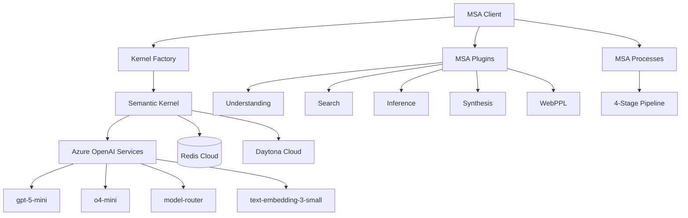

# MSA Semantic Kernel Integration

This directory contains the integration layer between the MSA (Model Synthesis Architecture) system and Microsoft's Semantic Kernel framework. It provides a unified interface for running MSA reasoning pipelines using Azure OpenAI services.

## Overview

The MSA Semantic Kernel integration implements the "Agent as a Step in a Process" pattern, where:

- **MSA Plugins** provide individual reasoning capabilities as SK functions
- **MSA Agents** orchestrate complex multi-step reasoning tasks  
- **MSA Processes** implement the 4-stage reasoning pipeline as SK processes
- **MSA Client** provides a unified interface for all capabilities

## Architecture



## Components

### 1. Kernel Factory (`kernel_factory.py`)

Creates and configures Semantic Kernel instances with:

- **Azure OpenAI Services**: 4 specific deployments for different reasoning needs
- **Redis Cloud**: Optional memory store for semantic search and caching
- **Daytona Cloud**: Optional sandbox for NumPyro execution and validation

### 2. Configuration (`config/settings.py`)

Centralized configuration management for:

- Azure OpenAI endpoints and API keys
- Redis Cloud connection strings
- Daytona Cloud sandbox settings
- MSA-specific parameters (confidence thresholds, caching, etc.)

### 3. MSA Client (`msa_client.py`)

Main interface providing:

- **Pipeline execution**: Complete 4-stage MSA reasoning
- **Individual plugins**: Understanding, search, inference, synthesis, WebPPL
- **Agent coordination**: Multi-step reasoning tasks
- **System management**: Status monitoring, resource cleanup

## Azure OpenAI Services

The integration uses four specific Azure OpenAI deployments:

| Service | Model | Purpose |
|---------|--------|---------|
| `gpt-5-mini` | GPT-5 mini | General reasoning and understanding |
| `o4-mini` | o4-mini | Complex reasoning and inference |
| `model-router` | Dynamic | Intelligent model selection |
| `text-embedding-3-small` | text-embedding-3-small | Semantic search and retrieval |

## Quick Start

### 1. Environment Setup

Set required environment variables:

```bash
export AZURE_OPENAI_ENDPOINT="https://your-azure-openai.openai.azure.com/"
export AZURE_OPENAI_API_KEY="your-api-key"

# Optional: Redis Cloud for memory/caching
export REDIS_URL="redis://your-redis-cloud-connection"

# Optional: Daytona Cloud for sandboxing  
export DAYTONA_ENDPOINT="https://app.daytona.io"
export DAYTONA_API_KEY="your-daytona-api-key"
```

### 2. Basic Usage

```python
import asyncio
from reasoning_kernel.semantic_kernel_integration.msa_client import create_msa_client

async def main():
    # Create and initialize client
    client = await create_msa_client()
    
    # Run complete MSA pipeline
    scenario = "A patient presents with fever and headache. What's the diagnosis?"
    result = await client.run_msa_pipeline(scenario)
    
    print("Results:")
    for stage, output in result.items():
        print(f"{stage}: {output}")
    
    await client.close()

asyncio.run(main())
```

### 3. Context Manager Usage

```python
from reasoning_kernel.semantic_kernel_integration.msa_client import msa_client

async def main():
    async with msa_client() as client:
        # Understanding
        understanding = await client.understand_scenario(scenario)
        
        # Search knowledge base
        results = await client.search_knowledge(understanding)
        
        # Perform inference
        inference = await client.perform_inference([results], scenario)
        
        # Generate WebPPL code
        webppl = await client.translate_to_webppl(inference)

asyncio.run(main())
```

## Advanced Features

### Custom Configuration

```python
from reasoning_kernel.config.settings import MSAConfig, AzureOpenAIConfig

config = MSAConfig(
    azure_config=AzureOpenAIConfig(
        endpoint="https://your-endpoint/",
        api_key="your-key",
        gpt4o_mini_deployment="custom-gpt4o-mini",
    o4_mini_deployment="custom-o4-mini"
    ),
    max_pipeline_steps=20,
    confidence_threshold=0.9
)

client = await create_msa_client(config)
```

### Individual Plugin Usage

Each MSA capability is available as an individual plugin:

```python
# Understanding: Parse and comprehend scenarios
understanding = await client.understand_scenario(scenario)

# Search: Retrieve relevant knowledge  
knowledge = await client.search_knowledge(query)

# Inference: Probabilistic reasoning
inference = await client.perform_inference(premises, query)

# Synthesis: Generate probabilistic programs
program = await client.synthesize_program(spec, examples)

# WebPPL: Translate to probabilistic programming language
webppl_code = await client.translate_to_webppl(description)
```

### System Status and Monitoring

```python
status = await client.get_system_status()
print(f"Status: {status['status']}")
print(f"Services: {status['services']}")
print(f"Plugins: {[p['name'] for p in status['plugins']]}")
```

## Integration with Existing MSA Components

The Semantic Kernel integration works with existing MSA components:

- **MSA Plugins** (`reasoning_kernel/msa_plugins/`): Already implement SK plugin interface
- **MSA Agents** (`reasoning_kernel/msa_agents/`): Orchestrate plugin execution
- **MSA Processes** (`reasoning_kernel/msa_processes/`): Implement SK Process framework

## Performance and Scaling

### Model Selection Strategy

- **gpt-5-mini**: Fast, efficient for understanding and synthesis
- **o4-mini**: Deep reasoning for complex inference tasks
- **model-router**: Dynamic selection based on task complexity
- **text-embedding-3-small**: Optimized for semantic search

### Caching and Memory

- **Redis Cloud**: Semantic search cache, function result caching
- **In-memory**: Plugin state, temporary results
- **Configurable**: TTL settings, cache invalidation strategies

### Sandboxing

- **Daytona Cloud**: Isolated NumPyro execution
- **WebPPL validation**: Safe probabilistic program execution
- **Resource limits**: CPU, memory, and time constraints

## Error Handling and Debugging

### Logging Configuration

```python
import logging
logging.basicConfig(level=logging.INFO)
logger = logging.getLogger("reasoning_kernel.semantic_kernel_integration")
```

### Common Issues

1. **Authentication Errors**: Verify Azure OpenAI credentials
2. **Model Deployment**: Ensure all 4 models are deployed in Azure
3. **Redis Connection**: Check Redis Cloud connectivity
4. **Rate Limits**: Monitor Azure OpenAI usage quotas

### Debugging

Enable debug logging to trace execution:

```python
logging.getLogger("semantic_kernel").setLevel(logging.DEBUG)
logging.getLogger("reasoning_kernel").setLevel(logging.DEBUG)
```

## Examples

See `examples/msa_client_example.py` for comprehensive usage examples including:

- Basic pipeline execution
- Individual plugin usage
- Custom configuration
- Error handling patterns

## Testing

Run the integration tests:

```bash
python -m pytest tests/test_msa_semantic_kernel_integration.py -v
```

## Contributing

When extending the MSA Semantic Kernel integration:

1. **Follow SK Patterns**: Use proper plugin, agent, and process patterns
2. **Async/Await**: All operations should be async for SK compatibility
3. **Error Handling**: Comprehensive error handling with logging
4. **Documentation**: Update this README for new capabilities
5. **Testing**: Add unit and integration tests

## Troubleshooting

### Environment Issues

- Verify all environment variables are set correctly
- Test Azure OpenAI connectivity independently
- Confirm model deployments exist and are active

### Performance Issues

- Monitor Azure OpenAI token usage and rate limits
- Check Redis Cloud connection latency
- Profile plugin execution times

### Integration Issues

- Verify SK version compatibility (requires 1.35.3+)
- Check plugin registration in kernel factory
- Validate process framework usage

## Architecture Decisions

### Why Semantic Kernel?

- **Orchestration**: Native support for multi-step reasoning workflows
- **Azure Integration**: First-class Azure OpenAI support
- **Extensibility**: Plugin architecture matches MSA component structure
- **Process Framework**: Agent-as-Step pattern for complex pipelines

### Why This Service Configuration?

- **gpt-5-mini**: Balance of speed and capability for most tasks
- **o4-mini**: Advanced reasoning for complex inference
- **model-router**: Cost optimization through intelligent routing
- **text-embedding-3-small**: Efficient semantic search at scale

This integration provides a production-ready foundation for MSA reasoning systems while maintaining compatibility with the existing research codebase.
