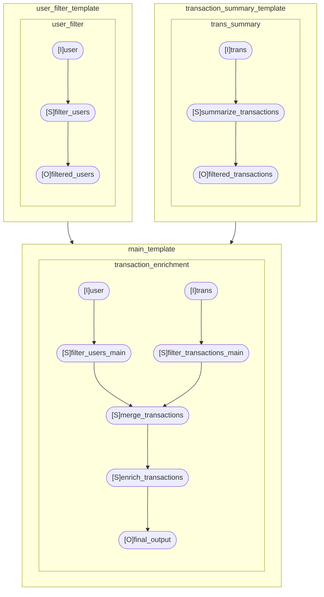

# ROTAB

**A template that moves with your thinking.**
**Fully compatible with LLM-based generation and validation.**

**ROTAB** is a lightweight tool that defines data processing using YAML templates and automatically converts them into executable Python code.
No implementation code required—just describe what you want to do.
This is the minimal system designed to realize that philosophy.

---

## Use Cases

- When you want to record data processing as a reproducible, reusable structure
- When you need to share and review processing logic with non-engineers
- When you want LLMs to generate, modify, or validate processing templates
- When you need to rapidly prototype and test different processing pipelines
- When you want to visualize the entire workflow clearly

## What ROTAB Offers

- Intuitive, readable syntax for describing processing logic—even for non-engineers
- No scripting or boilerplate code—just write a YAML template
- Auto-generates standalone, executable Python code
- Automatically visualizes the pipeline as a DAG
- Easily extendable using your own function files

---

## 1. How to Use

### Template Example (YAML)

```yaml
name: main_template

depends:
  - user_filter_template
  - transaction_summary_template

processes:
  - name: transaction_enrichment
    description: |
      This process enriches user transactions by filtering users based on age and
      transactions based on amount, then merging the two datasets.
    io:
      inputs:
        - name: user
          io_type: csv
          path: ../../source/outputs/filtered_users.csv
          schema: user

        - name: trans
          io_type: csv
          path: ../../source/outputs/filtered_transactions.csv
          schema: trans

      outputs:
        - name: final_output
          io_type: csv
          path: ../../source/outputs/final_output.csv
          schema: final_output

    steps:
      - name: filter_users_main
        with: user
        mutate:
          - filter: age > ${params.min_age}
          - derive: |
              log_age = log(age)
              age_bucket = age // 10 * 10
          - select: [user_id, log_age, age_bucket]
        as: filtered_users
        when: ${params.test}

      - name: filter_transactions_main
        with: trans
        mutate:
          - filter: amount > 1000
        as: filtered_trans

      - name: merge_transactions
        with: [filtered_users, filtered_trans]
        transform: merge(left=filtered_users, right=filtered_trans, on='user_id')
        as: enriched

      - name: enrich_transactions
        with: enriched
        mutate:
          - derive: |
              high_value = amount > 10000
          - select: ${params.enrich_transactions.columns}
        as: final_output
```

### Parameter Injection

You can inject values from a parameter YAML file using the `${...}` syntax inside your templates.

```yaml
# params.yaml
params:
  min_age: 18
```

This allows dynamic and reusable templates by separating logic from configuration.

### Running the Pipeline

```bash
rotab --template-dir ./examples/config/templates \
      --source-dir ./examples/source_polars \
      --param-dir ./examples/config/params \
      --schema-dir ./examples/config/schemas \
      --backend polars \
      --execute \
      --dag
```

- Python code is generated at the path specified in the template
- The generated code is standalone and directly executable

---

## 2. Generated Python Code

```python
sys.path.append(os.path.abspath(os.path.join(os.path.dirname(__file__), "..")))
import polars as plss
import fsspec
from rotab.core.parse import parse
from rotab.operation.derive_funcs_polars import *
from rotab.operation.transform_funcs_polars import *

def step_filter_users_main_transaction_enrichment(filtered_users):
    filtered_users_main = filtered_users
    filtered_users_main = filtered_users_main.filter(parse('age > 18'))
    filtered_users_main = filtered_users_main.with_columns(parse("""
        log_age = log(age)
        age_bucket = age // 10 * 10
        """))
    filtered_users_main = filtered_users_main.select(['user_id', 'log_age', 'age_bucket'])
    return filtered_users_main

def step_filter_transactions_main_transaction_enrichment(filtered_transactions):
    filtered_trans = filtered_transactions
    filtered_trans = filtered_trans.filter(parse('amount > 1000'))
    return filtered_trans

def step_merge_transactions_transaction_enrichment(filtered_users_main, filtered_trans):
    enriched = merge(left=filtered_users_main, right=filtered_trans, on='user_id')
    return enriched

def step_enrich_transactions_transaction_enrichment(enriched):
    final_output = enriched
    final_output = final_output.with_columns(parse("""
        high_value = amount > 10000
        """))
    final_output = final_output.select(['user_id', 'log_age', 'amount', 'high_value'])
    return final_output

def transaction_enrichment():
    """This process enriches user transactions by filtering users based on age and
    transactions based on amount, then merging the two datasets."""
    filtered_users = pl.scan_csv("data/outputs/filtered_users.csv", dtypes={"user_id": pl.Utf8, "age": pl.Int64, "age_group": pl.Int64})
    filtered_transactions = pl.scan_csv("data/outputs/filtered_transactions.csv", dtypes={"user_id": pl.Utf8, "amount": pl.Int64, "is_large": pl.Boolean})
    filtered_users_main = step_filter_users_main_transaction_enrichment(filtered_users)
    filtered_trans = step_filter_transactions_main_transaction_enrichment(filtered_transactions)
    enriched = step_merge_transactions_transaction_enrichment(filtered_users_main, filtered_trans)
    final_output = step_enrich_transactions_transaction_enrichment(enriched)
    final_output = final_output.with_columns(pl.col("user_id").cast(pl.Utf8))
    final_output = final_output.with_columns(pl.col("log_age").cast(pl.Float64))
    final_output = final_output.with_columns(pl.col("amount").cast(pl.Int64))
    final_output = final_output.with_columns(pl.col("high_value").cast(pl.Boolean))
    with fsspec.open("data/outputs/final_output.csv", "w") as f:
        final_output.collect(streaming=True).write_csv(f)
    return final_output

if __name__ == "__main__":
    transaction_enrichment()
```

---

## 3. Automatic DAG Generation



---

## 4. Built-in Functions

### Column Definition (`define`)

| Function                      | Description                        |
| ----------------------------- | ---------------------------------- |
| `log(x, base=10)`             | Logarithm with custom base         |
| `log1p(x)`                    | Natural logarithm of (1 + x)       |
| `exp(x)`                      | Exponential function               |
| `sqrt(x)`                     | Square root                        |
| `clip(x, min, max)`           | Clamp value between min and max    |
| `round(x, n=0)`               | Round to n decimal places          |
| `floor(x)`                    | Round down to nearest integer      |
| `ceil(x)`                     | Round up to nearest integer        |
| `abs(x)`                      | Absolute value                     |
| `len(x)`                      | Length of a string or list         |
| `startswith(x, p)`            | Check if string starts with prefix |
| `endswith(x, s)`              | Check if string ends with suffix   |
| `lower(x)`                    | Convert string to lowercase        |
| `upper(x)`                    | Convert string to uppercase        |
| `replace_values(x, old, new)` | Replace substring                  |
| `strip(x)`                    | Trim whitespace                    |
| `format_datetime(x, format)`  | Format datetime string             |
| `year(x)`                     | Extract year from datetime         |
| `month(x)`                    | Extract month                      |
| `day(x)`                      | Extract day                        |
| `weekday(x)`                  | Extract weekday (0 = Monday)       |
| `hour(x)`                     | Extract hour                       |
| `days_between(x1, x2)`        | Number of days between two dates   |
| `is_null(x)`                  | Check for null or NaN              |
| `not_null(x)`                 | Check for non-null value           |
| `min(x1, x2)`                 | Minimum of two values              |
| `max(x1, x2)`                 | Maximum of two values              |

### Table Transformation (`transform`)

| Function                                                     | Description                                       |
| ------------------------------------------------------------ | ------------------------------------------------- |
| `sort_by(table, column, ascending=True)`                     | Sort table by a column                            |
| `groupby_agg(table, by, aggregations)`                       | Group and aggregate. Example: `{"amount": "sum"}` |
| `drop_duplicates(table, subset=None)`                        | Remove duplicate rows                             |
| `merge(left, right, on, how='inner')`                        | Merge two dataframes on a column                  |
| `reshape(table, column_to, columns_from, column_value, agg)` | Pivot/melt depending on parameters                |
| `fillna(table, mapping)`                                     | Fill missing values. Example: `{ "age": 0 }`      |
| `sample(table, frac)`                                        | Random sample by fraction                         |
| `concat(tables)`                                             | Concatenate tables vertically                     |
| `drop_na(table, subset=None)`                                | Drop rows with missing values                     |
| `replace(table, columns, old, new)`                          | Replace values in specified columns               |

---

## License

MIT License
© 2025 PROJECT RO
